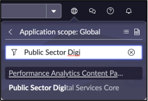
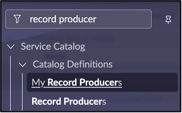
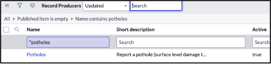
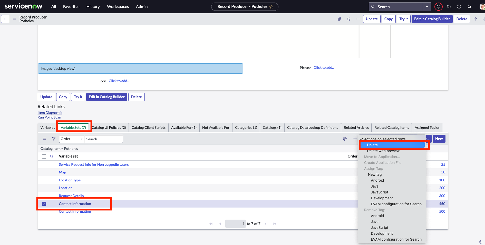
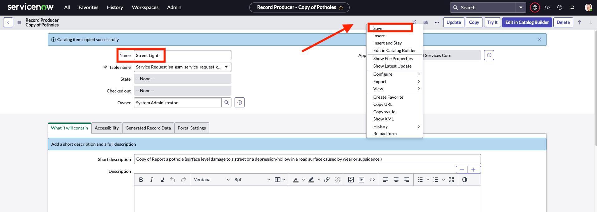

1. Change application scope to Public Sector Digital Services Core

2. Navigate to All > Service Catalog > Catalog Definitions > Record Producers.

3. Search in the name column for *potholes.  Click the name to open record producer.

4. Scroll down to **Variable Sets**. As you’ll see, there are 2 **Contact Information** variables, we will delete the first one. (Note: you won’t need to do this in your actual environments)

5. Click **Copy** to use this record producer as the starting point for the new Street Light record producer.

6. Change the name to **Street Light** and then **Save** the record.

7. Click **Edit in Catalog Builder** to modify the record producer.
