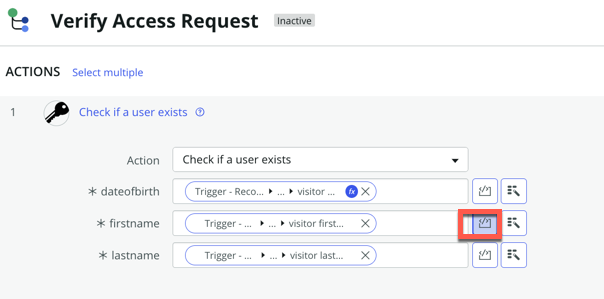

## Overview

Handling integrations is often not as straightforward as this lab may suggest. In the previous section of the lab, the data was sent to the API in the same format as it was in ServiceNow. However, in this scenario, we are sending data to an API that expects the data to be in a specific format. In this optional lab, we will explore how to apply data transformation in Flow Designer before sending the data to the external API.

## Instructions 

1. On your instance, navigate to the **All** menu (1) and in the filter navigator (2), type "x_snc_visitoracc_0_visitors_list.do" and press enter to open that custom table.
   

In this use case, a custom table is utilized by a ServiceNow app developed by ACME Inc. When a visitor checks in at the reception of their building, they can scan their government ID. Using our DocIntel capability, a new record is generated in that table for the visitor. Information such as the First Name, Last Name, and Date of Birth of the visitor is then extracted from their government ID and stored in that table. In the following section, we will concentrate on creating the workflow that will take this data, transform it, and utilize it with the new spoke we created earlier in this lab.

Please note the following details: Visitor First Name and Visitor Last Name values (1) are in uppercase. Additionally, observe the Date of Birth (2), which is in the MM/DD/YYYY format.


The external API for which we previously created a new spoke action won't recognize those values in that format. The API expects the format to be Firstname, Lastname, and a date in the YYYY-MM-DD format.

Now, let's create the workflow that will query the API to verify whether the user has the necessary authorization to access the building. We will utilize a Data Transform and our newly created Spoke Action for this purpose.


2. Open Flow Designer 
   


3. Click **Create new** (1) then **Flow** (2)
   


4. Type the value **Verify Access Request** on the  **Flow Name** field (1) then click **Submit** (2)
   


5. If you get this message, click **Skip tour** 
   


6. Click **Add a trigger** (1) to set the condition to trigger that flow.
   


7. Select **Record** (1) then click **Updated** (2). 
   


8. Select the **visitors** (1) table from the list then click **Add Filters** (2) Set the condition as shown below
   

:::note
With the condition we are setting above, the flow will be triggered as soon as DocIntel extracts data from the visitor's government ID and updates the visitor record associated with that visitor.
:::

Now we need to add to our flow the spoke action that we have created earlier in this lab.

9. Under the **Actions** section, click **Action** (1), type **visitor access** (2) then select **Visitor Access** from the **INSTALLED SPOKES** list (3) then click **Check if a use exists** (4) 
   


You should see a screen as shown below


We need to pass the data from the record to that Action step.

10. Expand the Visitors Record secrtion in the data pill as shown below: 
   


11. Then scroll down to see fields we need, **visitor dob**, **visitor lastname**, **visitor firstname**,


12. Grab those data fields and drop them to our action inputs as shown below:


Remember, the external API won't accept the format of that data. We need to apply some data transformation to send the data in the expected format. In Flow Designer, we can use 'Transforms' to dynamically modify the data in fields.

Let's begin with the formatting of the date of birth. Remember that in the ServiceNow record, the date format is MM/DD/YYYY, but we need to send it to the API in the format YYYY-MM-DD.

13. If you click the value in the **dateofbirth** field, it will show a **fx** icon, click on it, then type **Replace** (2), then select **Replace String** (3), we that Transforms we can use a simple regular expression to match the string to replace.
   Alt text](<./images///2023-09-21_13-08-32 (2).png>)


14. On the **Regex** field (1) type this value **(\d{2})/(\d{2})/(\d{4})** and on the **Replace String** field (2) type this value **$3-$1-$2**
   

:::tip Additional reading if interested to learn more about Regular expression, otherwise skip this. 

The regex pattern `(\d{2})/(\d{2})/(\d{4})` is used to match and capture date strings in the format MM/DD/YYYY. 

Here's what each part of the pattern does:

1. `(\d{2})`: This part captures two digits (0-9) and encloses them in parentheses to create a capturing group. It's used to match the month portion of the date (MM). `\d` represents any digit, and `{2}` specifies that exactly two digits must be matched.


2. `/`: This part matches the forward slash character (/) literally. It's used to separate the month, day, and year portions of the date.


3. `(\d{2})`: Similar to the first part, this captures two digits (0-9) to match the day portion of the date (DD).


4. `/`: Another forward slash to separate the day and year.


5. `(\d{4})`: This captures four digits (0-9) to match the year portion of the date (YYYY).

So, when you apply this regex pattern to a string, it will capture date strings in the format MM/DD/YYYY and store the month, day, and year portions as separate capturing groups, allowing you to extract and work with these components individually.

In the replace string field we have typed **$3-$1-$2**

$3 refers to the contents of capturing group 3, which is the year "2023."
$1 refers to the contents of capturing group 1, which is the month "12."
$2 refers to the contents of capturing group 2, which is the day "31."

This allows us to format the date as desired, although there might be other ways to achieve this as well.

:::

Now, let's perform some data transformation for the First Name and Last Name fields. They arrive in uppercase from ServiceNow, but the external API expects these values with only the first letter of the first name and the first letter of the last name in uppercase. Therefore, we need to transform the data to make it compatible. We could potentially use existing Transforms to accomplish this, but we want to introduce another method for more advanced data transformation. You can use the inline script feature on the field to transform the data.

15. Beside the firstname field, click that Toggle Scripting icon as shown below 
   

   add this piece of code: 
      
      ```js
      // Access the value you want to transform
      var inputString = fd_data.trigger.current.visitor_firstname; // Replace 'your_field_name' with the actual field name

      // Check if the inputString is not empty
      if (inputString) {
         // Convert the string to lowercase, except the first character
         var firstChar = inputString.charAt(0);
         var restOfString = inputString.slice(1).toLowerCase();
         var transformedString = firstChar + restOfString;
         
         // Return the transformed value
         return transformedString;
      } else {
         // If the input is empty, return it as-is
         return inputString;
      }
      ```


16. On the **lastname** field add this piece of code

      ```js
      // Access the value you want to transform
      var inputString = fd_data.trigger.current.visitor_lastname; // Replace 'your_field_name' with the actual field name

      // Check if the inputString is not empty
      if (inputString) {
         // Convert the string to lowercase, except the first character
         var firstChar = inputString.charAt(0);
         var restOfString = inputString.slice(1).toLowerCase();
         var transformedString = firstChar + restOfString;
    
         // Return the transformed value
         return transformedString;
      } else {
         // If the input is empty, return it as-is
         return inputString;
      }
      ```

In summary, this script capitalizes the first letter of the input string while converting the rest of the string to lowercase. If the input is empty, it returns an empty string. This transformation ensures that the format matches the expectations of the external API endpoint."
