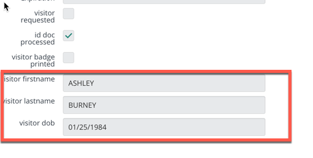
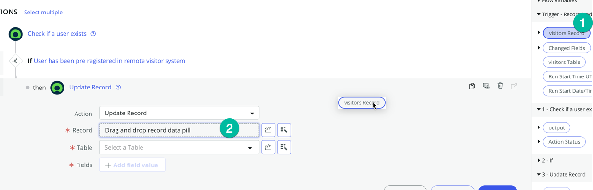
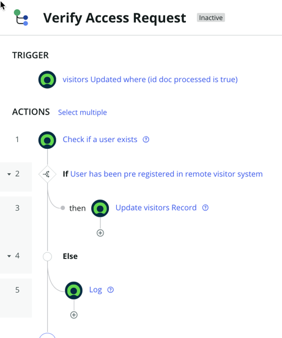

## Overview 
It is time to test if our Transforms work. 

## Instructions

1. Click Test to try your flow
   
      

2. Pick a record from the list (1) then click **Run Test** (2)
   

3. Click on **"Your test has finished running. View the flow execution details"**
   

4. In the **TRIGGER** section, on the right-hand side, single click on the **Open Current record** to inspect the values of that record
   

5. Scroll down to see the values for visitor firstname, visitor lasname, visitor dob
   

6. Notice the value are all stored in uppercase in ServiceNow, and the date of birth is not in the format that the API End point wants.Let Now see if our transforms have worked.

7. Click on the **Check if a user exists** (1) step to check if the values were transformed correctly:
   

8. If you continue to scroll down, you should be able to see the output that contains the response from the API End point
   

9. We are going to add steps to our flow to update the source record in ServiceNow with the values received from the external system (API endpoint). Please return to the 'Verify Access Request' flow.

10. Then click **Add and Action, Flow Logic, or Subflow**
   

11. We want to incorporate logic into the flow so that if the API confirms the user's existence (indicating that the visitor has been authorized and registered in the external visitor access app), we can retrieve the output from the API and update the record with information about the user's authorizations.

12. Add a **IF** statement by clicking **Flow Logic** (1), then **If** (2)
   

13. In the **Condition Label** field (1), copy and paste this text : "User has been pre registered in remote visitor system" this is just to make it easier for someone who read the flow to understand the logic then in the Condition.
   .png>)

14. In the Condition Section, Click the **Data pill** icon (1) then select **1 - Check if A user Exists** (2), **output** (3), then **code** (4)
   .png>)

15. type the value **0** (1) as shown and click **Done** (2)
   
   We know that when the API return code 0 means that the user have been found in the remote system

Now the the condition is set correctly we need to add a step to update the user record in servicenow when we meet this condition.

16. Click the **then** section as shown
   

17. Then Click **Action** (1), type **update record**, then click **Update record**
   .png>)

18. Drag the **Visitors Record** (1) from the data pill on the right hand side, then drop into the Record field of the **Update Record** step (2) as shown
   

19. This should set the right Table on the table field automatically as shown below.
    * Click **Add Field value** (1)
    .png>)

    * then add those fields

    | Field |
    |-------|
    | Access Expiration | 1984-01-25|
    | Building Location | Ashley |
    | Guest Title | Burney |
    | guest email| Burney |
    | host email | Burney |
    | host id number | Burney |
    | Guest phone | Burney |
    | Host name | Burney |
    | visitor requested | Burney |

    * Drag each values from the data pill on the right hand side (Trigger - Record Updated - Visitor Record) to the corresponding field on the record
    

20. The last field, **visitor requesed** is a true/false type, you just need to click the check box as shown
   

With the step we just added, if the user is found in the Visitor Access system, we then take all the information returned from the API and update the record in ServiceNow with those.

In the case the user is not found in the Visitor Access system, we just want to write a log. let just add that step.

21. Add a Else statement to your flow as shown, click **Add an Action, Flow Logic, or Subflow**, then select **Flow logic** (1), **Else** (2)
   

22. Add the **Log** step by click on **Action** (1), then type **log** (2), then click **ServiceNow Core** (3) then click **Log** (4)
   

23. On the **Field** (1), copy and past this value : "**No record in Visitor access app found for that user**" then click **Done** (2)
   

24. We are done building the flow, it should look like this:
   

25. It's time to test it, click the Test button, select a **visitor record** (2) then click **Run Test** (2)

26. Open the execution detail of the flow to see if has updated the record with the values coming from the API

27. If the step Update Record shows **Completed** it means it the record was successfully updated!
   

Feel free to go on the custom visitors table to verify that the record was update with the values from the API:

28. click on the **All** menu (1) and in the filter navigator (2) type the x_snc_visitoracc_0_visitors_list.do and press enter to open that custom table.
   

29. All the field on the visitor record you have used for your test should now be updated
   .png>)

## Recap 

Congratulations, this marks the end of the optional section. You have learned how to transform data before sending it via a custom spoke that we have built!