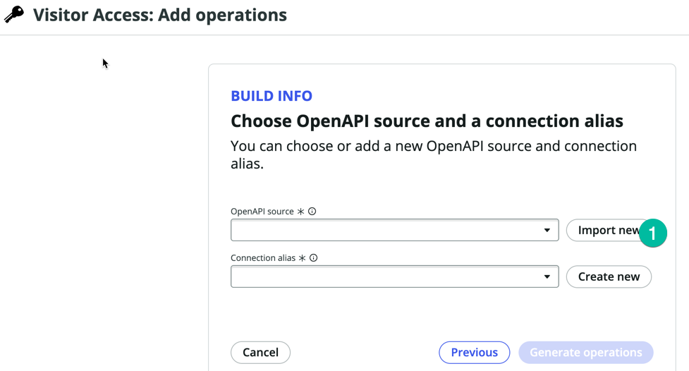
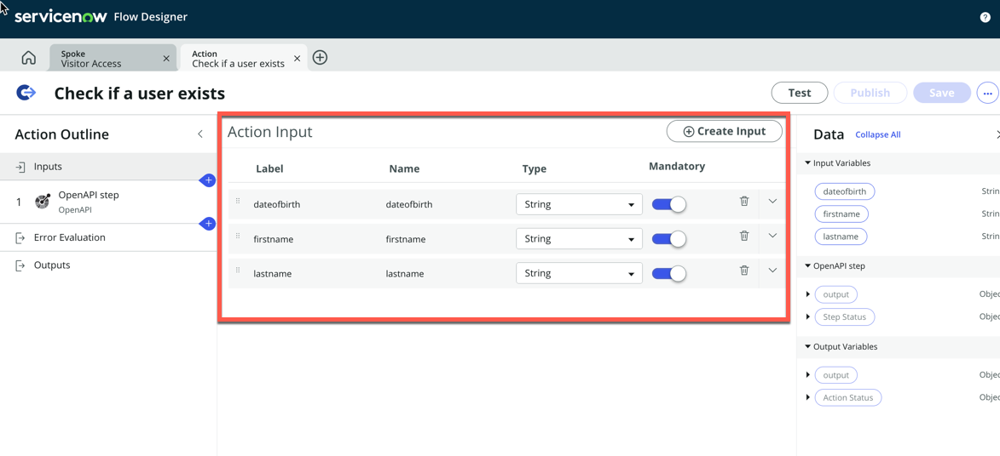

## Overview

In this exercise, you will create a custom Integration Hub Spoke. 

## Instructions

1. Log in to your instance, then, on the main page, click **All** (1). Next, type **flow** (2) and click **Flow Designer** (3) to open the Flow Designer UI.
   

2. Once you are in the **Flow Designer** UI, to access the Spoke Generator, select **Create New** (1) (located on the right-hand side of the screen), and then click on **Spoke**.
   

3. The Spoke Generator will request the following information from you: a thumbnail image (1) (you can upload a thumbnail image to serve as your Spoke logo; feel free to find a free image on Google Images and upload it here), a Spoke Name (2), and a Description (4).

   | Field | Value |
   |-------|-------|
   | Spoke Name | Visitor Access |
   | App Scope Name | This field is generated automatically from the Spoke Name |
   | Description | This spoke will be used to verify if visitor has been registered in the Visitor Access app |
   

4. Once you have set the value, click Create and Continue (1) as shown below:
   

5. On the next screen, you will be prompted to select the method you wish to use for creating your new spoke. We intend to utilize the OpenAPI Specification method, as we have been furnished with the YAML file that describes the API and adheres to the OPENAPI Specification.
   * Select **OpenAPI Specification** (1) then click **Continue** (2)
   

6. On the next screen, **Visitor Access: Add operations**, this is where you can provide the YAML file. Click **Import New** (1), and then provide the url to the  YAML file, copy URL from the link here [Swagger YAML File](./swagger.yaml).
   

7. Paste the URL copied in your clipboard in the previous step, then paste it in the **OpenAPI URL** field (1), then click **Import** (2) 
   

8. Once the import is done you should see something similar to this:
   

9. Then click on **Create New** next to the **Connection Alias field** (1) 
   
   :::note
   In ServiceNow, a Connection Alias is a configuration setting used to establish and oversee connections with external systems. It functions as an abstraction layer for connecting to external systems and streamlines the integration process within ServiceNow workflows and other components. Normally, when connecting ServiceNow to an external system, you must configure the URL of the endpoint (the third-party system) and specify how to authenticate with it. This is accomplished through Connection and Credentials settings in ServiceNow. In practice, it is essential to engage in discussions with the administrator of the remote system and coordinate with the security team before initiating this configuration.
   :::

10. In the **Connection alias name** (1) type **VisitorAppConnection** and keep the **Authentication Configuration Template** with the default value **Api Key Template** (2), then click **Create** (3)
   

11. Click **Generate operation** (1) 
   

12. The system will then prompt you to select which Spoke Action you want to create as shown below
   
   :::note
   For this lab, we are utilizing a very basic API designed explicitly for lab and educational purposes. This API consists of just one method, which is why only one action is visible. In real-world scenarios, most commercial applications you endeavor to integrate will have dozens or even hundreds of methods within their API. You will have the option to choose the methods you wish to utilize from ServiceNow and create Spoke Actions for them.
   :::

13. Select the ** Check if a user exists** (1) Action then click **Publish** (2)
   

14. Click the newly created Spoke Action **Check if a user exists** (1) this will open the Action editor in Flow designer so we can inspect it 
   

15. Notice the Action Input section, the Inputs for that Spoke action was created automatically 
   

16. Click the OpenAPI Step (1) 
   

17. Notice the step inputs, they are using the Action inputs, so the values from the Action Inputs will be passed as parameters when the API Call is made to the external system.
   

18. We need to update the Connection Alias in the Connection Details section. We have precreated in this lab instance a Connection record that point to the right API End point. We are going to use this one. 

19. Click on the **Connection Alias field** (1) then select **VisitorAccess_ConnectionAlias** (2) 
   

20. Notice the **Base URL** field was updated and displays the URL for the API End point. Those connection alias records are typically managed a by Security team or user with higher privileges.
    * On the right hand-side notice the outputs available from the OpenAPI Step, expand the **user** (1) section as shown below:
    
    Those are all the values that we can retrieve from the external app and use in a ServiceNow Workflow.

