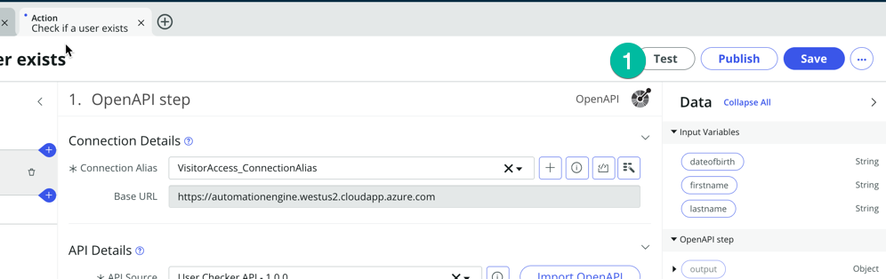
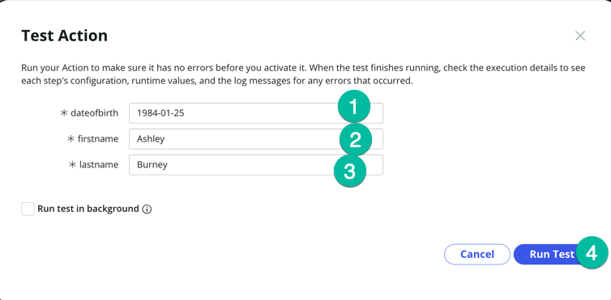
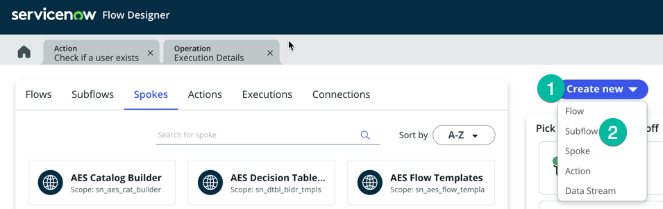
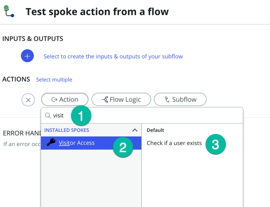

## Overview

In this activity, you will test the new spoke.

## Instructions

1. It's time to test that Spoke Action! Click on the **Test** button 
   

2. You will be prompted to enter some user information, **dateofbirth** (1), **firstname** (2), **lastname** (3) please use those values below
    * Then click **Run Test** (4)

    | Field | Value |
    |-------|-------|
    | dateofbirth | 1984-01-25|
    | firstname | Ashley |
    | lastname | Burney |

   

:::note
Typically those values will be passed to the action via a Workflow. we are just testing the action manually right now.
:::

3. Once the Action has been executed, click on **Your test has finished running. View the Action execution details** (1) to inspect the response we have received from the external system.
   

4. On the **Execution Details** page, scroll down until you see the **ouput Data** section and click on the output detail (1)
   .png>)
   You should see a screen similar to this. Notice the response returned by the API. It contains the return code, message and additional user information. Our new Spoke Action works!

5. Before you proceed to the next step,on your new Action please make sure to click "Save" (1) and then "Publish" (2) to ensure that the Action is saved and includes the update we added to the flow (changing the Connection Alias).
   

### Now let's use that Spoke Action from a flow! 

6. Click on the Home button to return to the main page of flow designer
   

### In the following steps, we just want to show a builder can consume/use the new Spoke Action that we have created. 

27. Click on **Create New** (1) then **Subflow** (2)
   

28. Enter a **Subflow name** (put the name you want) and click **submit** (leave all other field with default values)
   :::note
   Typically a builder would create a new flow or subflow in his own Application Scope, but for a quick test in a lab instance it doesn't matter we can save it in the Global scope.
   :::
   

29. A new tab will open for your new subflow, under **ACTIONS** Click **Add an Action, Flow Logic or Subflow** (1)
   

30. Select Action then type **Visit**, this should display your new spoke **Visitor Access** (2), click on it then click the action **Check if a useer exists** (3)
   

31. Now we can pass the value to the action, here we are going to hardcode values just for test purposes, typically we would lookup a record in ServiceNow and pass values from that record to the action. We will cover that in detail in the optional section of the lab.

   | Field | Value |
   |-------|-------|
   | dateofbirth | 1984-01-25|
   | firstname | Ashley |
   | lastname | Burney |

32. Using the values from the table above, set the **dateofbirth** (1). **firstname** (2). **lastname** (3) then click **Done** (4) and click the **Test** button. 
   
   Then click **Run Test** (1) 
   

33. Click **Your Test has finished running, View the subflow exectution details** 
   

## Recap

In this lab, we've learned how to create a new Spoke using the Spoke Generator, allowing us to integrate ServiceNow with an external application featuring a usable API. In the optional section of this lab, we will delve into more advanced concepts of Flow Designer/Ihub and demonstrate how to employ the value retrieved from the Spoke action to update a record in ServiceNow.

:::note
With the Spoke Generator, you no longer need to manually configure the REST Step and JSON Parser Step; the Spoke action generated by the Spoke Generator handles this automatically for you.
:::