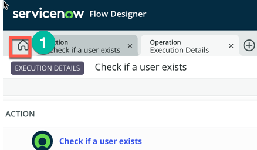
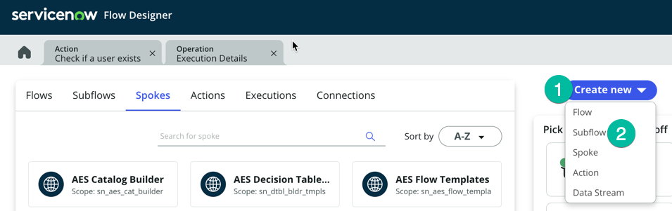
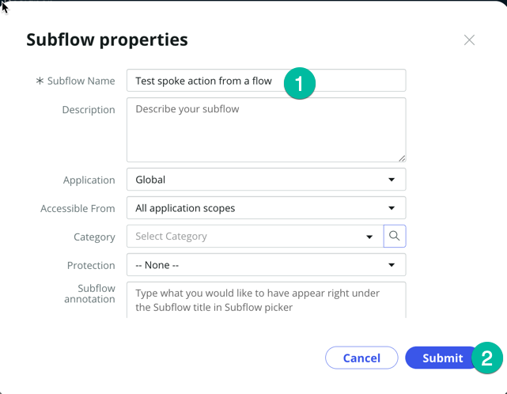
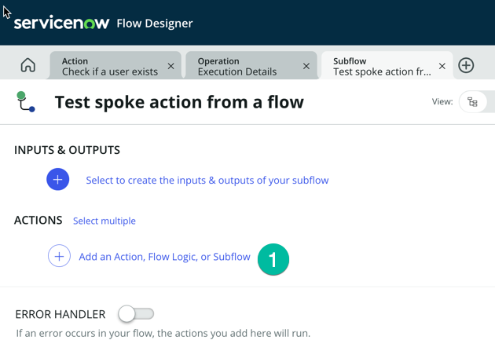
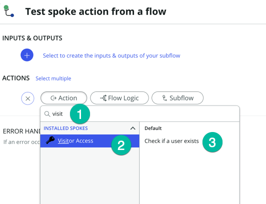
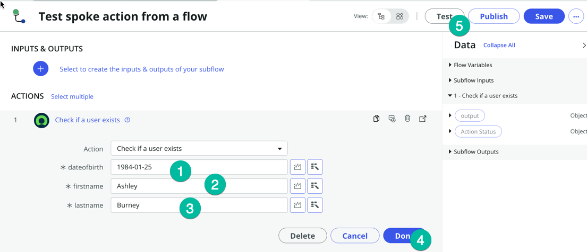
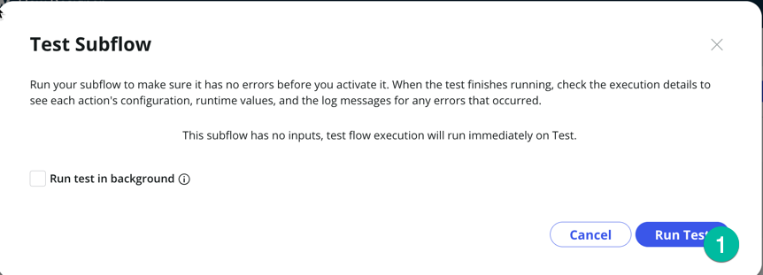
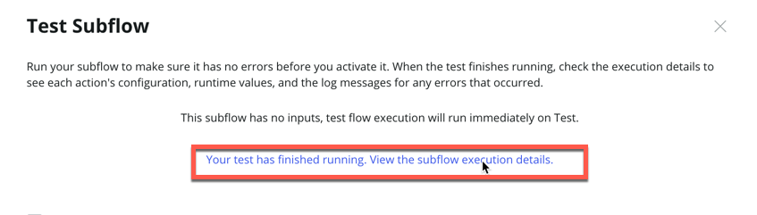

## Overview

In this activity, you will use the new Spoke in a Flow. 

## Instructions

1. Click on the Home button to return to the main page of flow designer
   

### In the following steps, we just want to show a builder can consume/use the new Spoke Action that we have created. 

2. Click on **Create New** (1) then **Subflow** (2)
   

3. Enter a **Subflow name** (put the name you want) and click **submit** (leave all other field with default values)
   :::note
   Typically a builder would create a new flow or subflow in his own Application Scope, but for a quick test in a lab instance it doesn't matter we can save it in the Global scope.
   :::
   

4. A new tab will open for your new subflow, under **ACTIONS** Click **Add an Action, Flow Logic or Subflow** (1)
   

5. Select Action then type **Visit**, this should display your new spoke **Visitor Access** (2), click on it then click the action **Check if a useer exists** (3)
   

6. Now we can pass the value to the action, here we are going to hardcode values just for test purposes, typically we would lookup a record in ServiceNow and pass values from that record to the action. We will cover that in detail in the optional section of the lab.

    | Field | Value |
    |-------|-------|
    | dateofbirth | 1984-01-25|
    | firstname | Ashley |
    | lastname | Burney |
    Using the values from the table above, set the **dateofbirth** (1). **firstname** (2). **lastname** (3) then click **Done** (4) and click the **Test** button. 
    

7. Then click **Run Test** (1) 
    

8. Click **Your Test has finished running, View the subflow exectution details** 
    

## Recap

In this lab, we've learned how to create a new Spoke using the Spoke Generator, allowing us to integrate ServiceNow with an external application featuring a usable API. In the optional section of this lab, we will delve into more advanced concepts of Flow Designer/Ihub and demonstrate how to employ the value retrieved from the Spoke action to update a record in ServiceNow.

:::note
With the Spoke Generator, you no longer need to manually configure the REST Step and JSON Parser Step; the Spoke action generated by the Spoke Generator handles this automatically for you.
:::