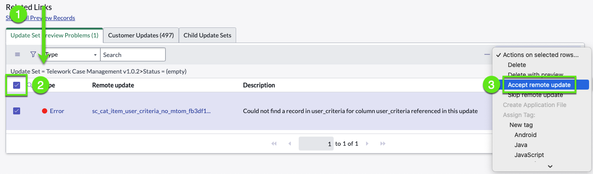
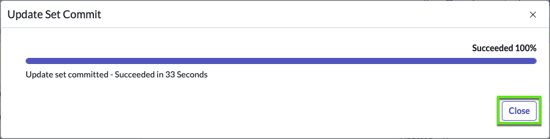
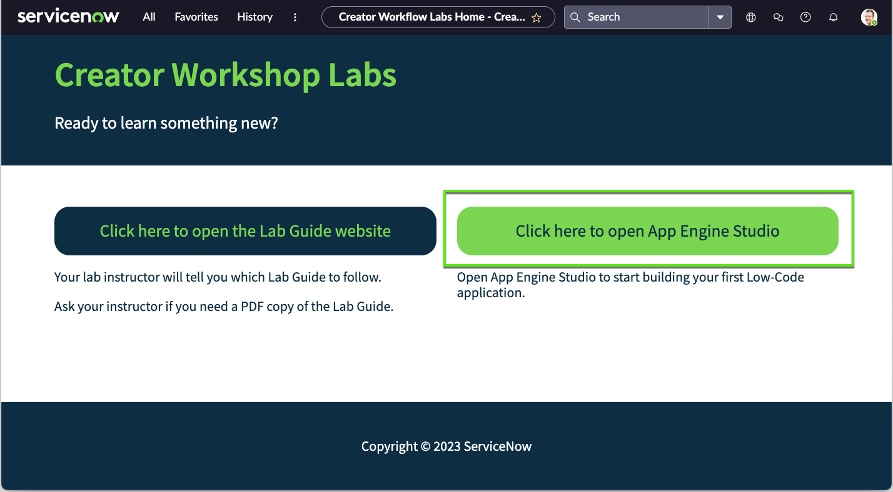

In this exercise, we will learn how to import an existing scoped application using an Update Set, or xml file.  This application was created in the 101 lab, Telework Case Management.

## Steps to Importing Application  

>1. Go to 'Retrieved Update Sets'  

>2. Scroll to 'Releated links' and click on 'Import Update Set from XML'  

>3. Upload Update Set  

>4. Find the record you just imported: State = 'Loaded'  

>5. Preview Update Set 

>6. Accept/Skip Remote Updates  

>7. Commit Update Set  
    
## Here are those steps in detail: 

# Step 1 - Go to 'Retrieved Update Sets'  

>1. Go to All  

>2. Then under 'System Update Sets' go to: **Retrieved Update Sets**  
  

# Step 2 - Import Update Set

>1. Scroll to the bottom of the list

>2. Click on related link: **Import Update Set from XML**
  

# Step 3 - Upload Update Set  

>1. Click on 'Choose File'

>2. Find and choose the file you downloaded earlier "Telework Case Management...xml"
  

>3. Click on 'Upload'
  

# Step 4 - Find record State = 'Loaded'

>1. Right click on 'Committed' (any record)

>2. Choose "Filter Out"  
  

>3. Click on retrieved update set "Telework Case Management..."  
  

# Step 5 - Preview Update Set  

>1. Click on 'Preview Update Set'  
  

>2. Watch the bar progress...until 100%

>3. Click on 'Close' (there can be errors, so it's ok if it says 'Failed')  
  

# Step 6:  if there are errors. If no errors, go to Step 7  

**For more information regarding update sets and use of the different options, here are some helpful links:**

[ServiceNow Update Sets](https://docs.servicenow.com/bundle/vancouver-application-development/page/build/system-update-sets/concept/system-update-sets.html)  
[Update Set Super Guide](https://www.servicenowelite.com/blog/2016/8/7/update-sets)  

>1. Scroll to the related lists

>2. Select 'All' records under 'Update Set Preview Problems'

>3. Expand 'Actions on selected rows' option box

>4. Click on 'Accept Remote Update'

# Step 7 - Commit Update Set    

>1. Click on 'Commit Update Set'
  

>2. Click on **Close**
  

>3. You should now see the applicaiton has been successfully imported:  
  

>4. Click on the ServiceNow logo to go to the home page
  

>5. Click the button **Click here to open App Engine Studio**
  

**Congratulations!**

You have completed importing the Telework Case Management application.

Continue into App Engine Studio to find your application - Telework Case Management.

