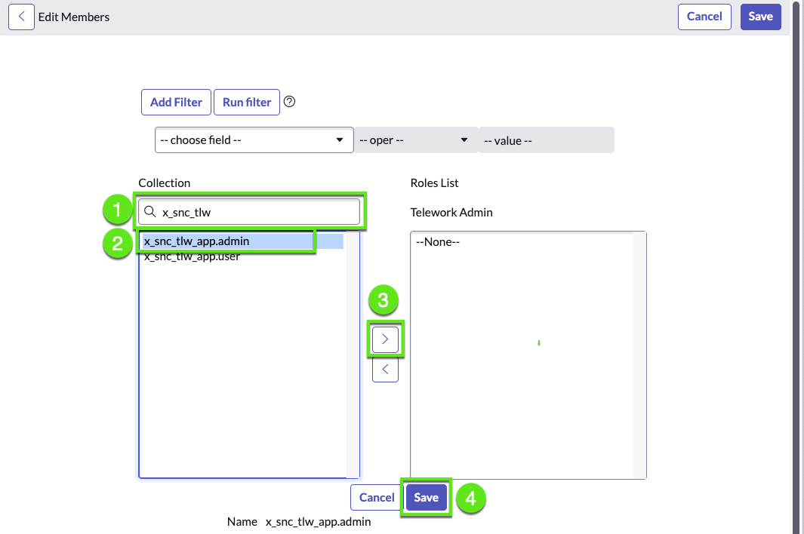

# Restrict access from Admins

If we login as a regular admin, we can see we have access to the application. In this exercise, we will secure the app so that even other administrators cannot access the app and its data.

1. Log in as user **admin** 

2. Go to App Engine Studio

3. Notice that the **admin** can see all the records in the Telework application

    

## Update the admin role for our app as an Application Administrator

1. Go to the roles list

    1. Click the **All** menu
    
    2. Search for "roles" 
    
    3. click on: System Security > Users and Groups > Roles or User Administration > Roles.

    

2. Open the role for the application-specific admin role.

    1. Click to show the filter

    2. For the field, select **Application**

    3. For the value, start typing **"Tele"** and then select the "Telework application".

    4. Click **Run**

    5. Open the admin role for our app.
    
    

3. Configure the form to add the **Application Administrator** field.

    1. Right-click in the header to show the record menu

    2. Select Configure > **Form layout**

    

    3. Add the field **Application Administrator** to the role form

        1. Click **Edit this section in Global**

        2. Select the field **Application Administrator** 

        3. Click on the **[ › ]** button to add the field to the list of selected fields

        4. Click Save at the bottom. 

        

4. Set the Telework Admin role to an Application Administrator

    1. In the role record, select the Application Administrator check box,
    
    2. then Click Update.

    

## Assign the admin role for our app to a user

We're going to assign the Telework admin role to the **Telework Admin** user

1. Go to the list of users

    | Steps                                                 | 
    |---------------------------------------|------------------------|
    |➊|Click the **All** menu  | 
    |➋|Search for **Users**    |
    |➌|Click on **Users**      |

    

2. Open the user **Telework Admin**

    | Steps                                                 | 
    |---------------------------------------|------------------------|
    |➊|Type **Telework** menu  | 
    |➋|Hit the <kbd>enter</kbd> key  |
    |➌|Click on the user **Telework Admin**     |

    

3.  Assign the **App's Admin** role

    On the **Roles** tab, click Edit then follow the steps below.

    :::danger  Update role name
    The name of the role should match
    :::

    | Steps                                                 | 
    |---------------------------------------|------------------------|
    |➊| Type **x_snc_tlw**  |
    |➋| Select **x_snc_tlw**  |
    |➌| Click on the [ › ] button to add the field to the list of selected fields   |
    |➍| Click Save.   |

    

## Set Application administration

1. Impersonate the Telework.Admin user

    1. In the top right, click the **Avatar**
    2. Click **Impersonate user**.
    3. Type "telework"
    4. Click the **Telework Admin** user
    5. Click Impersonate user. 
    

2. Open the app in the developer Studio
    1. Click the **All** menu
    2. Type **Studio**
    3. Click **Studio**
    

3. Open the “Telework Case Management” app
    1. Type **telework** 
    2. Click the **Telework (done) app** 
    

4. Set Application administration
    1. In the top menu, choose File
    2. then click **Settings**
    3. Check [x] Application administration
    4. Click **Update**.
    

## Verify Admins don't have access anymore

1. Log out & Log in as **admin**
    

2. Go to the browser tab with the App Engine Studio

3. Notice that the **admin** can **not** see any record in the Telework application
    

We have secured the app so that even other administrators cannot access the app and its data.