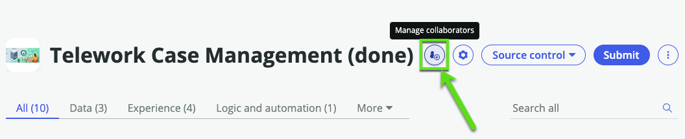

# Overview

Amanda has successfully rolled out her application to her team, and it's caught the attention of another team who also wishes to use it. A primary condition is to maintain the privacy of records across the two teams.

In our workshop, we'll configure this by setting up specific access controls: Amanda's team will have visibility over requests from individuals with names starting from A to J. While Linda's team will have access to requests from people with names starting from K to Z. This will ensure both teams can use the app while maintaining the necessary separation of data.

Let's get started. 

Citizen developers like Amanda need special privileges to configure this so Amanda is going to request...

## Help from App Engine Admins

1.	Login as Adam with the credentials (adam / AppEngine4ever!)

2. Elevate to Security Admin

3. In AES, Click the **Manage collaborators** button
    

4. Create 2 roles
    1. fulfiller_Development

    2. fulfiller_Customer_Support

1. go to Access Control

x_snc_xx_telewor_0_telework_case

- Amanda needs the x_snc_xx_telework.user role

- Amanda can see all the records in the table https://democreatorwf43591.service-now.com/x_snc_xx_telewor_0_telework_case_list.do

- open Amanda's user record

- then we assign her the fulfiller_A_to_J role 

_0: Billie Cowley (Development)
x_snc_xx_telewor_0:  - lucius.bagnoli (Customer Support)

