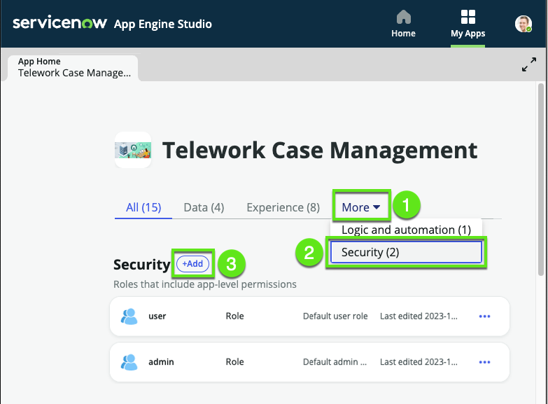
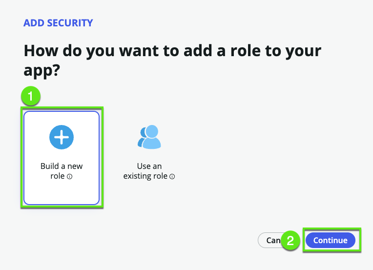

# Overview

Amanda has successfully rolled out her application to her team, and it's caught the attention of another team who also wishes to use it. A primary condition is to maintain the privacy of records across the two teams.

In this exercise, we will compartamentalize telework cases for the users in the Development department and for the users in the Customer support team.  

We'll configure this by defining:

1. One fulfiller role for each team: Fulfiller_Development and Fulfiller_Customer_Support 

2. Then we'll define specific access controls for each.

3. In the end, XXXXXXXX's team will have visibility over requests from users in the Development department while YYYYYYYYYYY's team will have access to requests from the users in the Customer support team. 

This will ensure both teams can use the app while maintaining the necessary separation of data.

Let's get started. 

Citizen developers like Amanda need special privileges to configure access controls so Amanda is going to request...

## Help from App Engine Admins

1.	Logged in as Admin

2. Elevate to Security Admin

    | Steps                                                 | 
    |---------------------------------------|------------------------|
    |➊| In the top right, click the **Avatar**  |
    |➋| Select **Elevate role**    |
    |➌| Check [✔] security_admin   |
    |➍| Click Update.   |

    

3. Go to **App Engine Studio > Security**

    | **Steps**                                                 | 
    |---------------------------------------|------------------------|
    |➊| In AES, click **More**  |
    |➋| Click **Security**    |
    |➌| Click **Add**   |

    

4. Create role **Fulfiller_Development**

    | **Steps**                                                 | 
    |---------------------------------------|------------------------|
    |➊| Click **build a new role**  |
    |➋| Click Continue.   |

    

5. Give the role a name and description.

    | **Steps**                                                 | 
    |-------------|-----------------------------------------|
    | Name        | Fulfiller_Development                   |
    | Description | Fulfiller in the Development department |

    

7. Repeat the steps 4-5 to create the role ** Fulfiller_Customer_Support **

## Define access controls 

1. go to Access Control

x_snc_xx_telewor_0_telework_case

- Amanda needs the x_snc_xx_telework.user role

- Amanda can see all the records in the table https://democreatorwf43591.service-now.com/x_snc_xx_telewor_0_telework_case_list.do

- open Amanda's user record

- then we assign her the fulfiller_A_to_J role 

_0: Billie Cowley (Development)
x_snc_xx_telewor_0:  - lucius.bagnoli (Customer Support)

