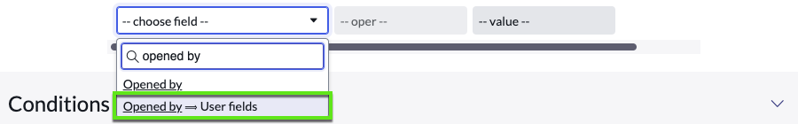
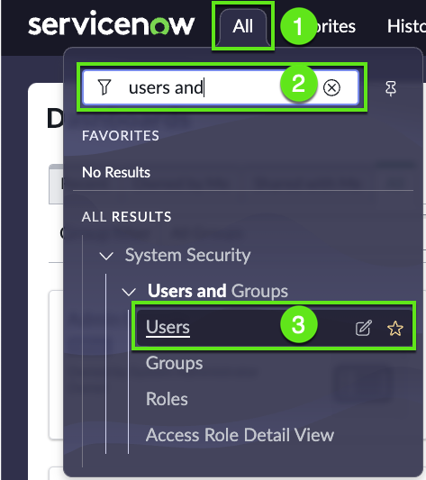
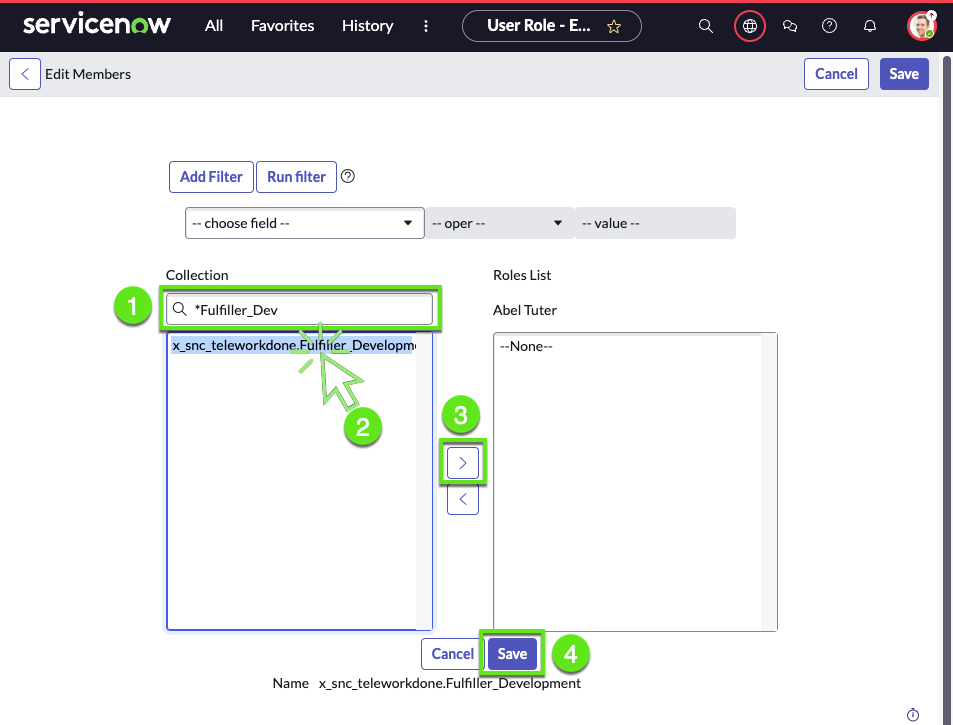

# Overview

Amanda has successfully rolled out her application to her team, and it's caught the attention of another team who also wishes to use it. A primary condition is to maintain the privacy of records across the two teams.

In this exercise, we will compartamentalize telework cases for the users in the Development department and for the users in the Customer support team.  

We'll configure this by defining:

>1. One fulfiller role for each team: Fulfiller_Development and Fulfiller_Customer_Support 

>2. Then we'll define specific access controls for each.

>3. In the end, one team will have visibility only over requests from users in the Development department while the other team will have access only to requests from the users in the Customer support department. 

This will ensure both teams can use the app while maintaining the necessary separation and privacy of data.

Let's get started. 

Citizen developers like Amanda need special privileges to configure access controls so Amanda is going to request...

## Help from App Engine Admins

1.	Logged in as Admin

2. Elevate to Security Admin

    | Steps                                                 | 
    |---------------------------------------|------------------------|
    |➊| In the top right, click the **Avatar**  |
    |➋| Select **Elevate role**    |
    |➌| Check [✔] security_admin   |
    |➍| Click Update.   |

    

3. Go to **App Engine Studio > Security**

    | **Steps**                                                 | 
    |---------------------------------------|------------------------|
    |➊| In AES, click **More**  |
    |➋| Click **Security**    |
    |➌| Click **Add**   |

    

:::info
When Amanda created the app it was only for one team and having only one user role was enough.
Now that we need to open the application to another team we need to have more specific roles to ensure proper security.
:::

4. Create role **Fulfiller_Development**

    | **Steps**                                                 | 
    |---------------------------------------|------------------------|
    |➊| Click **build a new role**  |
    |➋| Click Continue.   |

    

5. Give the role a name and description.

    | **Steps**                                             | 
    |-------------|-----------------------------------------|
    | Name        | Fulfiller_Development                   |
    | Description | Fulfiller in the Development department |

    

6. Give the role the desired permissions

    

7. **Success**

    Click Done.

    

7. Repeat the steps 4 to 7 to create the role ** Fulfiller_Customer_Support **

    | **Steps**                                                  | 
    |-------------|----------------------------------------------|
    | Name        | Fulfiller_Customer_Support                   |
    | Description | Fulfiller in the Customer Support department |

8. You should see the two new roles in the app

    

## Refine the access controls 

1. **Navigate to the Access Control List (ACL)**
    

2. **Filter the list of records**

    | **Filter**                                      | 
    |-------------|---------------------------------|
    |➊| Set the filter as shown below |
    |➋| Click **Run**    |
    |➌| Click on the **Updated by** to get the admin ACL at the top   |
    |➍| Open the first record  |

    

3. Review the ACL 

4. Define the condition: Opened by someone in the Development department

    1. We click on the condition field, scroll down to select **Show related fields**

        

    2. Select "Opened by ⟹ User fields"

        

    3. Click again on the field and we can now see the fields inside the Opened by

        

    4. Scroll down and select **department**

        
    
    5. Click again on the field and then select **Opened by Department**

        

    6. Finally set the condition value to **Development**

        

    7. Save the record

        

    8. Notice ServiceNow has generated a description

        

    9. To secure the data access let's review the other ACL our work 

        We need to delete any ACL that does not have any restriction

        

         
## Assign the role to Abel

### Open user Abel

1. Go to the list of users

    | Steps                                                 | 
    |---------------------------------------|------------------------|
    |➊| Click the **All** menu  | 
    |➋| Search for **Users**    |
    |➌| Click on **Users**      |

    

2. Open the user **Abel**

    

3. Click **Edit** Roles

    

4. Grant Abel the telework user role

    

## Let's test

1. Go to App Engine Studio

2. Preview the Telework case table

    

3. Notice we can see all the records

    

4. Go back to the admin view & Impersonate **Abel**

    

5. Go back to the Telework case list and Notice we can see all the records

    

