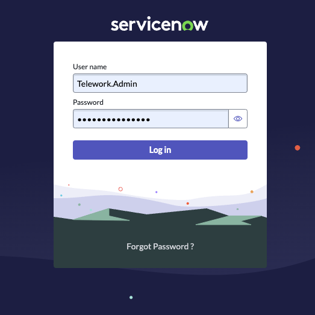
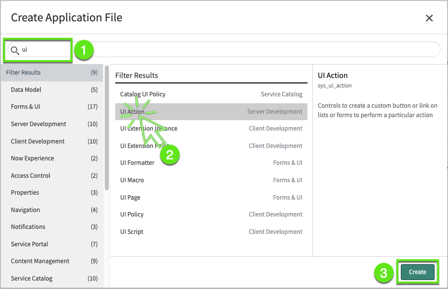

# Restrict Table Choices

...

## ...

1.	Login as Telework.Admin with the credentials (Telework.Admin / AppEngine4ever!)
    

2. Open the app in the developer Studio

3. Create a UI Action record (Click **Create Application File** )
    

4. Notice how we can select any table outside of our current scope

5. We'll change that

