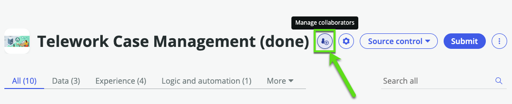

# Collaboration

Amanda is now ready to release the first version of her application, but before she does, she wants to invite collaborators to help her get started on version two.

## Invite Collaborators

1.	Login as Amanda with the credentials (amanda / AppEngine4ever!)
    

2. Open the Telework app in App Engine Studio

3. Click the **Manage collaborators** button
    

4. Invite **Ingrid** as an **Integration_Specialist**, Click Send. 
    

    The invitation is sent.
    

## Accept the Collaborator invitation

In AEMC, app engine admins can monitor and govern applications developed through AES. She can approve or reject collaboration, deployment, and application intake requests.

1. Impersonate **Adam** one of the App Engine Admin
    

2. Go to **App Engine Management Center**, and **click** the collaboration requests number
    

3. **Click** the collaboration requests number for the Telework application.
    

4. Review the details and click **Approve**
    

5. Log out & Log in as **Ingrid** (ingrid/AppEngine4ever!), one of the App Engine Integration specialist
    

6. Open the Telework app in App Engine Studio

7. We can see that Ingrid can edit the Flow but not other records
:::danger
Right now she can't see any record at all
:::
