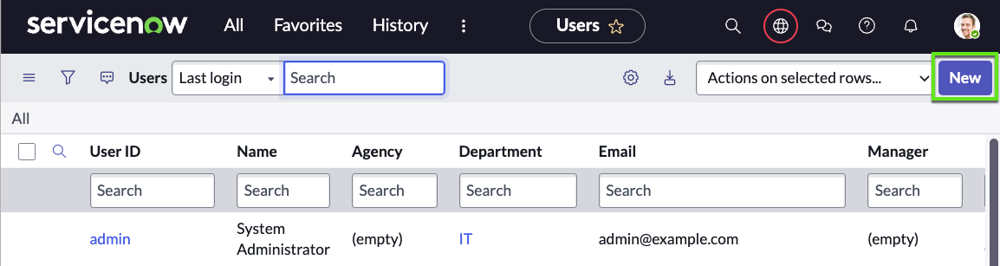
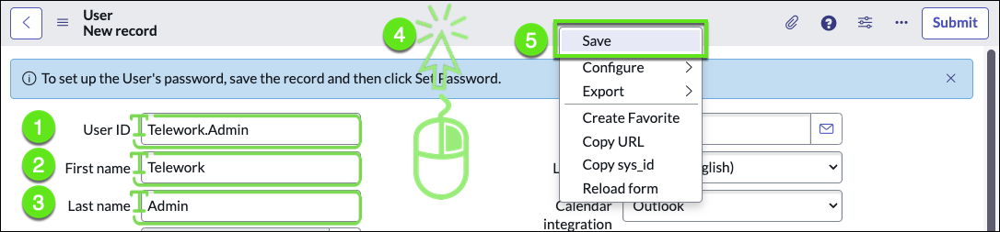
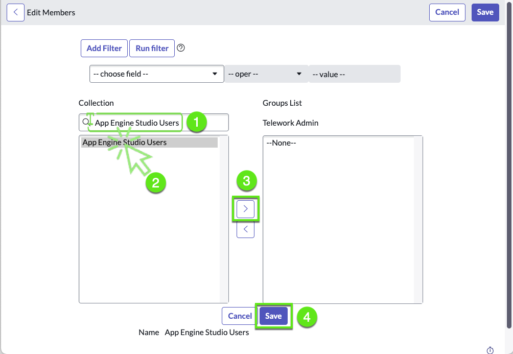

== NEXT = Collaboration

Now let’s join Elsa, one of the App Engine admins in the App Engine Management Center.

Elsa is part of App Engine Admin group, and she receives an new Application request. In AEMC, app engine admins can monitor and govern applications developed through AES. She can approve or reject collaboration, deployment, and application intake requests.

App Engine Management Center on the ServiceNow platform equips you with everything necessary to manage all aspects of low-code app dev. With this all-new App Engine capability, you can control the intake of new applications, streamline developer collaboration, and manage the app deployment process in a manner that is custom tailored to your infrastructure.  

But before we can deploy the app, our manager asked us to make sure the application is secure. The app might contain sensitive data about employees such as personal address that not even ServiceNow administrators should be able to see.

In this exercise, we will learn techniques for securing our application to specific users and roles.

## Marc's Notes 

Talk about:
 1. scope 

 2. the new Access-analyzer

    ServiceNow® Access Analyzer an access evaluation tool that helps to view the permissions of an identity for a resource.

    :::danger  Might need to be installed 
    Check if installed on the cloud lab instance
    :::

## References
* [Restrict access to an application](https://docs.servicenow.com/bundle/vancouver-application-development/page/build/applications/task/enable-application-administration.html)
* [Application access settings](https://docs.servicenow.com/bundle/vancouver-application-development/page/build/applications/concept/c_ApplicationAccessSettings.html)

# OLD STUFF

2. Click on the New button, to create a new user

    

3. Fill the user form with the following values (💡 double-click to select, copy & paste into the form).

    | |Field Name                | Field Value
    |-|--------------------------| --------------
    |➊|User ID    | Telework.Admin
    |➋|First name | Telework
    |➌|Last name  | Admin
    |➍|Right-click in the header 
    |➎|Click on the Submit button.

    

3.  Assign the **App Engine Studio Users** role

    :::tip Best practice
    Rather than adding a role individually to each user, assign a role to a group. Group members have all of the roles assigned to a group.
    :::

    In the **Telework.Admin** user record, scroll down to the related lists, On the **Groups** tab, click Edit then follow the steps below.

    | Steps                                                 | 
    |---------------------------------------|------------------------|
    |➊| Type **App Engine Studio Users**  |
    |➋| Select **App Engine Studio Users**  |
    |➌| Click on the [ › ] button to add the field to the list of selected fields   |
    |➍| Click Save.   |

    

    

