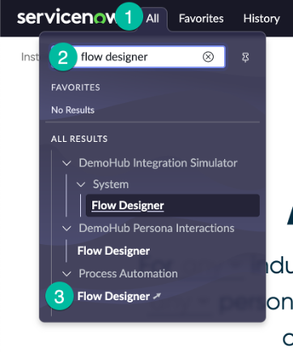
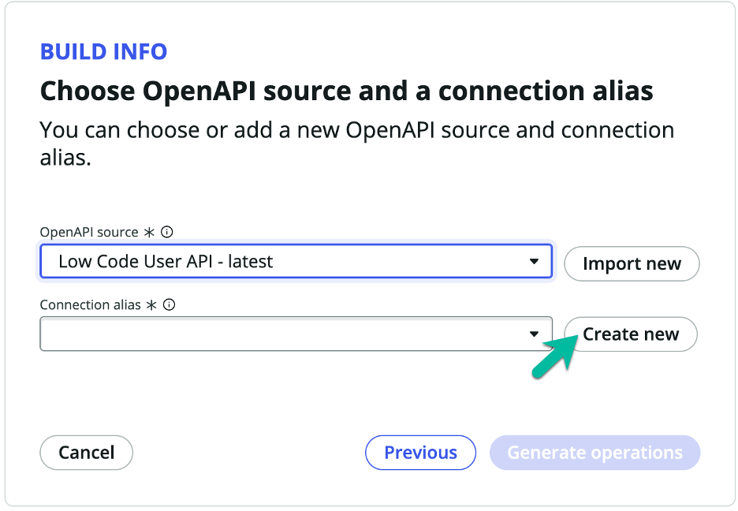
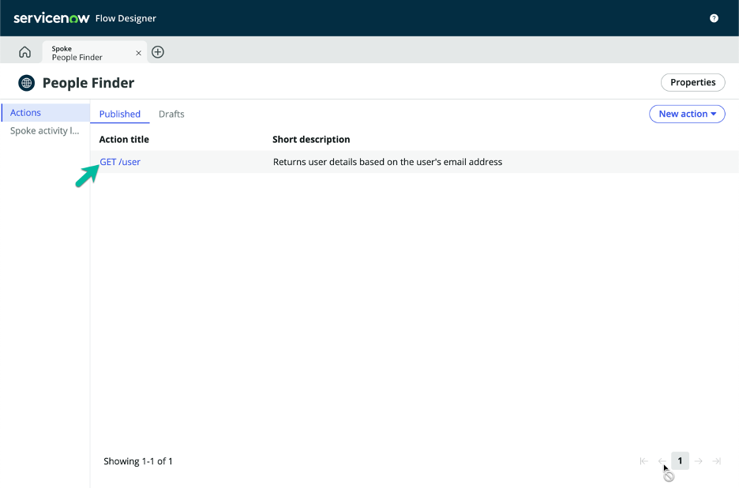
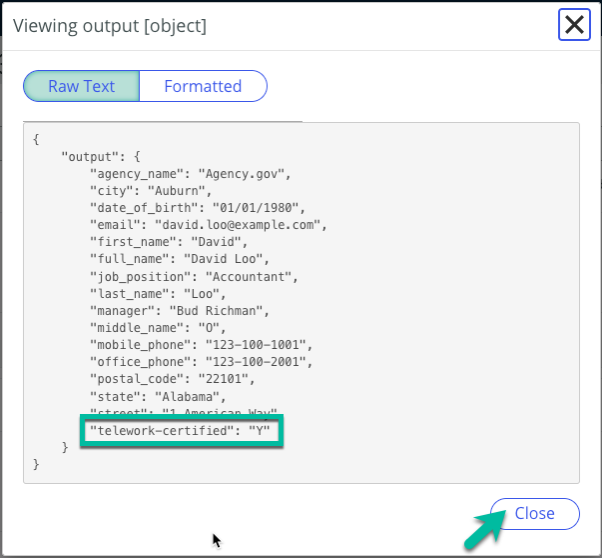
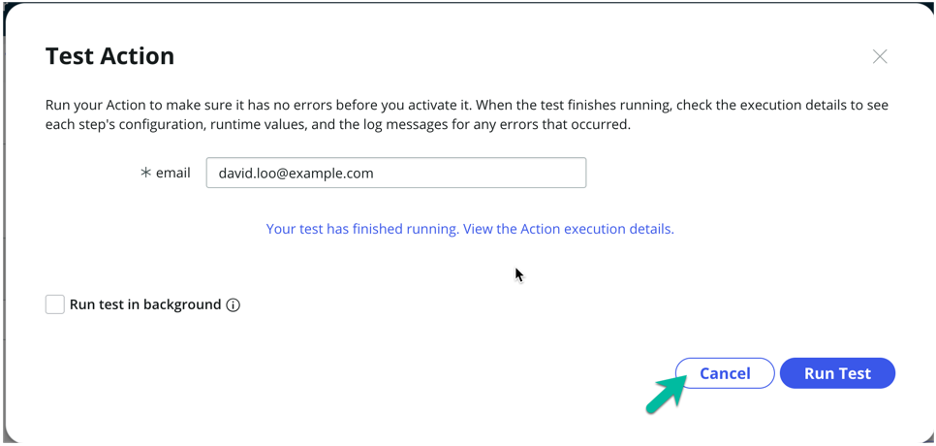

# Create People Finder Spoke

We will create a re-usble integration to the finance department's People Finder Open API, so that we can access this data in our Main flow.

## Open Flow Designer to use Spoke Generator to create the People Finder Integration

1. Go to the tab with the ServiceNow Admin Home Page (your title may be different).  

2. Open Flow Desginer from the All Menu

   1. Click the **All** menu
    
   2. Search for "flow designer" 
    
   3. Click on: Process Automation > Flow Designer

3. Create New Spoke

   1. Click on the Create new button. 

   2. Select "Spoke" from the list.

4. Setup General Information for the Spoke (💡 double-click to select, copy & paste into the form).

   | |Field Name                | Field Value
   |-|--------------------------| --------------
   |➊|Drag and drop the icon in the telework_lab files folder we downloaded earlier | people_finder.png
   |➋|Spoke Name (App scope name will auto-populate) | People Finder
   |➌|Description | API to find people in a remote system
   |➍|Click on the Create and continue button.  

5. Specify how we want to build our Spoke

   1. Select OpenAPI

   2. Click on the Continue button.

6. For the OpenAPI source, click Import new  

7. Fill the user form with the following values (💡 double-click to select, copy & paste into the form).

   | |Field Name                | Field Value
   |-|--------------------------| --------------
   |➊|Import method    | Import from URL
   |➋|OpenAPI URL | https://low-code.guide/api-specs.json
   |➌|Click on the Import button.  

8. For the Connection alias, click on the Create new button.  

9. Fill the user form with the following values (💡 double-click to select, copy & paste into the form).

   | |Field Name                | Field Value
   |-|--------------------------| --------------
   |➊|Connection alias name | People Finder
   |➋|Authentication Configuration Template | API Key Template
   |➌|Click on the Create button.  

10. To continue, click the Generate operations

1. Specify how we want to build our Spoke

   1. Select all actions

   2. Click on the Publish button. 

12. Click the "GET /user" link to view the action we just created  

13. Before we can test and use our spoke, we need to set the Base URL for the Connection. Click to expand the OpenAPI step  

14. Click the plus sign next to the Connection Alias  

15. Set up the HTTPs(s) Connection (💡 double-click to select, copy & paste into the form).

   | |Field Name                | Field Value
   |-|--------------------------| --------------
   |➊|Name | People Finder
   |➋|Connection alias | x_snc_people_finde.People_Finder
   |➌|Connection URL | https://low-code.guide/api
   |➍|Click on the Submit button.  

16. The Base URL should now be populated. Click on the Test button.  

17. Test the action with David Loo's email (💡 double-click to select, copy & paste into the form).

   | |Field Name                | Field Value
   |-|--------------------------| --------------
   |➊|email | david.loo@example.com
   |➋|Click on the Run Test button.  

18. When the test completes, click the link to view the execution results  

19. Click on the RUNTIME VALUE link  

20. Review the JSON results. Note the "telework-certified" value. Click the Close button to continue.  

21. Close the Execution Details tab  

22. Close the Test Action model by clicking the Cancel button.  

23. Click on the Save button to save the GET /user spoke action.  

24. Click the Publish button to publish the spoke, so it will be available to call from our Main Flow.  

25. Confirm publication of the action by clicking on the Publish button.   

