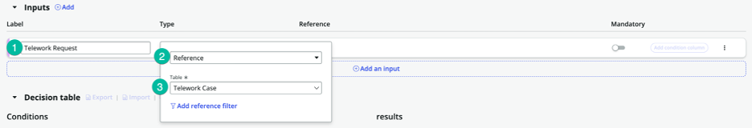
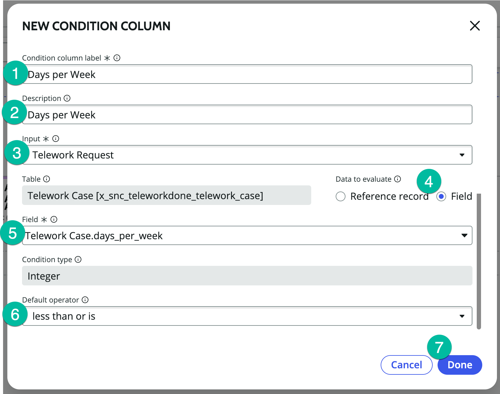
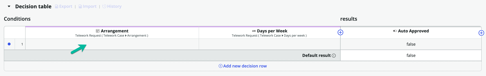
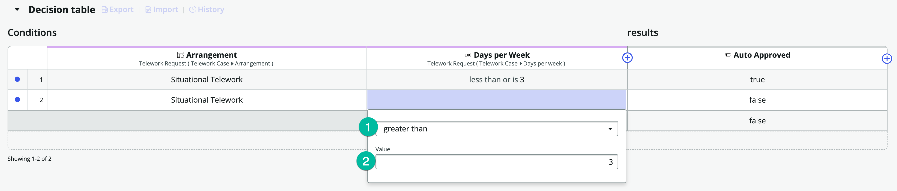
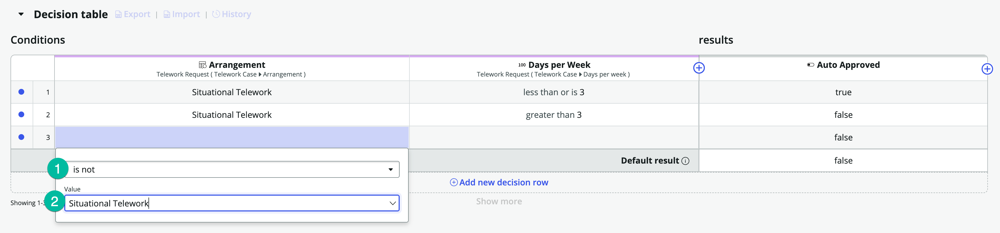
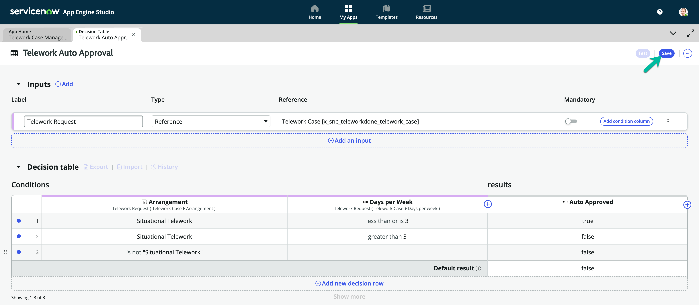

# Create Decision Table for Auto Approval Conditions

We will create a decision table to assess the arrangement type and numbers of days and return an auto-approval result that we can access in our Main flow.

## Return to App Engine Studio to Build the Decision Table

1. Go to the tab with the App Engine Studio.  

2. Click on "Logic and Automation (1)".  

3. Click the + Add button.  

4. Select the Decision tile.  

5. Click the Begin button.  

6. Set up your decision table.

   | |Field Name                | Field Value
   |-|--------------------------| --------------
   |➊|Name | Telework Auto Approval
   |➋|Accessible from | This application scope only
   |➌|Click on the Continue button.  

7. Click the Edit Decision Table button.  

8. Click the "⨁ Add" button next to Inputs.  

9. Populate the following:

   | |Field Name                | Field Value
   |-|--------------------------| --------------
   |➊|Label | Arrangement
   |➋|Type | Reference
   |➌|Table | Arrangement  

10. Click the "⨁ Add" button next to Inputs again.  

11. Populate the following:

   | |Field Name                | Field Value
   |-|--------------------------| --------------
   |➊|Label | Number of Days
   |➋|Type | Integer  

12.  In the Decision Table section, click "⨁ Add condition column".  

13. Populate the NEW CONDITION COLUMN form.

   | |Field Name                | Field Value
   |-|--------------------------| --------------
   |➊|Condition Column Label | Arrangement
   |➋|Description | Type of Arrangement
   |❸|Input | Arrangement
   |❹|Data to Evaluate | Reference Record
   |❺|Default operator | is
   |❻|Click on the Done button.  

1. Add another condition column.

   1. Click the plus button ⨁ next the condition we just created.

   2. Select "Add condition column".  

15. Populate the NEW CONDITION COLUMN form.

   | |Field Name                | Field Value
   |-|--------------------------| --------------
   |➊|Condition Column Label | Number of Days
   |➋|Description | Number of Days
   |❸|Input | Number of Days
   |❹|Default operator | less than or is
   |❺|Click on the Done button.  

16. In the results column, click "⨁ Add result column".  

17. Populate the NEW RESULT COLUMN form.

   | |Field Name                | Field Value
   |-|--------------------------| --------------
   |➊|Result Column Label | Auto Approved
   |➋|Description | Is telework auto approved
   |❸|Result Type | True/False
   |❹|Click on the Done button.  

18. Let's define our first decision row, by clicking into row 1.  

19. Populate the Arrangement Condition.

   | |Field Name                | Field Value
   |-|--------------------------| --------------
   |➊|Operator | is
   |➋|Value | Situational Telework  

20. Populate the Number of Days Condition.

   | |Field Name                | Field Value
   |-|--------------------------| --------------
   |➊|Operator | less than or is
   |➋|Value | 3
   |❸|Click on the value in the Auto Approved column (currently false).  

2. Change the result for Auto Approval to true.

   1. Switch the reult to true.

   2. Click the "OK" button to continue.  

22. Let's add our next decicion row by clicking "⨁ Add new deicion row".  

23. Populate the Arrangement Condition.

   | |Field Name                | Field Value
   |-|--------------------------| --------------
   |➊|Operator | is
   |➋|Value | Situational Telework  

24. Populate the Number of Days Condition.

   | |Field Name                | Field Value
   |-|--------------------------| --------------
   |➊|Operator | greater than
   |➋|Value | 3  

25. Let's add another decicion row by clicking "⨁ Add new deicion row".  

26. Populate the Arrangement Condition.

   | |Field Name                | Field Value
   |-|--------------------------| --------------
   |➊|Operator | is not
   |➋|Value | Situational Telework  

27. Let's save our work by clikcing the Save button.  

## Bonus

Test diffent scenarios before modifying the Main Flow.

