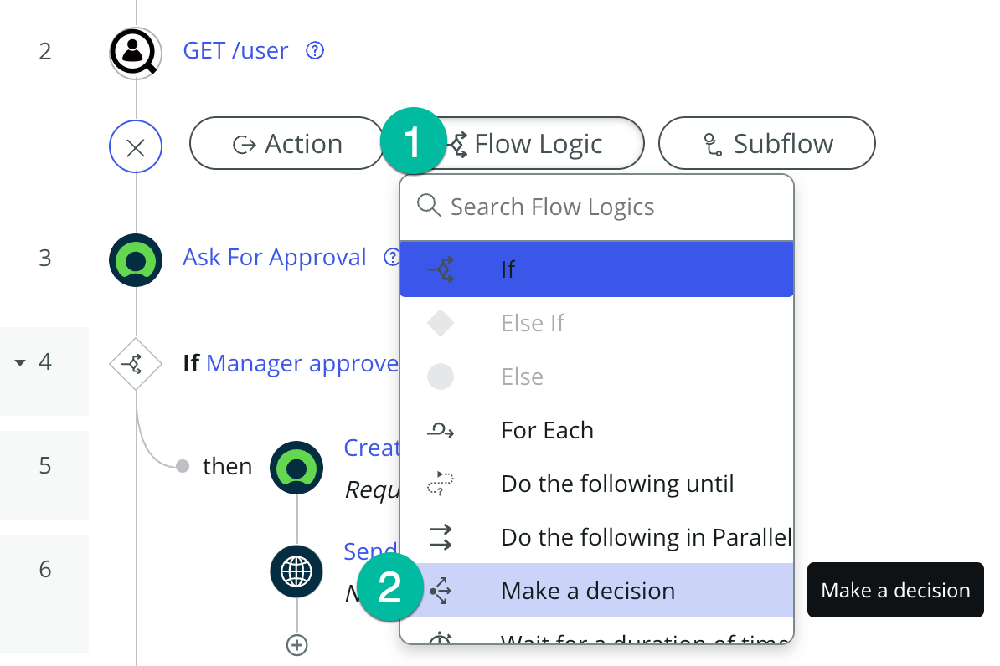
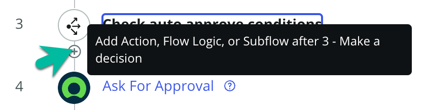
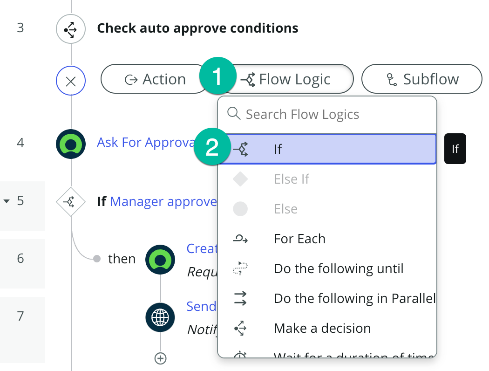

# Modify the Telework Case Approval Flow

Now that we have created the People Finder Spoke and our Auto Approval Decision Table, let's modify the Telework Case Approval Flow to allow auto-approval for those that were pre-certified or have requested 3 days or less for Situational Telework.

## Open the Telework Case Approval Flow and add our changes

1. Return to the App Home tab in App Engine Studio.  

2. Open the Telework Case Approval flow by clicking on the row under Logic and Automation.  

3. Toggle the Flow Designer view to Tree View.  

4. First, we want to add a Flow Variable to store the status of auto approval.

   >1. Click the ... button next to the Save button on the top-left of your screen.

   >2. Select "Flow Variables" from the drop-down.  

5. Click the plus sign ⨁ to add a variable.  

6. Set up the flow variable.

   | |Field Name                | Field Value
   |-|--------------------------| --------------
   |➊|Label |Approved
   |➋|Name |approved
   |❸|Type | True/False
   |❹|Click on the 🆇 button to close.  

7. Before our first step, we want to call the People Finder Spoke. Hover above the "Ask for Approval" step and click the plus sign ⨁.  

8. Add the People Finder Spoke

   >1. Select "Action" as the step type.

   >2. Search for "people finder".

   >3. Select the "GET /user" action.  

9. Click the data pill picker for email.  

10. Dot-walk to the email address of the person that opened the request.

   >1. Click "Trigger - Record Ceated"

   >2. Click the blue arrow next to the "Telework Case" record to drill down.

   >3. Click the blue arrow next to "Opened by".

   >4. Click on "Email" to set the value.  

11. Click the Done button.  

12. Next, we want to use the decision table we built. Hover in-between steps 2 and 3 and click the plus sign ⨁.  

13. Add the Telework Auto Approval Decision Table.

   >1. Select "Flow Logic" as the step type.

   >2. Select "Make a decision" from the list.  

14. Setup the decision step.

   | |Field Name                | Field Value
   |-|--------------------------| --------------
   |➊|Decision Label |Check auto approve conditions
   |➋|Decision Table |Telework Auto Approval
   |❸|Execution | First decision that matches
   |❹|Use Branches | Un-check
   |❺|Telework Request | Drag and drop Telework Case Record data pill   
   |❻|Click on the Done button.  

15. Now, we have to check if either auto-approve condition has been met. Hover in-between steps 3 and 4 and click the plus sign ⨁.  

16. Add the if condition.

   >1. Select "Flow Logic" as the step type.

   >2. Select "If" from the list.  

17. Setup the if condition.

   | |Field Name                | Field Value
   |-|--------------------------| --------------
   |➊|Condition Label |If auto approve conditions are met
   |➋|Condition 1 |Dot-walk (see step 18 below)
   |❸|Operator | is
   |❹|Value | Y
   |❺|Click on the or button.
   |❻|Condition 2 | Dot-walk (see step 19 below)
   |❼|Operator | is
   |❽|Value |True
   |❾|Click on the Done button.  

18. Dot-walk Condition 1 (step 2 above)

   >1. Click "2 - GET /User"

   >2. Click the blue arrow next to the "output" object to drill down.

   >3. Click on "telework-certified" to set the value.  

19. Dot-walk Condition 2 (step 2 above)

   >1. Click "3 - Make A Decision"

   >2. Click the blue arrow next to the "Decision Table Multiple Result Record" record to drill down.

   >3. Click the blue arrow next to the "Result elements" glide_var to drill down.

   >4. Click on "Auto Approved" to set the value.  

20. Let's set the Approved value to true.

   >1. Select "Flow Logic" as the step type.

   >2. Select "Set Flow Variables" from the list.  

21.  To add a flow variable to set, click the plus sign ⨁.  

22. Set the Approved flow variable to true.

   >1. Select "Approved | True/False" from the drop-down.

   >2. Check the data box for true.

   >3. Click the Done button.  

23. Now let's add the flow logic for when our condition is not met. Hover above step 6 and click the plus sign ⨁.  

24. Add the else condition.

   >1. Select "Flow Logic" as the step type.

   >2. Select "Else" from the list.  

25. Move the ask for approval action.

   >1. Hover next to step 7 until you see and cross-shape and the text appears "Drag to reorder steps".

   >2. Drag step 7 onto the plus sign ⨁ under step 6.

26. Move the if condition for then manager approves.

   >1. Hover next to step 8 until you see and cross-shape and the text appears "Drag to reorder steps".

   >2. Drag step 8 onto the plus sign ⨁ under step 7.

27. Now let's set the flow variable when the manager approves. Hover above step 9 and click the plus sign ⨁.

28. Set the Approval flow variable to true.

   >1. Select "Flow Logic" as the action type.

   >2. Select "Set Flow Variables" from the list.  

29. To add a flow variable to set, click the plus sign ⨁.  

30. Set the Approved flow variable to true.

   >1. Drag and drop the Approved flow variable from the data pills on the right side of the screen into the Name field.

   >2. Check the data box for true.

   >3. Click the Done button.  

31. Let's return to our mainline logic and add a new step.  

32. Add the if condition.

   >1. Select "Flow Logic" as the step type.

   >2. Select "If" from the list.  

33. Setup the if condition.

   | |Field Name                | Field Value
   |-|--------------------------| --------------
   |➊|Condition Label | If all approve conditions are met
   |➋|Condition 1 | Drag and drop Approved data pill
   |❸|Operator | is
   |❹|Value | True
   |❺|Click on the Done button.  

34. Delete the step placeholder under step 12.

35. Move the Create Task step.

   >1. Hover next to step 10 until you see and cross-shape and the text appears "Drag to reorder steps".

   >2. Drag step 10 onto the plus sign ⨁ under the then condition in step 12.

36. Move the Send Email step.

   >1. Hover next to the new step 10 until you see and cross-shape and the text appears "Drag to reorder steps".

   >2. Drag step 10 onto the plus sign ⨁ under the new step 12 (Create Task).

39. Save the changes to the Main flow by clicking the Save button.  

40. Activate the Main flow by clicking the Activate button.  

## Bonus

Do you remeber hot to test your flow from the previous lab? Test your work using what you've learned!

