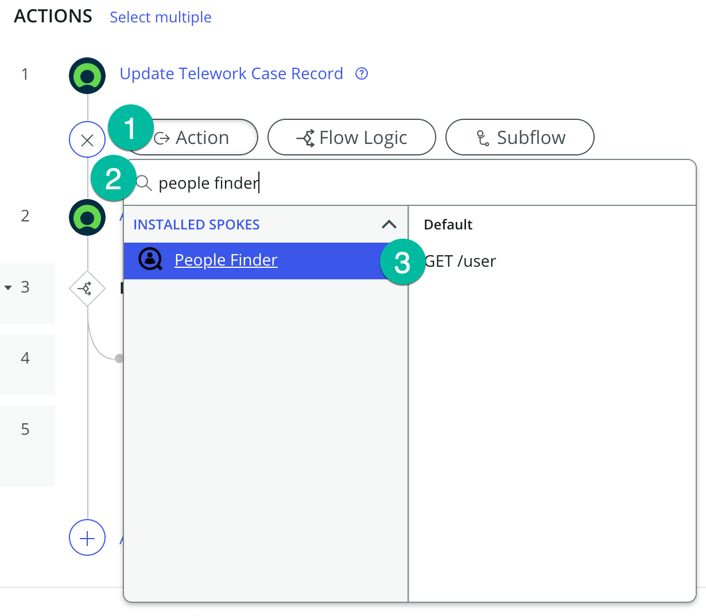
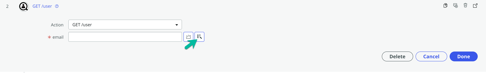
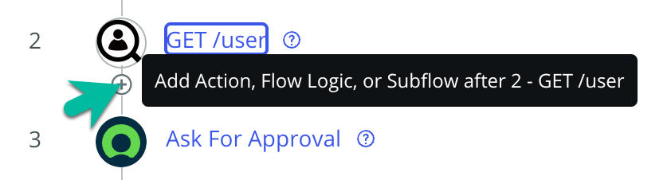

# Modify the Telework Case Main Flow

Now that we have created the People Finder Spoke and our Auto Approval Decision Table, let's modify the Telework Case Main Flow to allow auto-approval for those that were pre-certified or have requested 3 days or less for Situational Telework.

## Open the Main Flow and add our changes

1. Return to the App Home tab in App Engine Studio.

2. Open the Main flow by clicking on the row under Logic and Automation.

3. Toggle the Flow Designer view to Process View.

4. First, we want to add a Flow Variable to store the status of auto approval.

    1. Click the ... button next to the Save button on the top-left of your screen.

    2. Select "Flow Variables" from the drop-down.

5. Click the plus sign ⨁ to add a variable.

6. Set up the flow variable.

    | |Field Name                | Field Value
    |-|--------------------------| --------------
    |➊|Label |Approved
    |➋|Name |approved
    |❸|Type | True/False
    |❹|Click on the 🆇 button to close.

7. Before our first step, we want to call the People Finder Spoke. Hover above the "Ask for Approval" step, and click the plus sign ⨁.

8. Add the People Finder Spoke

    1. Select Action as the step type.

    2. Search for "people finder".

    3. Select the "GET /user" action.

9. 

10.

11.

12.

13.

14.

15.

