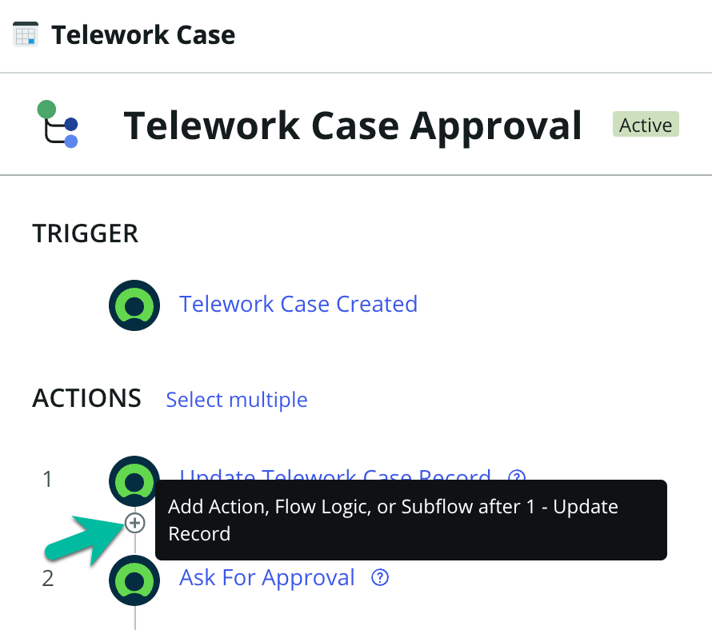
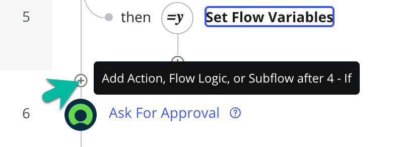
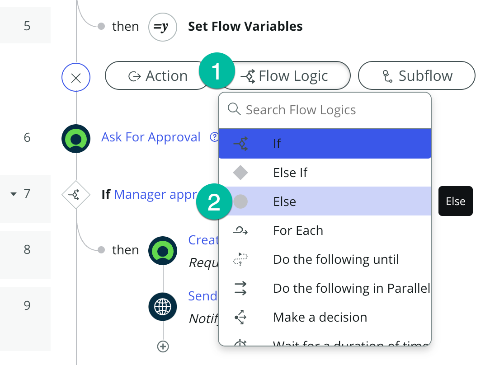
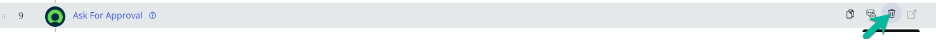
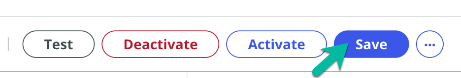

# Modify the Telework Case Main Flow

Now that we have created the People Finder Spoke and our Auto Approval Decision Table, let's modify the Telework Case Main Flow to allow auto-approval for those that were pre-certified or have requested 3 days or less for Situational Telework.

## Open the Main Flow and add our changes

1. Return to the App Home tab in App Engine Studio.  

2. Open the Main flow by clicking on the row under Logic and Automation.  

3. Toggle the Flow Designer view to Process View.  

4. First, we want to add a Flow Variable to store the status of auto approval.

   1. Click the ... button next to the Save button on the top-left of your screen.

   2. Select "Flow Variables" from the drop-down.  

5. Click the plus sign ⨁ to add a variable.  

6. Set up the flow variable.

   | |Field Name                | Field Value
   |-|--------------------------| --------------
   |➊|Label |Approved
   |➋|Name |approved
   |❸|Type | True/False
   |❹|Click on the 🆇 button to close.  

7. Before our first step, we want to call the People Finder Spoke. Hover above the "Ask for Approval" step and click the plus sign ⨁.  

8. Add the People Finder Spoke

   1. Select "Action" as the step type.
   
   2. Search for "people finder".
   
   3. Select the "GET /user" action.  

9. Click the data pill picker for email.  

1. Dot-walk to the email address of the person that opened the request.

   1. Click "Trigger - Record Ceated"

   2. Click the blue arrow next to the "Telework Case" record to drill down.

   3. Click the blue arrow next to "Opened by".

   4. Click on "Email" to set the value.  

11. Click the Done button.  

12. Next, we want to use the decision table we built. Hover in-between steps 1 and 2 and click the plus sign ⨁.  

1. Add the Telework Auto Approval Decision Table.

   1. Select "Flow Logic" as the step type.

   2. Select "Make a decision" from the list.  

14. Setup the decision step.

   | |Field Name                | Field Value
   |-|--------------------------| --------------
   |➊|Decision Label |Check auto approve conditions
   |➋|Decision Table |Telework Auto Approval
   |❸|Execution | First decision that matches
   |❹|Use Branches | Un-check
   |❺|Arrangement | Dot-walk (see step 15 below)
   |❻|Number of Days | Dot-walk (see step 16 below)
   |❼|Click on the Done button.  

1. Dot-walk Arrangement (step 5 above)

   1. Click "Trigger - Record Ceated"

   2. Click the blue arrow next to the "Telework Case" record to drill down.

   3. Click on "Arrangement" to set the value.  

1. Dot-walk Number of Days (step 6 above)

   1. Click "Trigger - Record Ceated"

   2. Click the blue arrow next to the "Telework Case" record to drill down.

   3. Click on "Days per week" to set the value.  

17. Now, we have to check if either auto-approve condition has been met. Hover in-between steps 2 and 3 and click the plus sign ⨁.  

1. Add the if condition.

   1. Select "Flow Logic" as the step type.

   2. Select "If" from the list.  

19. Setup the if condition.

   | |Field Name                | Field Value
   |-|--------------------------| --------------
   |➊|Condition Label |If auto approve conditions are met
   |➋|Condition 1 |Dot-walk (see step 20 below)
   |❸|Operator | is
   |❹|Value | Y
   |❺|Click on the or button.
   |❻|Condition 2 | Dot-walk (see step 21 below)
   |❼|Operator | is
   |❽|Value |True
   |❾|Click on the Done button.  

2. Dot-walk Condition 1 (step 2 above)

   1. Click "1 - GET /User"

   2. Click the blue arrow next to the "output" object to drill down.

   3. Click on "telework-certified" to set the value.  

3. Dot-walk Condition 2 (step 2 above)

   1. Click "2 - Make A Decision"

   2. Click the blue arrow next to the "Decision Table Multiple Result Record" record to drill down.

   3. Click the blue arrow next to the "Result elements" glide_var to drill down.

   4. Click on "Auto Approved" to set the value.  

2. Let's set the Approved value to true.

   1. Select "Flow Logic" as the step type.

   2. Select "Set Flow Variables" from the list.  

23.  To add a flow variable to set, click the plus sign ⨁.  

4. Set the Approved flow variable to true.

   1. Drag and drop the Approved flow variable from the data pills on the right side of the screen into the Name field.

   2. Check the data box for true.

   3. Click the Done button.  

25. Now let's the flow logic for when our condition is not met. Hover above step 5 and click the plus sign ⨁.  

6. Add the else condition.

   1. Select "Flow Logic" as the step type.

   2. Select "Else" from the list.  

7. Add the ask for approval action.

   1. Select "Action" as the step type.

   2. Select "ServiceNow Core" > "Ask for Approval".  

8. Setup the approval step.

   1. Drag and drop the Telework Case Record from the data pills on the right-side of your screen.

   2. Set the Approval When field to "Anyone Approves.

   3. Dot-walk to the manager of the person that opened the telework request (see step 29 below).

   4. Click the Done button.  

9. Dot-walk to the manager (step 3 above).  

   1. Click "Trigger - Record Ceated".

   2. Click the blue arrow next to the "Telework Case" record to drill down.

   3. Click the blue arrow next to "Opened by".

   4. Click on "Manager" to set the value.  

3. Add the if condition for then manager approves.

   1. Select "Flow Logic" as the step type.

   2. Select "If" from the list.  

1. Setup the if condition to check for manager approval.

   1. Drag and drop Approval State from the data pills on the right-side of your screen.

   2. Set the value to "Approved".

   3. Click the Done button.  

2. Set the Approval flow variable to true.

   1. Select "Flow Logic" as the action type.

   2. Select "Set Flow Variables" from the list.  

33. To add a flow variable to set, click the plus sign ⨁.  

4. Set the Approved flow variable to true.

   1. Drag and drop the Approved flow variable from the data pills on the right side of the screen into the Name field.

   2. Check the data box for true.

   3. Click the Done button.  

35. We no longer need our old Ask for Approval action, so go to line 9 and click the delete icon.  

36. Confirm that we want to delete the action by clicking Delete.  

37. To modify the if condition to check for approval, click on line 9 to expand.  

8. Modify the approval condition.

   1. Change the condition label to: if approval conditions met

   2. Clear Condition 1.

   3. Drag and drop the Approved flow variable from the data pills on the right side of the screen into the Condition 1 field.

   4. Set value to "True".

   5. Click the Done button.  

39. Save the changes to the Main flow by clicking the Save button.  

40. Activate the Main flow by clicking the Activate button.  

## Bonus

Do you remeber hot to test your flow from the previous lab? Test your work using what you've learned!

