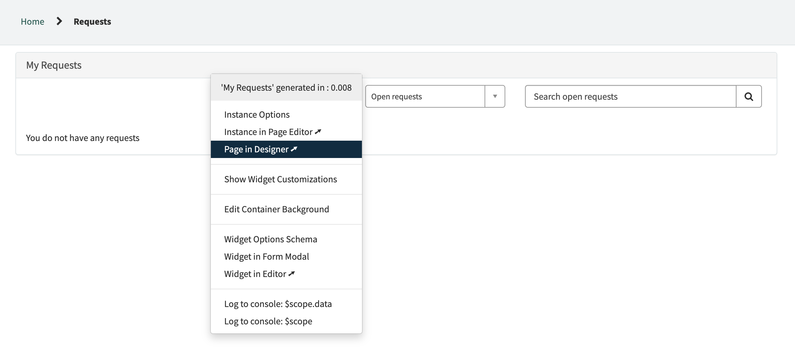
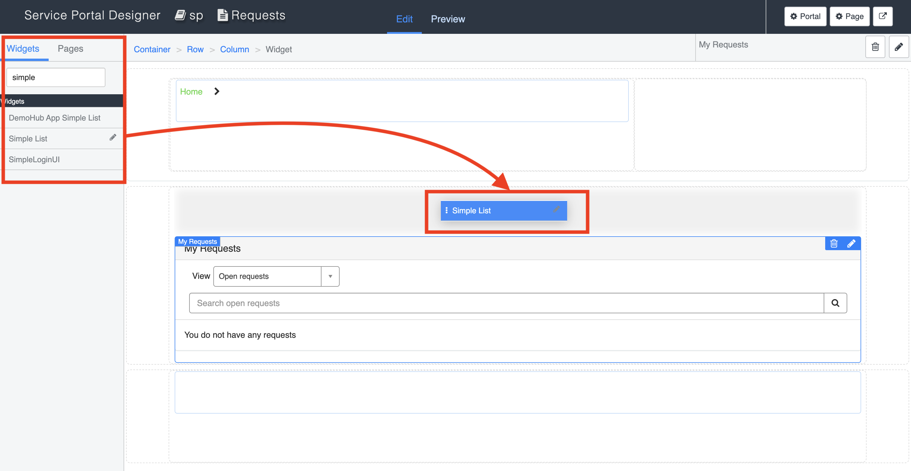
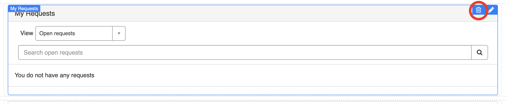
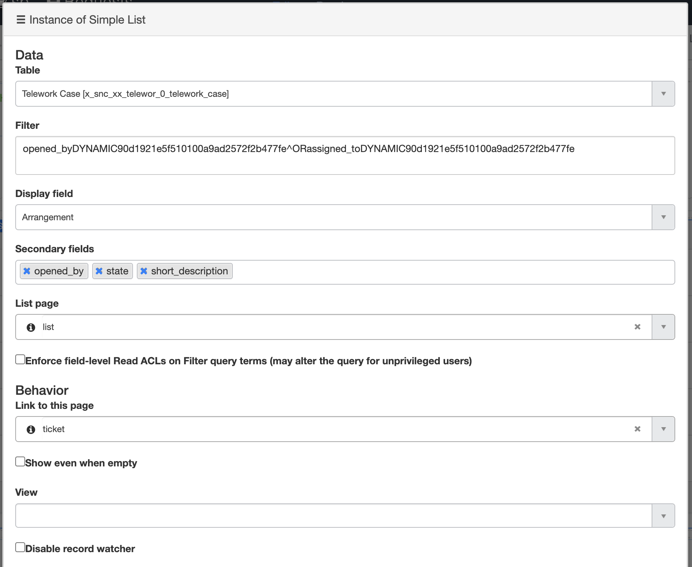
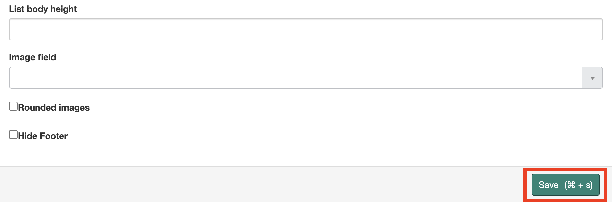
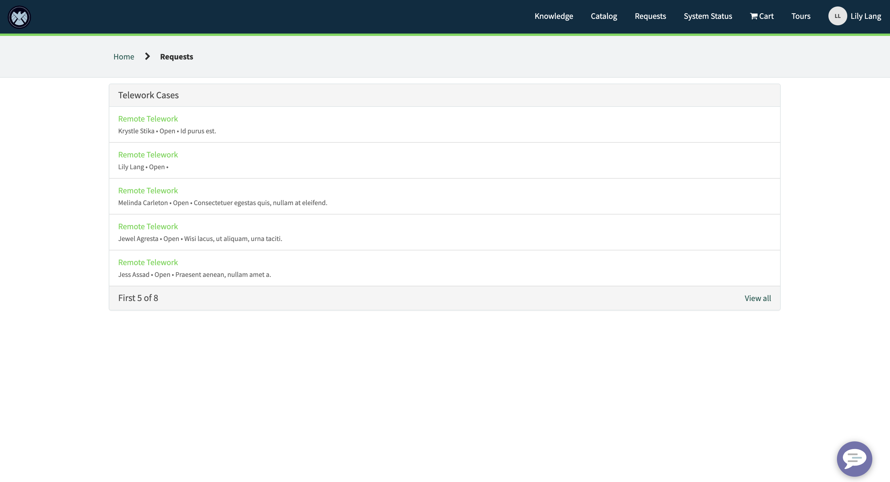
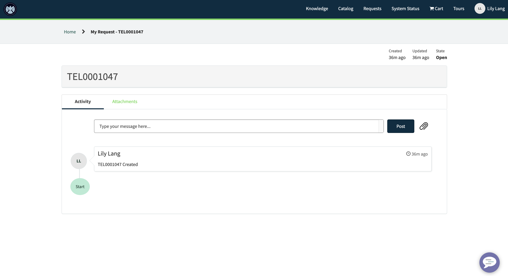

# Portal: Add a Widget
In this exercise, we will learn how to configure an existing page and widget to give users access to the list of Telework Case requests that they've submitted or are assigned to them.  


## Steps  


1. From the service portal home, select **Requests** in the navbar at the top right of the screen  
  


2. **Ctrl + Right Click** on the “My Requests” widget and select **Page in Designer**  
  


3. Find the **Simple List** widget in the list on the left of the page and **drag/drop** it above the “My Requests” widget
  


4. Remove the My Requests widget from the page by clicking the **trash can icon** on the top right of the widget  
  


5. Configure the **widget options** for the Simple List by selecting the pencil icon on the top right of the widget  
  


6. Set the following values:  

    **Table:** Telework Case  
    **Display Field:** Arrangement  
    **Secondary fields:** Opened by, State, Short Description  
    **List page:** list   
    **Link to this page:** ticket  
    **Filter:**  *This will show all Telework Cases opened by or assigned to the logged in user*  
    ```
    opened_byDYNAMIC90d1921e5f510100a9ad2572f2b477fe^ORassigned_toDYNAMIC90d1921e5f510100a9ad2572f2b477fe
    ```      
      


7. **Save** your widget options (you may need to scroll down)  
  


8. Refresh the tab where your portal **request page** is open to see your new widget  
  


9. Click on any record to navigate to the ticket page  
  


# Notes 

 - 
 