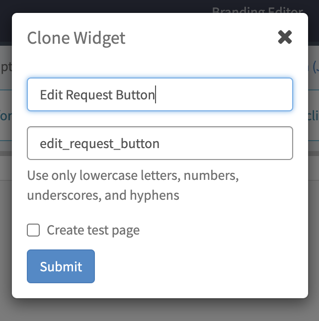

# Portal: Create a Widget
In this exercise we will learn...  


## Steps  


1. To access the Widget Editor, navigate to **Service Portal** > **Service Portal Configuration**, then click **Widget Editor**  
  


2. Select **link-button** under Edit an existing widget  
  


3. Select **Clone “link-button”** from the additional options from the menu in the top right  
  


4. Name your widget **Edit Request Button**.  The Widget ID will auto-populate  
  


5. **Submit**  


6. Select your new widget in the top left of the widget editor  
  


7. Replace the HTML Template and Server Script with the following code:  

    **HTML:**  
    ```
    <a href="?id=form&table=YOUR_TABLE&sys_id={{data.sys_id}}&view=sp" class="btn btn-{{options.color}} m-b" ng-if="data.socialQAEnabled && data.canReadKnowledgeBase">{{data.buttonMsg}}</a>
    ```

    **Server Script:**  
    ```
    (function($sp) {
    var sys_id = $sp.getParameter('sys_id');
    data.sys_id = sys_id; 

    data.buttonMsg = gs.getMessage(options.button_text || "Click Here");
    data.socialQAEnabled = true;
    data.canReadKnowledgeBase = true;
    })($sp);
    ```  

     


8. **Save** using the blue button at the top right of the widget editor  


9. Replace **YOUR_TABLE** in the HTML template with the name of your table  
    
    - In the platform view, navigate to **System Definition** > **Tables**  
      
    - In the search bar below "Label" search for: *telework  
      
    - Hit **Enter/Return** on your keyboard  
    - Open your **Telework Case** table by clicking on the label  
    - Copy the value in the **Name** field  
      
    - Go back to the browser tab where the widget editor is open and replace **YOUR_TABLE** with the copied value  
      
    - **Save**  


10. Go back to the platform view and change your scope to **Service Portal – Standard Ticket** using the scope picker on the navbar  
  


11. Navigate back to the Service Portal request page and click on any telework case to take you to the **ticket page**  
  


12. **Ctrl + Right click** on the widget and select **Page in Designer**  
  


13. Drag and drop your Edit Request Button widget to the top right section of the page  
  


14. Configure the options for your widget and set the Contents of button to **Edit**  
  


15. **Save**  


16. Navigate back to the tab where your ticket page is open and **reload** the page to see your new button  
  


17. Use the Edit button to see your ticket in an editable form page  
  


# Notes 

 - 
 