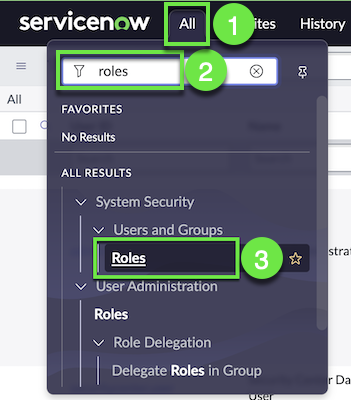
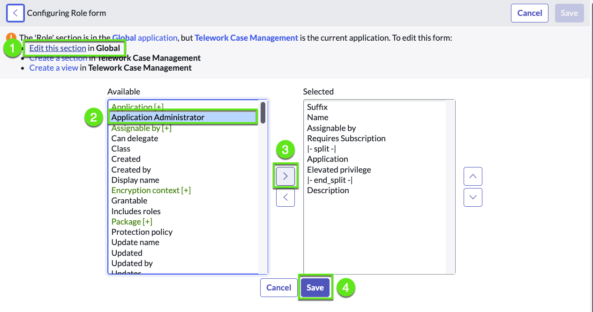

# Restrict access from Admins

We will secure the app so that even other administrators cannot access the app and its data.

## Update the admin role for our app as an Application Administrator

1. Go to the roles list

    1. Click the **All** menu
    
    2. Search for "roles" 
    
    3. click on: System Security > Users and Groups > Roles or User Administration > Roles.

    

2. Open the role for the application-specific admin role.

    1. Click to show the filter

    2. For the field, select **Application**

    3. For the value, start typing **"Tele"** and then select the "Telework application".

    4. Open the default admin record
    
    

3. Configure the form to add the **Application Administrator** field.

    1. Right-click in the header to show the record menu

    2. Select Configure > **Form layout**

    

    3. Add the field **Application Administrator** to the role form

        1. Click **Edit this section in Global**

        2. Select the field **Application Administrator** 

        3. Click on the **[ › ]** button to add the field to the list of selected fields

        4. Click Save at the bottom. 

        

4. Set the Telework Admin role to an Application Administrator

    1. In the role record, select the Application Administrator check box,
    
    2. then Click Update.

    

## Create a new user with the admin role for our app 

So far we have developed logged in as the admin user. We'll create a user for our application, assign them the "App Engine Studio Users" role and the role we just created for the Telework app.

1. Go the users list

    1. Click the **All** menu
    
    2. Search for "Users"

    3. Click on **Users**

    

2. Click on the New button, to create a new user

    

3. Fill the user form with the following values (💡 double-click to select, copy & paste into the form).

    | |Field Name                | Field Value
    |-|--------------------------| --------------
    |➊|User ID    | Telework.Admin
    |➋|First name | Telework
    |➌|Last name  | Admin
    |➍|Click on the Submit button.

    

4. Assign the **App Engine Studio Users** role

    :::tip Best practice
    Rather than adding a role individually to each user, assign a role to a group. Group members have all of the roles assigned to a group.
    :::

    1. sd

    hello

5. sdf

hello

    

