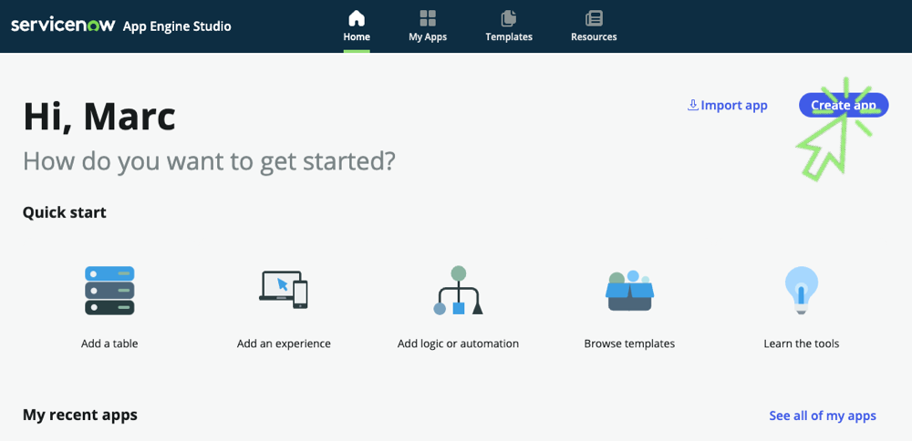
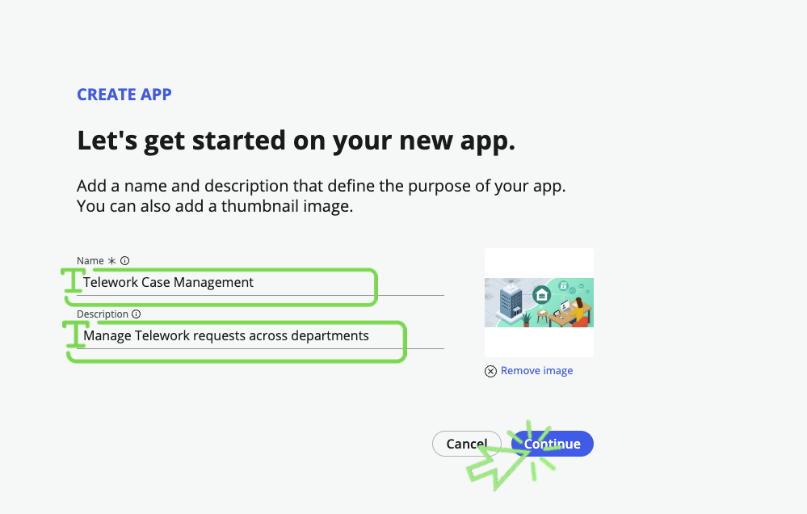
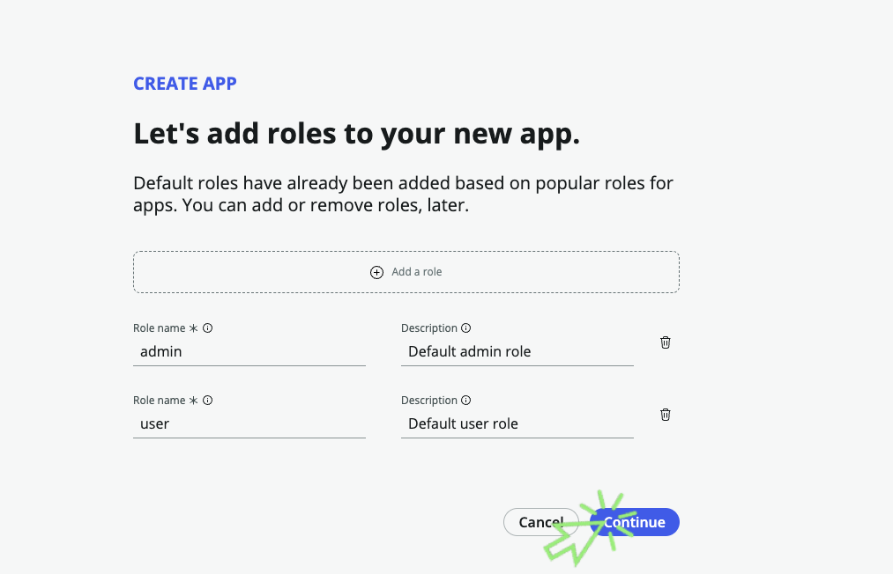
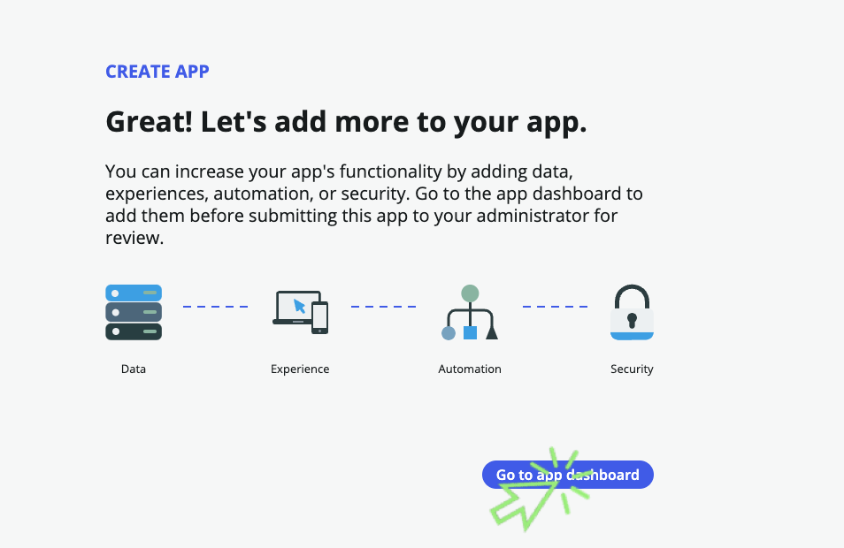

1. Click on the Create App button.

2. Configure the app.
    1. _Name_: **Telework Case Management**
    2. _Description_: **Manage Telework requests across departments**
    :::note
    Your initials will prevent you from using the same app name as another lab attendee.
    :::

3. **Optional** – Add an image to the application. Images can be a great way to personalize and provide character for your application.
    1. Click the app logo or browse to upload tile.
    2. Browse to and select the  **telework App Logo.png** file you downloaded.

4. The screen should look like below (note in this case we used ER as initials).

5. Click on the Continue button.

6. In the __Let's add roles__ screen, Click on the Continue button.

7. The app will be created. Once it is finished, Click on the Go to app dashboard button.
