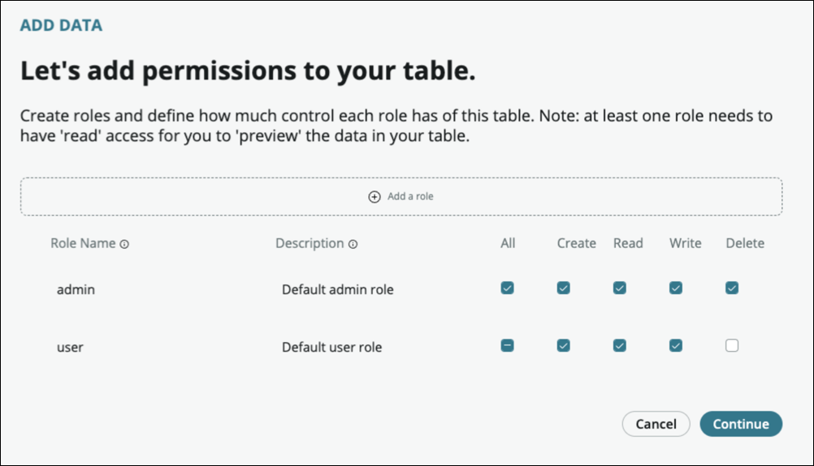
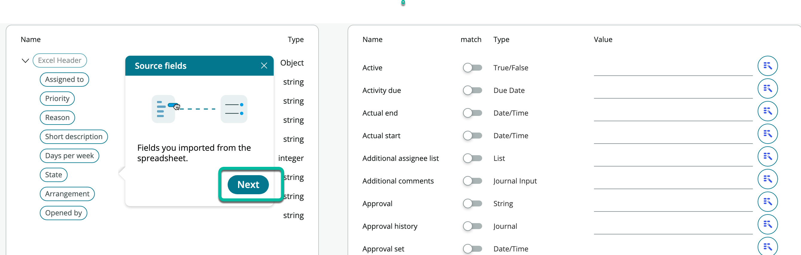
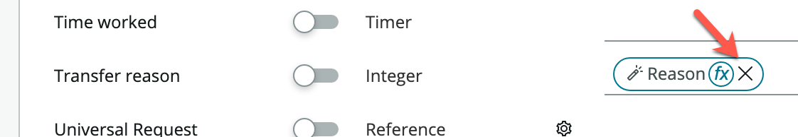
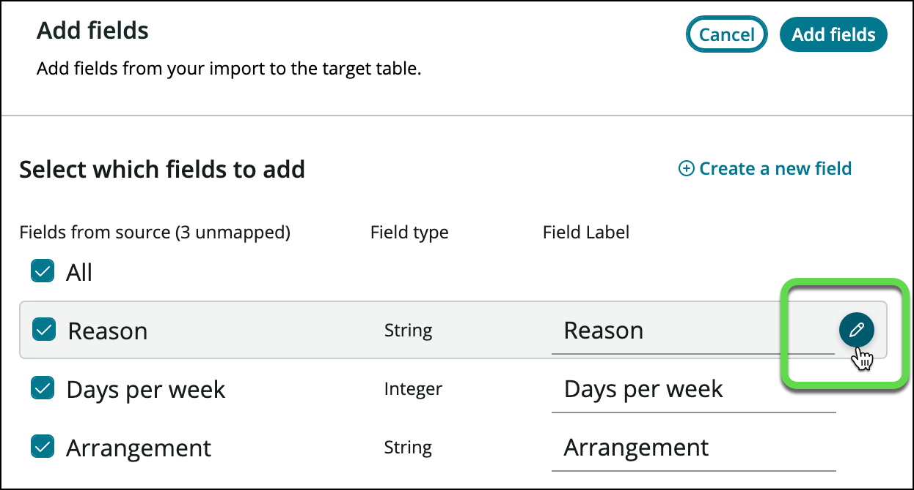
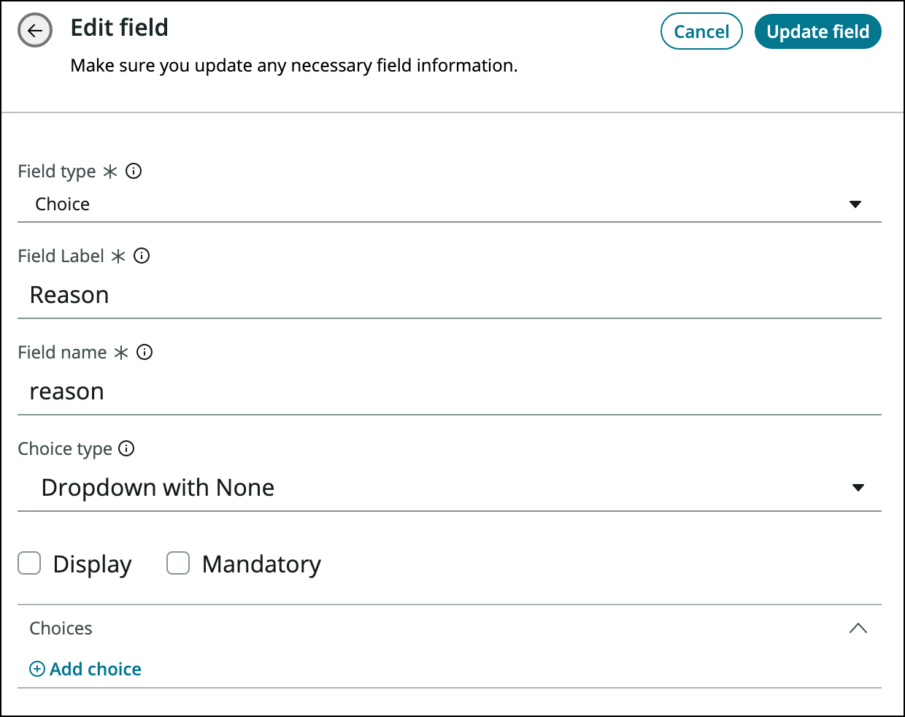
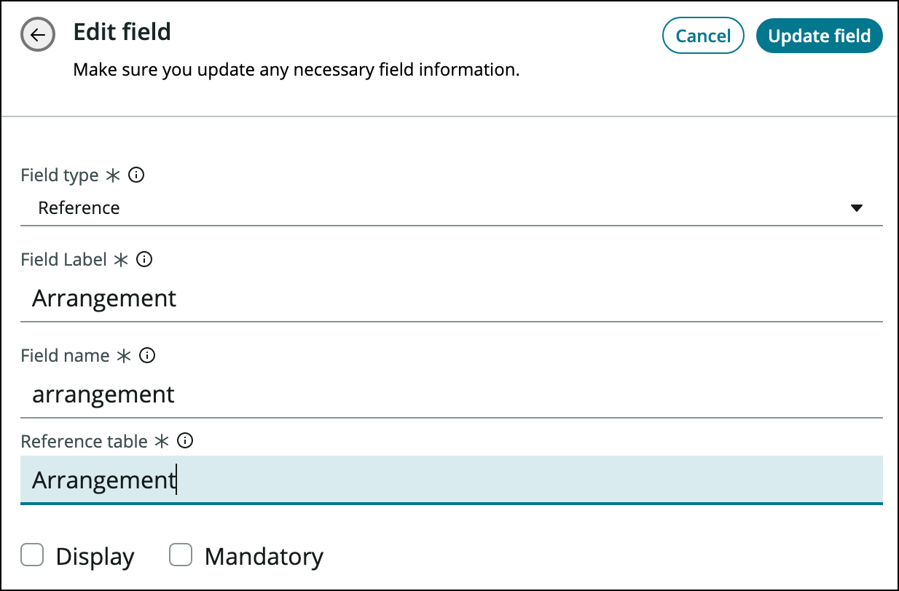
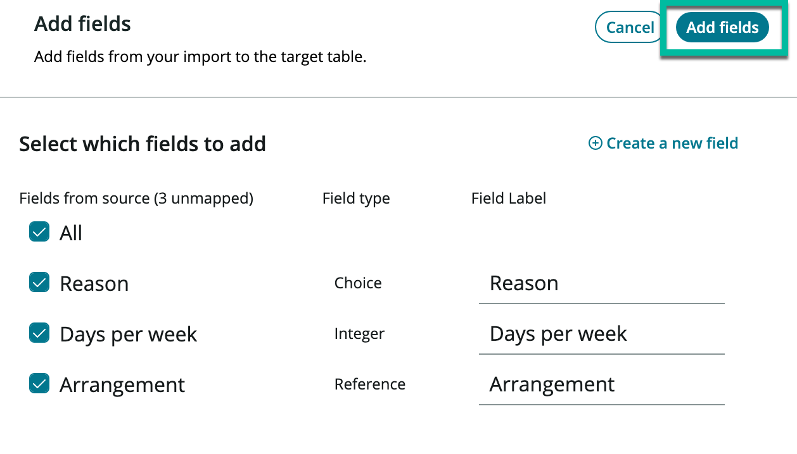
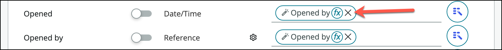
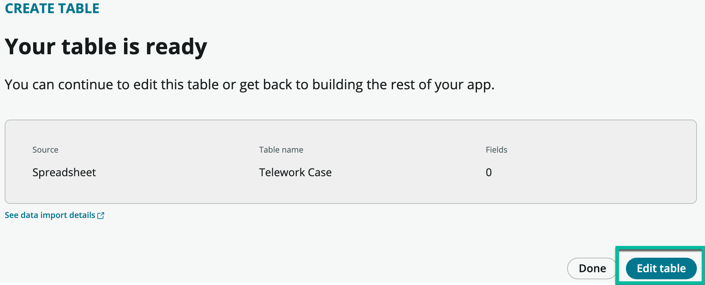
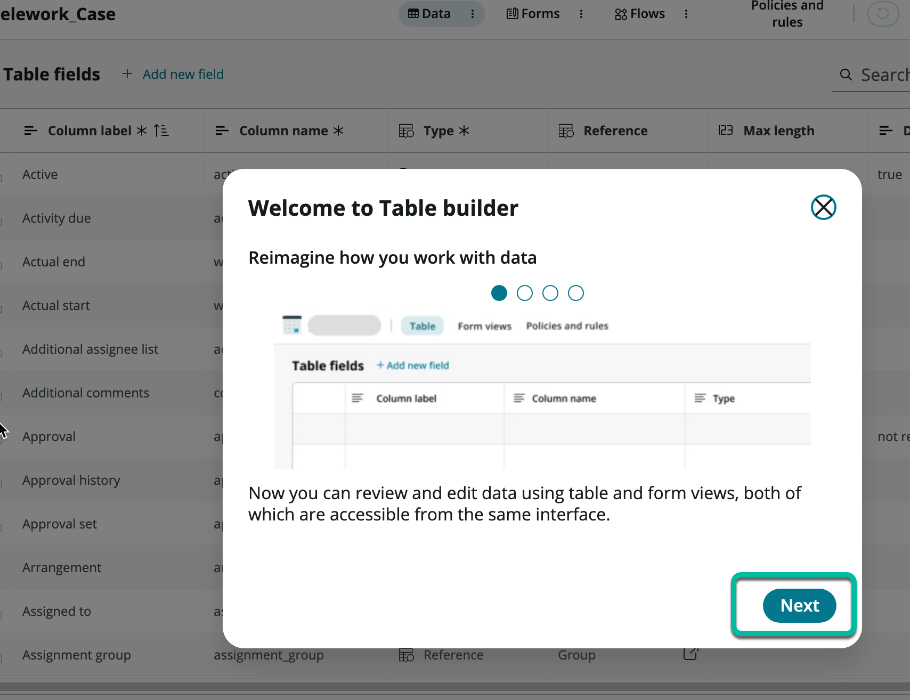

We will create the core tables for our application. To create a table in App Engine Studio:

1. Click the  **Add**  icon (⨁ Add) for _Data_ on the _App Home_ tab.

2.  ① Select <strong>Import a spreadsheet</strong> tile,  
    ② Click on the Continue button. 

    

3. ① Drag and drop the file <strong>Telework Data.xlsx</strong> (in the telework_lab files folder we downloaded earlier), 
   ② Click on the Continue button.

    

4. Our spreadsheet has multiple sheets. **We only need the first one** "Telework Arrangement".

5. ① Check ☑ <strong>Import spreadsheet data</strong> (in the telework_lab files folder we downloaded earlier), 
   ② Click on <strong>Convert to table</strong>.

    

6. ① Select <strong>Create new table</strong> (to hold the Arrangement data), 
   ② Click on the Continue button.

    

7. ① Click the Expand/Collapse icon (⌄) to see advanced configuration options, 
   ② Check the <strong>Display</strong> checkbox, 
   ③Click on the Continue button. 

    

:::info
The **Display** field is the one that appears if you reference this record from another table. A table can only have a single field marked as the **Display** field. 

For example, in a drop-down or reference we want it to display "Remote Telework" and not the full Description or sys_id of the record. 

Fields are also known as table columns. 
:::

8. **Set the table name**  
   ① Set the table label to <strong>Arrangement</strong>. (Hit <kbd>⇥ Tab</kbd>) The table name will auto populate. 
   ② Click on the Continue button.

    

9. **Set the permissions** 
    ① For the <strong>admin</strong> role, click the <strong>All</strong> checkbox  
    ② For the <strong>user</strong> role, click the <strong>All</strong> checkbox and then remove the <strong>Delete</strong> permission. 
    ③ Click on the Continue button. 

    

10. A loading screen will appear while the table is being created. When it completes, click Done.

11. We haven't converted all the sheets in the spreadsheets, so we'll see this message pop up.

12. Click Yes, leave.

13. Let's add the Telework Case table. Click the  **Add**  icon (⨁ Add) for _Data_ on the _App Home_ tab.

14. ①Select the **Import a spreadsheet** tile,  
    ②Click on the Continue button.

    

15. On the _Choose a spreadsheet to import from_ screen, click the  **Drag and drop or browse to upload spreadsheet** link.

16. Browse and select the  **telework_cases.xlsx**  file you downloaded.

17. Select ☑ **Import spreadsheet data**.

18. Click on the Continue button.

19. Select **Create from an extensible table**, then click Continue.

20. **On the _Which table do you want to use?_ screen,** 
    ➊ Click in the table field, 
    ➋ Select the <strong>Task</strong> table,  
    ➌ Click on the Continue button.

    

21. **On the _let's get more info about your new table_ screen,**
     
    ➊ Set the table label to <strong>Telework Case</strong>.  (Hit <kbd>⇥ Tab</kbd>) The table name will auto populate,  
    ➋ Check the <strong>Auto number</strong>,  
    ➌ Keep the Prefix as <strong>TEL</strong>  
    ➍ Click the Continue button.

    

22. **Set the permissions.**  
    ① For the <strong>admin</strong> role, click the <strong>All</strong> checkbox   
    ② For the <strong>user</strong> role, click the <strong>All</strong> checkbox and then remove the <strong>Delete</strong> permission.  
    ③ Click on the Continue button.

    

23. On the _Great! Now your table is ready for data_ screen, select the Continue button.

24. A loading screen will appear: _Sit tight while we create data mapping instance for table Arrangement_.

25. Read the help pop-up and click Next until Done.

26. Notice the fields have already been auto-mapped, but some are not correct. Clear out the _Transfer reason_ value.

27. Click on the Add Fields link button at the top.

28. Hover over the row and edit the Reason field by clicking on the pencil icon.

29. 
    1. Click **Field type**
    2. Select **Choice** 
    3. Click the Update field button.   
    **The choices will be added for you based on the spreadsheet data!**
    

30. Days per week is ok as an integer.

31. Days per week is ok as an integer, but Edit the Arrangment field.
    - Field type: **Reference**
    - Reference table: **Arrangement**
    - Click the Update field button.

    

32.   Lets add the new fields to our table by clicking the Add fields button. 

33. Clear the Description, Opened, and Transfer reason values. Click on the Continue button.

34. Your table is now ready. Click the Edit table button. Click through all the helper screens.

35. Click the Next button on the Welcome to Table builder helper and other popups.
  

:::info
We can see all the fields that our table inherited from the Task table, making building applications faster.
:::

**Exercise Recap**
Congratulations, you've built the first tables in your solution.

In this exercise, we learned how to create a new application and map out the data elements important to enable our business process.

We learned to use the Table Builder to add and configure columns including Reference fields and Choice lists.

We were able to complete all these tasks using simple point-and-click administration and without requiring specialized application or database knowledge.

**Next we'll take a look at the list & form views that have been generated for our table and adjust the layouts.**