## Purpose

ServiceNow offers multiple ways to create a user experience for submitting a form. In this exercise, we will learn one quick way to get users off paper forms and emails.

1. Go to App Home tab, "App home Telework"

2. On the application homepage, locate the **Experience** section and click the **⨁ Add icon**.

### This takes us to a selection where we can identify the type of experience we wish to create.

3. **Select** the **Record Producer** option.

:::info
A record producer is a specific type of catalog item that allows end users to create records from the service catalog.
:::

4. This launches the record producer creator.

5. Click on the Begin button

6. Set the following values (💡 double-click, copy & paste into the form).

    | |Field Name                | Field Value
    |-|--------------------------| --------------
    |①|Name              | Apply for Telework
    |②|Short Description | Use this form to apply for Telework
    |③|Click on the Continue button.

    

7. Click on the Edit record producer button.

8. Click on **Destination** , then type **Tel**, and select the **Telework Case** table.

9. Click on **Location** , then under **Catalogs**, click on **Browse**.

10. Click on **Service Catalog** , then click on the right arrow to move the item over to the Selected list.

11. At the bottom, Click on the Save selections button.
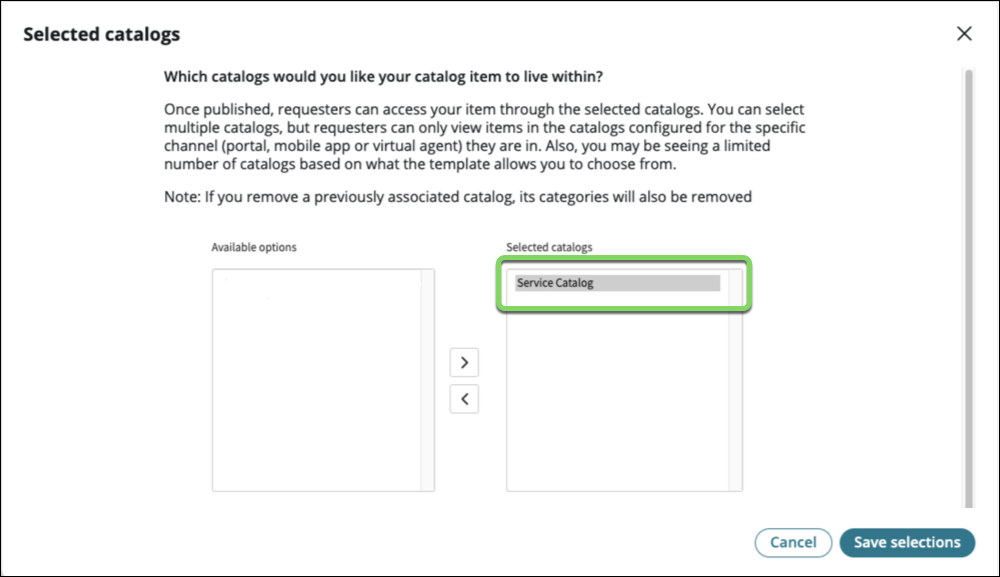

12. Under **Categories** , **click** on **Browse**.

13. Move **Can We Help You?** to the right-hand side and Click on the Save selections button.

    Your screen should look like below.

    

14. Let's add questions to the form. Click the Continue to Questions button.

:::info
Unlike in a paper-based form, we don't need to ask users to fill personal information like first name, last name, …, or date of request. That information will be automatically attached to the case. This makes filling forms so much faster.
:::

15. We want to allow users to open a case on behalf of another individual, so let's start by asking users " **Who is this request for?**" and " **When do you need this?"**

16. **Click** on Questions.

17. Click the arrow next to Insert new question then click "Question set".
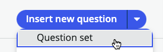

18. Select "Standard Employee Questions" and click Submit.

:::tip
This will add two frequently asked questions on forms. Click the little arrow on the left to see the questions.

:::

19. One key information we need users to provide is the type of arrangement they are applying for.

    1. Click Insert new question.

    2. For Question type, select **Choice**.

    3. For **Question subtype** , select **Record reference**.
    

    4. Scroll down to the **Details** section.

    5. In the **Details** section, enter the following information: (💡 double-click, copy & paste into the form).

    | |Field Name                   | Field Value
    |-|-----------------------------| --------------
    |1|**Map to a specific field**  | Checked
    |2|**Table field**              | choose **Arrangement**
    |3|**Question label**           | What type of Telework arrangement are you applying for? 
    |4|**Mandatory**                | Checked 
    |5|**Question Preview** | Notice on the right panel, then **Question Preview** shows what the question will look like to the user. 

    :::info
    Notice the **Question Preview** that shows what the question will look like to the user.
    
    :::

    6. Click on **Continue to Additional details →**.

    7. In the **Additional details** section, set the **Source Table** to the **Arrangement** table we imported earlier as options for this question.
    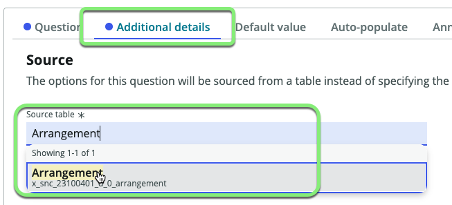

    8. Then Click on the **Annotation** tab.
    

    In the current process, the team is spending a lot of time correcting and manually re-routing applications due to people confusing the different types of Telework arrangement.   
    Let's fix that.  
    We'll use the  **Annotation**  tab to provide users with additional instructions for the question.  

    11. Check the box **Show instructions**.

    12. Open the file: **telework form annotation.docx**.

    13. Copy all the text in the file ( ⌘ Cmd  or CTRL+A, CTRL+C )

    14. Paste it into the Annotation section of the Telework Form (⌘ Cmd  or CTRL+V ). You can choose to either keep or remove formatting.

    15. Click on the Insert Question button.
    

20. Back to the main form, Click on the Insert Question button.

21. When users select the arrangement type **Situational** , we'll prompt them for the number of days per week. 

    1. Set the following values in the **Type** section:  

    |Field Name                   | Field Value
    |-----------------------------| --------------
    |Question type                | Text
    |Question subtype             | Single line

    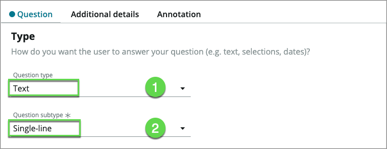

    2. Scroll down to the **Details** section.

    3. In the **Details** section, enter the following information: (💡 double-click, copy & paste into the form).

    Field Name                   | Field Value
    -----------------------------| --------------
    Map to a specific field      | Checked
    Table field                  | Days per week
    Question label	             | Number of Days per Week?
    Name                         | days_per_week

    4. Click on **Additional details**.

    

    5. In the **Additional details** section, for the **Text validation** field, select **Number**.

    6. Click on the Insert Question button.

22. Back on the **Questions** page, we're going to define the dynamic behavior of the question "Number of Days per week?" based on the answer to the previous question "What type of Telework...?" 

    1. For the question "Number of Days per Week?", click on the **behavior** icon, then click **Define new behavior**.

    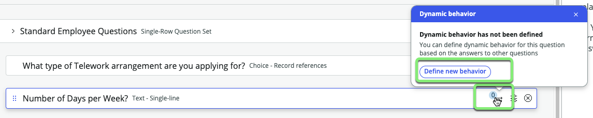

    2. In the **Actions** tab, we'll specify the behavior we need:

    |Field Name                     | Field Value
    |------------------------------ | --------------
    | Make the question mandatory | Yes
    | Make the question visible   | Yes

    

    2. Click on the **Conditions** tab.

    

    3. Set the **Dynamic Behavior Condition** filter to 

    | | |
    |--|--|--
    |arrangement | is | Situational Telework

    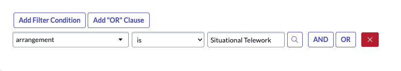

    4. Click on the Add behavior button in the bottom right.

    

:::info
This will create a UI effect where the "Number of Days per Week" field will only appear when "What type of Telework arrangement are you apply for?" is "Situational Telework". 
:::

23. Back on the **Questions** page, we're going to ask for the reason for Teleworking. Click on Insert New Question.
    
    1. In the **Type** section set the following values:

    |Field Name                    | Field Value
    |-----------------------------| --------------
    |Question type                | Choice
    |Question subtype             | Dropdown (fixed values)

    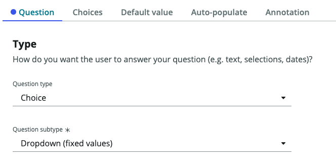

    2. Scroll down to the **Details** section.

    3. In the **Details** section, enter the following information: (💡 Copy & paste into the form). 
    
    Field Name                   | Field Value
    -----------------------------| --------------
    **Map to a specific field**  | Checked
    **Table field**              | Reason
    **Question label**           | What is the reason for Teleworking? 
    **Name**                     | reason
    **Mandatory**                | Checked 

    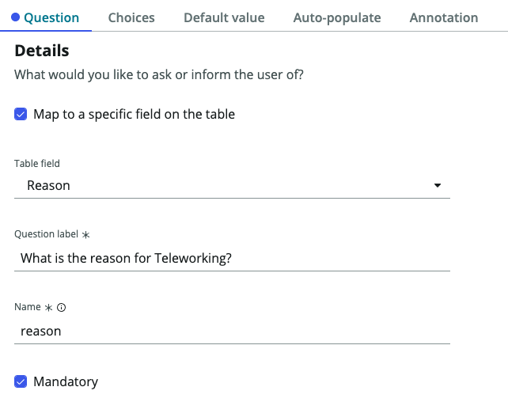
    
    4. Click on **Continue to Choices**. 

    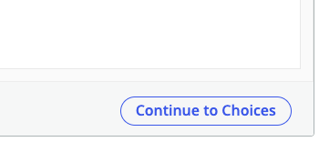
  
    5. Check **Include none choice**. 

    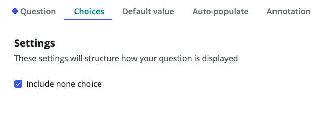

    6. In the **Available choices** section, click the + to insert a new choice. Add the following choices. (💡 Type in the Display Name and the value is created for you).

    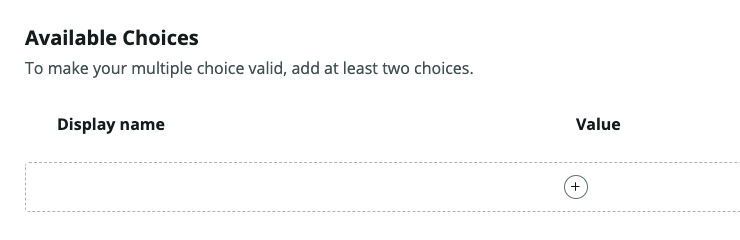

    

    |Display Name                 | Value
    |-----------------------------| --------------
    |Medical                      | medical
    |Dependent Care               | dependent_care
    |Reasonable Accommodation     | reasonable_accommodation

    Should look like this when complete:

    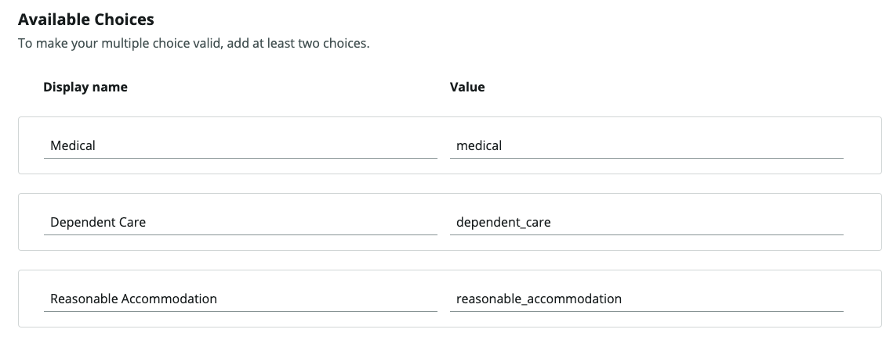

    7. Click Insert Question in the bottom right. 

    

Your screen should now look like this:

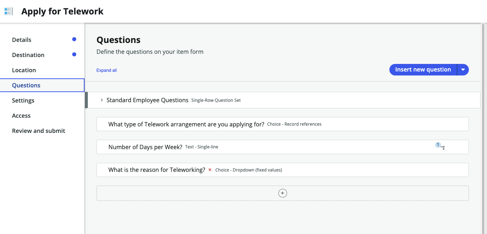

24. Back to the questions page:

    1. Click Save.

    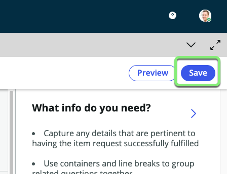

    2. Click Preview.

    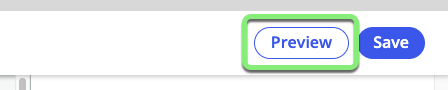

25. The **Preview** page allows to visualize what our form will look like in different experiences. (You can interact with the item but not submit it).

    | **Portal** | **Now Mobile**
    | --- | --- |
    |  | 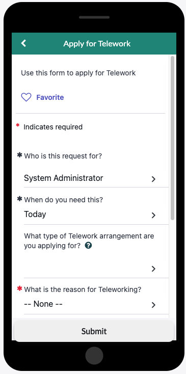

26. Close the Preview by clicking on the X on the top right.

:::info
If you want to preview your catalog item in the Virtual Agent you will need to activate the plugins_ _ **Glide Virtual Agent** and **Service Management Virtual Agent Topic Blocks**.
Additional setup beyond that is required to get NLU to perform a topic conversation via the Virtual Agent.
Feel free to experiment this after completing the entire lab.
:::

27. Let's publish the form to the Service Portal.
 
    1. Click on **Review and Submit**.

    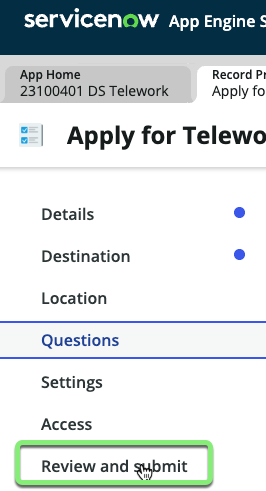

    2. Click Submit in the bottom right.

    

28. **Congratulations!** The form is published on your development instance.   
Click Return to my application.
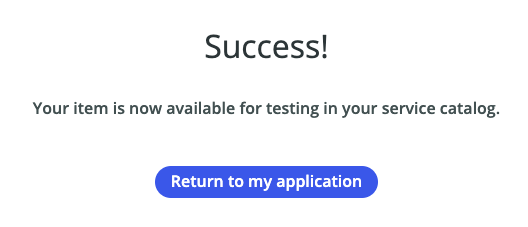

### Let's see how users can easily find it on the Service Portal

30. Go to the browser tab with ServiceNow Admin Home page.

31. Open the Service Portal by doing the following:
    1. Click All.
    2. Type **Portal**.
    3. Click on **Service Portal Home**.
    

32. In the portal, search for "Telework"

### The catalog item is found.

33. Click on the item to Apply for Telework.

34. In the **Details** section, enter the following information: (💡 double-click, copy & paste into the form).

    |Step |Field Name                  | Field Value
    |--|--------------------------- | --------------
    |1 | Who is this request for?   | David Loo
    |2 | When do you need this?     | This week
    |3 | What type of Telework arrangement are you applying for? | Situational Telework
    |4 | Number of days per week?   | 3
    |5 | What is the reason for Teleworking? | Dependent Care
    |6 | Click on the Submit button.

    

## **Exercise Recap**

In this exercise, we learned how to use App Engine Studio (AES) to easily create customized Catalog Items that users can access in Service Portal and on mobile devices.

Our next exercise will focus on taking the building blocks created to this point and making them actionable to drive automation and process optimization