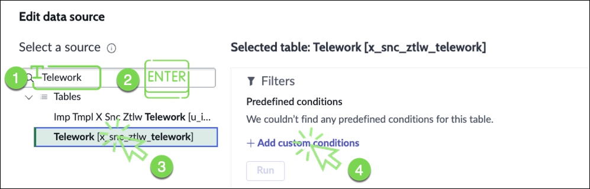

The Workspace Builder empowers users of all skill sets to build a custom workspace in a no-code environment. With this builder, you can quickly create a workspace and configure its layout, lists, and record pages. If you need access to more advanced functionalities and configurations, you can open the workspace in UI Builder from within this builder.

A lot has been pre-configured for us. We'll make a couple of changes to improve it.

1. Click the **Preview** button in the upper right to open the workspace in a new browser tab. 

2. Go into Edit Mode by clicking the **Edit** button Let's make sure the scores point to the Telework table. Click_Edit_Button.png

3. **(1)** Click the **Unassigned Tasks** score, **(2)** Click Configure **(3)** Click the Task table

4. **(1)** Type "Telework", **(3)** Select the Telework Case table, **(4)** Click **Add custom conditions**.

5. Set the Condition to **Assigned to = Empty**.
    1. Click Run.
    2. Click Apply.
    

6. **(1)** Click the **Critical Tasks** score, **(2)** Click the Task table.

7. **(1)** Type "Telework", **(3)** Click the Telework table, **(4)** Click **Add custom conditions**.

8. Set the Condition to **Priority = Critical**.
    1. Click Run.
    2. Click Apply.
    

9.  Click **Save**

## Now, let's help the business users visualize quickly cases by priority.

10. Add a new Data Visualization. At the top, (1) Click on **Add new element**, **(2)** select **Data visualization** .

11. Scroll down, the component has been added at the bottom of the page.

12. Drag and drop the new data component from the bottom of the dashboard to right above the My Work section and size it to expand across the screen.

13. On the new component, click the configure icon

14. In the configuration panel, **(1)** Click the **Visualization Type Dropdown** , **(2)** type "vert" **(3)** select **Vertical bar**.

15. - Click on **Header and border** to expand that section, 
    - type "Cases by Priority" in the **Chart Title** field.
    

16. Under Data sources, click **+ Add data source**.

17. In the window that opens, choose the Telework Case table as the source. **(1)** Select the Case table from the Suggested sources., **(2)** Click **Add custom conditions**.

18. We want to see only the non-closed cases. 
    1. Set **State is one of Pending, Open, Work in Progress**. 
    2. Click **Add this source**.
    

19. In the **Group by** section, 
    1. Click the pencil icon next to **Active**.
    2. Set **Priority** for the Group by.
    3. Click **Apply**.
    

20. On the top right, Click **Save** hen **Exit Edit Mode** 

## And voilà, your new dashboard!

## Exercise Recap

In this exercise, we learned how to create a custom workspace and used the the Workspace Builder to display key performance indicators and organize information in ways that benefit our users.