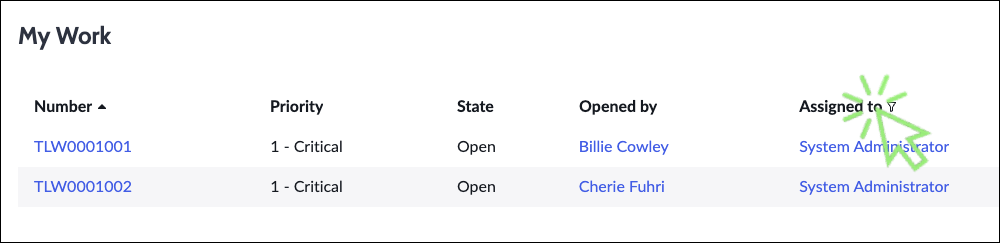
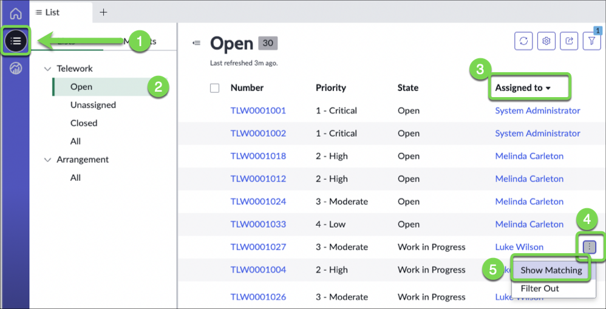
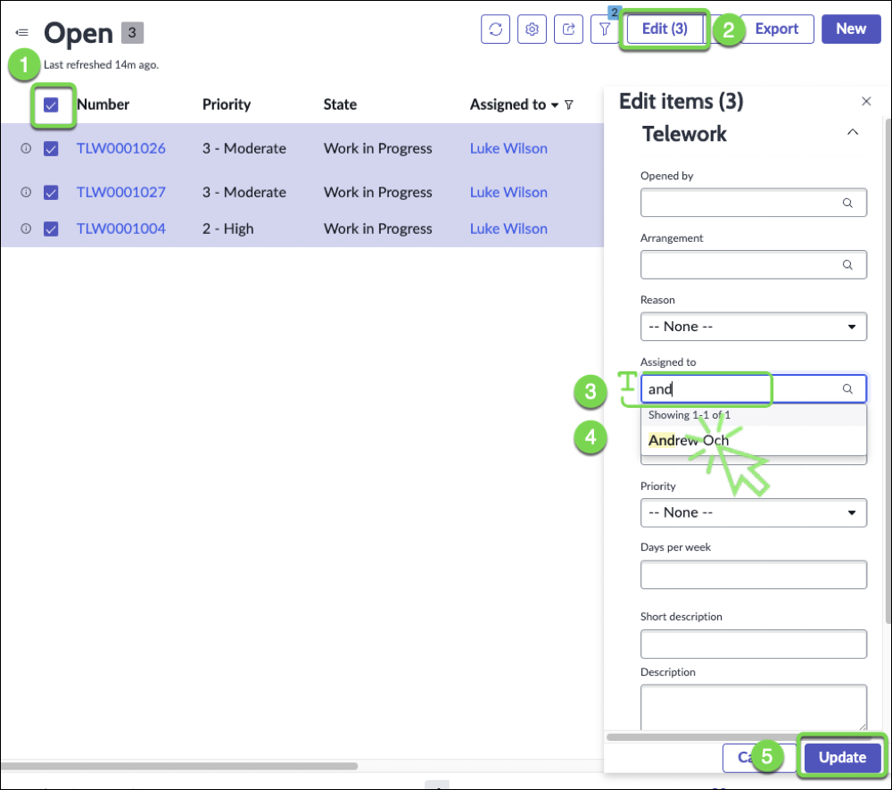
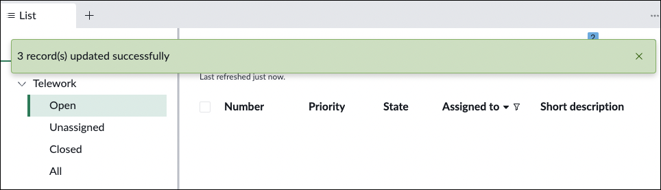
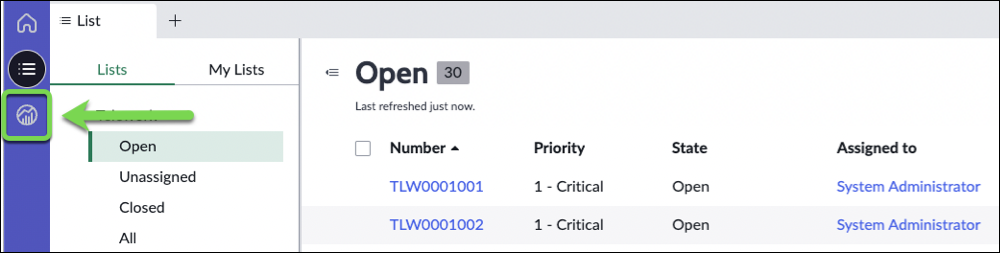
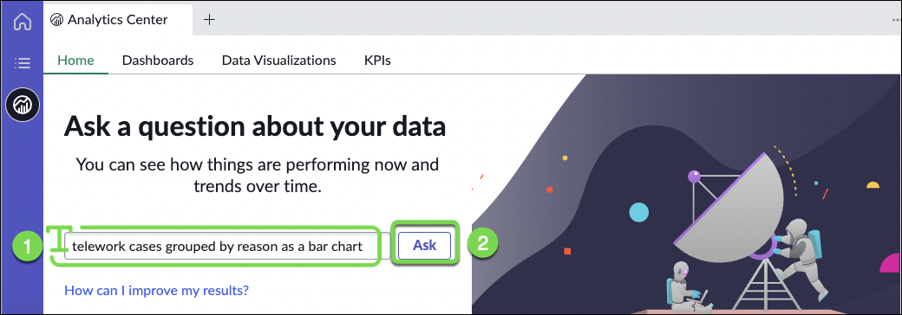
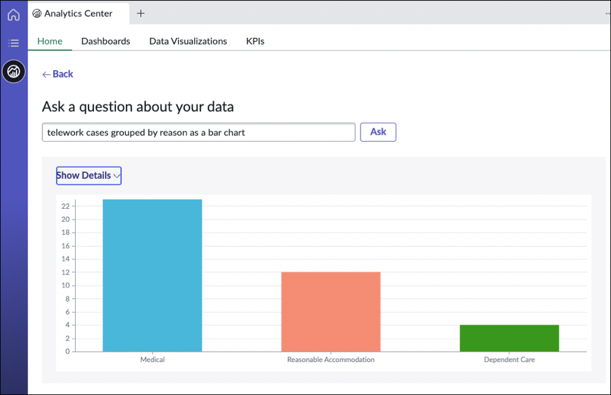
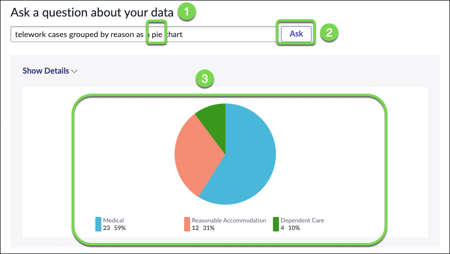

1. Let's take care of the **Critical Tasks**. Click on the **Critical Tasks** score or the critical bar chart.

2. 
   1. Select all rows, 
   2. Click **Edit** 
   3. Select **Assign to me**
   4. Close the tab.
    

3. Refresh the **My Tasks** score. You now have 2 tasks assigned to you.

4. In the **My Work** list, click on the **Assigned to** header to refresh the list.

**Great!** Now let's see how quick we can handle an emergency ⚠️.

## Bulk Assignment

Our team member _Luke Wilson_ is out sick today. We need to reassign his work to another case worker. (_It is hard to do when the work is managed via emails and spreadsheets!_)

5. Let's find all the open cases assigned to Luke Wilson

    1. Click the List icon.
    2. Click on **Open** in the Telework Case section.
    3. Sort cases by **Assigned to** by clicking on the header.
    4. Click the button next to "Luke Wilson".
    5. click "Show Matching".
    

6. Let's assign Luke's cases to Andrew Och

    1. Select all rows
    2. Click **Edit** 
    3. type **and**
    4. Select "Andrew Och"
    5. Click Update.
    
    
    You should see this message:
    

## Finding Answers with the Analytics Center

7. Now let's check the Analytics Center to quickly find the data we need.

8. Click the Analytics Center button.

9. Let's ask some question about our data.
   1. Type the following query: 

            show me all the telework cases grouped by reason as a bar chart

   2. Click the Ask button.
    
   3. And here is the answer:
    
   4. Try changing the query:  
      1. Replace **bar** with **pie**
      2. Click Ask to get a Pie Chart.
    

:::info
As you type in a query, Analytics Q&A suggests recent searches, indicators, tables, and columns that match what you have typed so far. Only the tables and columns to which you have access are shown
:::

**Exercise Recap**

In this exercise, we learned how to use the out-of-the-box capabilities to manage work and quickly find answers to questions about our data.