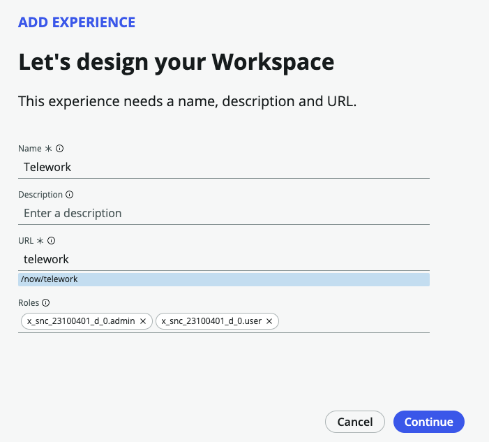
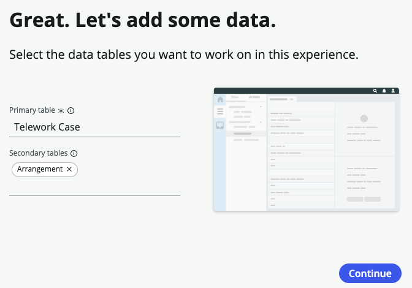
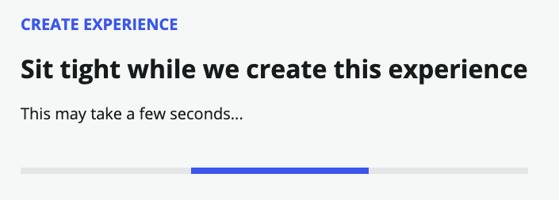
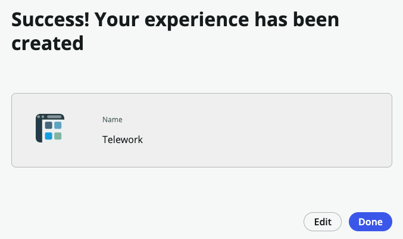

We will now create and configure the Workspace experience for our new application.

1. On the application homepage, locate the **Experience** section and click the **⨁ Add icon**.

This takes us to a selection where we can identify the type of experience we wish to create.

2. Click the **Workspace** tile to create a workspace to help users manage and fulfill requests sent to them.

3. Click on the Begin button to begin the Workspace Builder wizard.

4. Next, leave the default value and Click on the Continue button.

Next, we'll select the tables we want to work with in this workspace.

5. Set **Primary table** and **Secondary tables** like below and click on the Continue button.

    |Field Name           | Field Value
    |---------------------| --------------
    | Primary table    | Telework Case
    | Secondary tables | Arrangement

    
    

7. Your new Workspace experience is completed.  Click on the Edit button.

8. We are now directed to the Workspace Builder. Click on the Get started button.

9. We now have a fully functioning workspace to get work done quickly.

:::info
The Workspace Builder for App Engine allows you to manage dashboards, build lists, and customize record pages for workspaces created in App Engine Studio. App Engine licensed customers enjoy exclusive access to this premium feature.
:::

Next, let's tailor the workspace to our needs.
