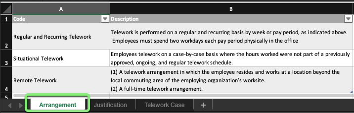
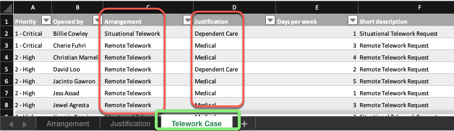

## Overview

In the use case story for this lab, Amanda and her team of fulfillers have been tracking the Telework Case requests in a spreadsheet called `Telework_Data.xlsx`.

Review the spreadsheet so that you understand the data you will be converting to a digital experience in a ServiceNow application.

## Instructions

1. Open the file `Telework_Data.xlsx` on your local laptop.

2. Notice that it has three separate sheets in it. 

3. * Click on the the first sheet "**Arrangement**". 
   * Users select these to specify what type of Telework they need. 
   

4. * Click on the second sheet "**Justification**". 
   * Users select these to specify why they need to Telework.
   

5. * Click on the third sheet "**Telework Case**". 
   * These are the different Telework Cases Users have submitted.
   * It contains references to the first two tables.
   

6. Close the spreadsheet. 

## Exercise Recap

It is always a good idea to understand the data that you will be converting to an application before beginning development work. 