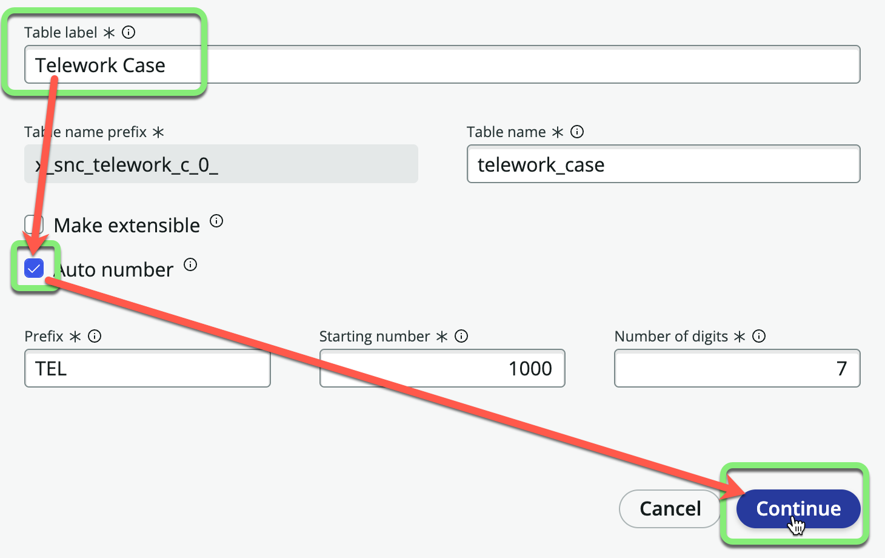

## Overview

In this exercise, we will import data from the `Telework_Data.xlsx` spreadsheet directly into new tables. 

## Instructions

1. **Close the guided tour.**
   * Check "Don't show me this again"
   * Click the 'X' in the corner.
  

2. Next to **Data**, click +Add.
   

3. - Select "Import a spreadsheet".
   - Click Continue.
   

4. - Drag and drop the file `Telework_Data.xlsx` onto the box 
   :::note
   _If you have trouble with the drag and drop, just click '..browse to upload a spreadsheet' and select the file._
   :::
   - Click Continue.
   
   
**Looks like the spreadsheet has multiple worksheets.**

5. Start with the `Arrangement` worksheet. 
   - Check 'Import spreadsheet data'.
   - Click Convert to table.
   

6. Leave 'A new table' selected.
   - Click **Create new table**.
   - Click Continue.
   

7. **Set the Display field for the table.**
   - Click the chevron at the end of the **Code** row to expand options.
   
   - Check the **Display** checkbox under **Code**.
   
   - Click Continue.

:::info
* The **Display** field is the one that appears when referencing this record from another table. Each table can have only one field marked as the **Display** field.
* For example, if you reference this table in a dropdown, it will display the Code and not the Description.
* Fields are also known as table columns.
:::

8. **Table Label**:
   - Set the "Table label" to `Arrangement`.
   - Click Continue.
   
   - Notice that "Table name" has been auto-populated with 'arrangement'. 
   - Click Continue again.
   

:::tip
* Always give your table a singular name and not plural. ServiceNow will automatically make it plural when viewing multiple records.

* For example, if you name the table 'Arrangements', then later you will see it in ServiceNow as 'Arrangementss' with two s's. 
:::

9. **Set the Table Permissions.**
   - For the **admin** role, check "All".
   - For the **user** role, check "Read".
   - Click Continue.
   

**Next import the `Justfication` worksheet.**

10. Click the chevron next to 'Justification'. 
   

11. - Check 'Import spreadsheet data'.
    - Click Convert to table.
    

12. Leave 'A new table' selected.
    - Click **Create new table**.
    - Click Continue.
    

13. Click the chevron to expand options.
    

14. - Check Display.
    - Click Continue.
    

15. **Table Label**:
    - Set the "Table label" to `Justification`.
    - Click Continue.
    
    - Notice that "Table name" has been auto-populated with 'justification'. 
    - Click Continue again.

16. **Set the Table Permissions.**
    - For the **admin** role, check "All".
    - For the **user** role, check "Read".
    - Click Continue.
    

**Next import the `Telework Case` worksheet.**

17. Click the chevron next to 'Telework Case'.
   

18. - Check 'Import spreadsheet data'.
    - Click Convert to table.
    

:::warning
Pay close attention to the next step!
:::

19. Leave 'A new table' selected.
    - Click **Create from an extensible table**.
    - Click Continue.
    

20. **Select the Table**:
    1. Click in the search box.
    2. Click on the **Task** table.
    3. Click Continue.
    

21. **Table Configuration**:
    - Set the "Table label" to `Telework Case`.
    - Check 'Auto number'.
    - Click Continue.
    

22. **Set Permissions**:
    - For the <strong>admin</strong> role, check <strong>All</strong>.
    - For the <strong>user</strong> role, check <strong>All</strong> and uncheck <strong>Delete</strong>.
    - Click Continue.
    

**In the next steps, you will match fields from your import with the fields on your newly extended table. You’ll have an opportunity to create new fields from your import in the new table.**

:::info Source: telework_cases.xlsx
* On the left side of the page are the source fields from the spreadsheet.
* The system was able to **Auto map** some of the fields with matching names in the Target table.
* **Auto mapped** fields have a checkmark next to them. 

:::

:::info Target: Telework Case
* On the right side of the page are the target fields in the **Telework Case** table.
* When the system was able to **Auto map** a field, it added a Data pill from the Source table. 

:::

:::caution
* On the left side of the screen, you can see that some of the spreadsheet columns do not exist in the target table.
* You will create these new fields in the next few steps. 

:::

23. **Add the the missing fields.**
    * Click the **Add Fields** link on the right.
    
    You will be given the option to '_Add fields from your import to the target table_'.
    

Days per week is ok as an integer. **Do not do anything to it.**

24. **Modify Field Type**: Change 'Justification' from from `String` to `Reference`.
     1. Hover over the row and edit the field **Justification** by clicking on the pencil icon.
     
     2. Click "String" under **Field type** and change it to **Reference**.
     
     
     3. In 'Reference table', type `just`.
     4. Click the `Justification` table in the search results.
     
     5. Click Update field

:::note
* A `Reference` field points to another table. You want the `Justification` **field** to point to the the `Justification` **table** created earlier. 
:::

25. **Modify Field Type**: Change Arrangement from `String` to `Reference`.
     1. Hover over the row and edit the field **Arrangement** by clicking on the pencil icon.
     
     2. Click "String" under **Field type** and change it to **Reference**.
     
     
     4. Type `Arrangement` into the **Reference table** field and click on **Arrangement** in the drop-down. 
     
     5. Click Update field.

26. **Finish adding new fields.**
    * Click Add fields to add the new fields to the Target table. 
    

Each field on the left side of the page should now have a checkmark beside of it like below. If not, please review previous steps or ask an instructor for assistance. 

27. Click Continue in the bottom right. 

28. Click Edit tables.
    

## Exercise Recap

Well done! You've have imported the spreadsheet used by Amanda and her team to track Telework Cases into three new tables. 

The `Telework Case` table references the `Justification` and `Arrangement` tables.  This will help ensure data input consistency. 

Since `Justification` and `Arrangement` are standalone table, you can easily add or remove entries in production. This means the choices can be adjusted without the need to deploy a new version of the application.