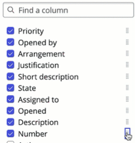

## Overview 

Table Builder is a powerful tool for designing and customizing tables, forms, and form elements within ServiceNow. In this exercise, you will learn how to edit the `Telework Case` table using the **Spreadsheet** view in the **Data** tab of Table Builder. 

Additionally, you will explore the **Fields** view to modify the table properties and structure.

## Instructions

1. * Click the `Arrangement` tab.
   * Close the **Welcome to Table builder** pop-up  by clicking the 'X' in the corner. 
   * You can see the `Arrangement` worksheet was successfully imported into the new `Arrangement` table. 
   * Close the `Arrangement` tab. 
   

2. * Click the `Justification` tab.
   
   * Close the **Welcome to Table builder** pop-up  by clicking the 'X' in the corner. 
   * You can see the `Justification` worksheet was successfully imported into the new `Justification` table. 
   * Close the `Justification` tab. 

3. You should now be on the `Telework Case` tab. _(If not, click on it.)_
   * Close the **Welcome to Table builder** pop-up  by clicking the 'X' in the corner. 

4. Check the 'Do not show again' option and then click the 'x' to dismiss the next pop-up.
   

:::info
The default view in Table Builder is the "Spreadsheet" view. 

In this view, you can view and edit data.
:::

5. **Rearrange the columns displayed.**
   1. Click **Manage columns**.
   
   2. Scroll down and check the box next to 'Number'.
   
   :::tip
   The button with eight dots is called the **Handle icon**.
   
   :::
   3. Click and hold the **Handle Icon** next to 'Number', and drag to the top of the list.
   
   4. Click Apply.

:::info
You can reorder columns through drag-and-drop with the **Handle icon**.

If you rearrange the columns in spreadsheet view, the system will retain this personalized view of the column layout for you. 
:::

### In the next few steps, you will set the default columns for everywhere else in the application.

6. Click 'Preview' in the top right.

:::caution
You are seeing a **personalized** layout of the columns that you set up with Spreadsheet view. 

:::

7. **Reset your personalized list view to the Default view.**
   * Click the Gear cog icon. 
   
   ### Note that you are in the 'Personalize List Columns' pop-up. 
   * Click Reset to column defaults
   

:::info
The purpose of setting and then resetting a Personalized list view was to teach you the difference between your *personal* list view and the Default view that everyone else would see. 
:::

### Set the Default view for all Users in the system.

8. 
   * Click the three dots to the right the word 'Priority' in the first column.
   * Click 'Configure'
   * Click 'List Layout'
   

9. 
   * Search for 'Number' on the left side.
   * Click it.
   * Click the right chevron to move it to the right side.
   

9. Click the up chevron to move 'Number' to the top of the list. 

10. Arrange the right hand side to have these fields in the following order. *(You may need to move some of the fields back to the left side.)*
    * Number 
    * Short description
    * Priority
    * Opened by
    * Assigned to
    ### RESULT
    

11. Click Save.
   
   ### RESULT
   

12. Close the '**Preview - Telework Case**' tab.

13. **Switch to the 'Fields' view of Table Builder.**
    - Click the three dots next to **Data** and select 'Fields.'
    

14. **Hide the `Task` fields and only view custom fields related to 'Telework Case.'**
    :::info
    The dark gray rows are fields that exist on the `Task` table that we are inheriting in our table `Telework Case` table.
    :::
    - Click **Filter options.**
    - Choose 'Hide extended fields.'
    
    Now you can easily see only the custom Fields related to the `Telework Case` table.  
    

## Exercise Recap

In this exercise, you've learned how to use **Table Builder** to view and edit data in the **Spreadsheet view** and configure your Fields in the **Fields view**. The next exercise will involve using the **Form** feature to view and customize the form used to display individual records (rows) within the table.

For more information and advanced capabilities, you can refer to the [ServiceNow Product Documentation: Table Builder](https://docs.servicenow.com/csh?topicname=tb-landing-page.html&version=latest).