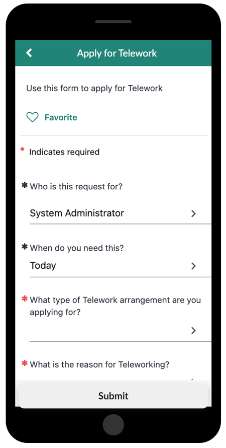
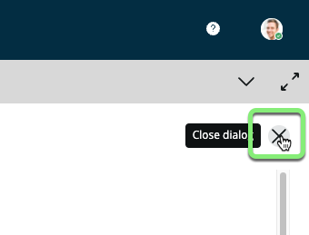
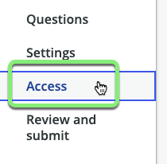
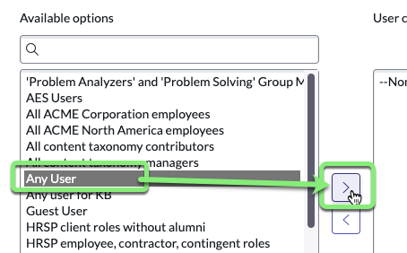
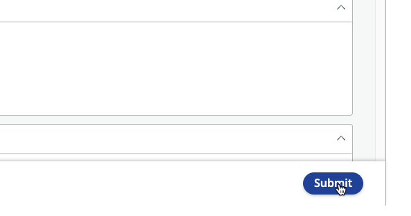

## Overview

Preview the form in App Engine Studio before publishing and confirm that the form fields behave as expected. 

## Instructions

1. Click Preview.

2. The **Preview** page allows to visualize what our form will look like in different experiences.  (_You can interact with the item but not submit it._)

    |**Portal Preview** |
    |---|
    | |

    |**Now Mobile Preview**|
    |---|
    ||

3. Close the Preview by clicking on the X on the top right.

4. **Configure who can access the Record Producer form to order it.**
    1.  Click **Access** on the sidebar. 
    
    2. Under **Available for**, click **Browse**.
    
    3. Move 'Any User' to the right box.
    
    4. Click Save Selections.

5. Click Continue to Review and submit.

6. Click Submit.

7. Click Return to my application.

## Exercise Recap

**Congratulations!** 

The form is published on the application. Users will be able to use it to submit Telework Case requests when the app is promoted to the ServiceNow Production environent. 
