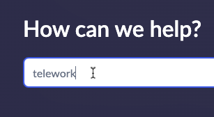

## Overview

**Requester users** access ServiceNow via portals.  The main 'out-of-the-box' default portal offered by ServiceNow is called **Employee Center**. 

_More Info: [ServiceNow Product Docs Employee Center](https://docs.servicenow.com/csh?topicname=employee-center-landing-page.html&version=latest)_

In this exercise, you will preview the 'Apply for Telework' Record Producer in the Employee Center portal. 

## Instructions

1. Go to the browser tab that says 'Home - Creator Workshops'.

2. **Open the Employee Center**.
    1. Click All.
    2. Type `employee center`.
    3. Click **Employee Center**.
    

3. **Search for the 'Apply for Telework' Record Producer form.**
   1. Type `telework` in the search box.
   2. Press ENTER on your keyboard. 
   

4. Click 'Apply for Telework' in the search results.

:::tip
Click the question-mark icon to see the annotation you pasted from the Word doc.

Click it again to close the annotation.

:::

5. Fill out the form with the following values: (💡 double-click, copy & paste into the form).

    |Step |Field Name                  | Field Value
    |--|--------------------------- | --------------
    |1 | Who is this request for?   | David Loo
    |2 | When do you need this?     | This week
    |3 | What type of Telework arrangement are you applying for? | Situational Telework
    |4 | Number of days per week?   | 3
    |5 | What is the reason for Teleworking? | Dependent Care
    |6 | Click Submit.
    
    

## Exercise Recap

In this exercise, you learned how to use Employee Center to submit a Telework Case request on behalf of a different user than yourself. 
