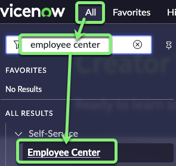
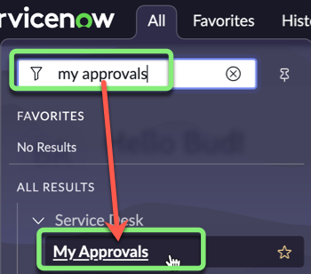
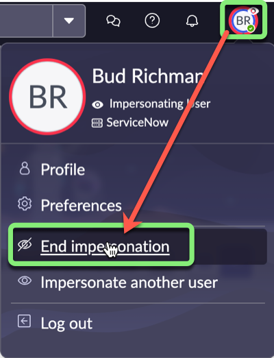

## Overview

In this section, we will test the flow we just created and make sure it functions as expected. We need to test with a user who has a manager. Fortunately ServiceNow allows admins to impersonate other authenticated users for testing purposes.

In our use case story, you will assume the role of 'David Loo'. He recently learned his child has a minor sickness and will need to stay home for a few days.

He is excited to use the new digital form on the Employee Center to submit his request instead of walking his paper form around the office. 

## Instructions

1. Go to the browser tab that says 'Home - Creator Workshops'.

2. Click the avatar photo in the top right corner of the page. 

3. **Impersonate 'David Loo'.**
   1. Select **Impersonate User**.
   
   2. Search for `David Loo` and click his name in the search results.
   
   3. Click Impersonate User.

4. Close the **New to Vancouver** pop-up.

5. **Open the Employee Center**.
    1. Click All.
    2. Type `employee center`.
    3. Click **Employee Center**.
    

6. Type `telework` in the Search box and hit ENTER.

7. Click **Apply for Telework** in the search results.

8. Fill out the form with the following values: (💡 double-click, copy & paste into the form).

    |Field Name               | Field Value
    |--------------------------- | --------------
    |**Who is this request for?**   | David Loo
    |**When do you need this?**     | Today
    |**What type of Telework arrangement are you applying for?** | Situational Telework
    |**Number of days per week?**   | 3
    |**What is the reason for Teleworking?** | Dependent Care

    

    Click Submit.

    

9. Go to the browser tab that says 'Home - Creator Workshops'.

**Bud Richman is the manager of David Loo and will approve his Telework Case.**

10. **Impersonate 'Bud Richman'.**
    1. Click **Impersonate another user**.
    
    2. Search for `Bud Richman` and click his name in the search results.
    
    3. Click Impersonate User.

11. Close the **Welcome to Service Operations** pop-up.

12. **As Bud, approve David's Telework Case request.**
    1. In the **All** menu, search for and select, type **My Approvals**.
    
    2. Right-click on **Requested**.
    3. Select **Approve**.
    

Recall that in the Flow, an email should be sent to the **Opened by** user after the manager approves. 

13. **See if the email was sent.**
    1. In the top right, click the profile photo to open the User menu.
    2. Select  **End Impersonation**.
    
    3. In the **All** menu, search for and select **Outbox**.
    
    4. Click on the **Created** column name to show most recent at the top.
    
    5. Click the **Created** column to open the email to david.loo @ example.com.
    
    6. Scroll down to the bottom of the page, and click on the **Preview Email** related link.
    
    You can see the email includes the information from the Data Pills that you put in the body of the email.
    

## Exercise Recap

In this exercise, you tested the Automated Flow by impersonating a user, submitted a record, and ensuring the automated steps took place. 