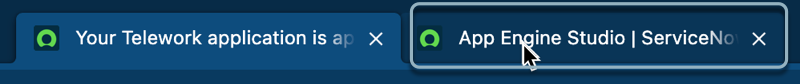
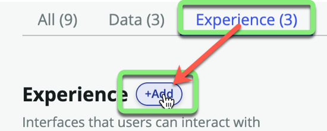
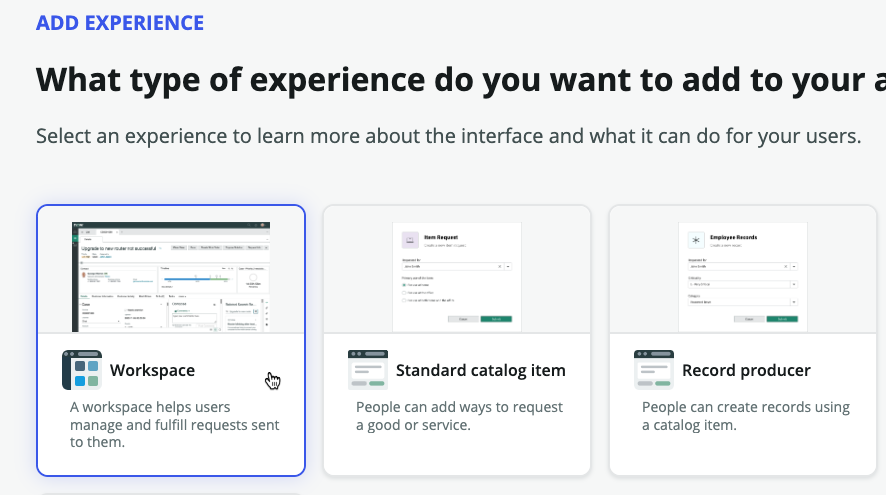
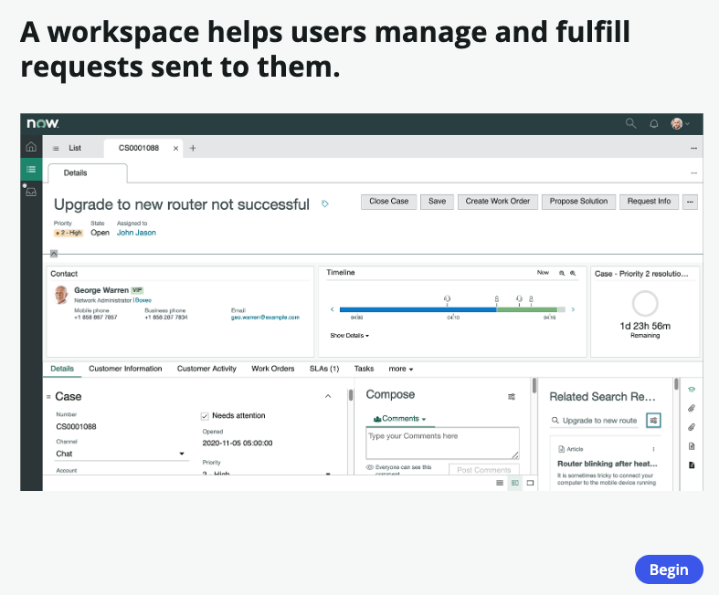
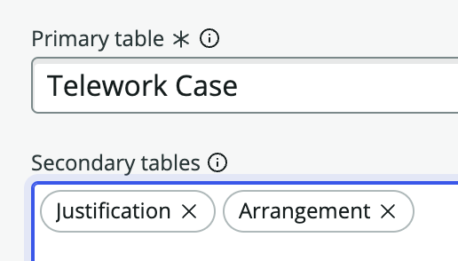

## Overview 

Next you will create and configure a Workspace experience for the Fulfiller users of the application. 

## Instructions
1. Return to the **App Engine Studio** browser tab.

2. On the application homepage, click the **Experience** tab.

3. Click +Add.

4. Click the **Workspace** tile to create a workspace to help users manage and fulfill requests sent to them.

5. Click on the Begin button to begin the Workspace Builder wizard.

6. Leave the default values and click Continue.

5. Set **Primary table** and **Secondary tables** like below and click on the Continue button.

    |**Field Name**           | **Field Value**
    |---------------------| --------------
    | **Primary table**    | Telework Case
    | **Secondary tables** | Arrangement, Justification

    

    

7. Your new Workspace experience is completed.  Click on the Edit button.

8. You are now directed to the Workspace Builder. Click on the Get started button.

9. Your Workspace Builder view should look like below. 
:::note
_The view below might look slightly different depending on your screen resolution._
:::

:::info
The Workspace Builder for App Engine allows you to manage dashboards, build lists, and customize record pages for workspaces created in App Engine Studio. App Engine licensed customers enjoy exclusive access to this premium feature.
:::

## Exercise Recap

In this exercise, you were able to quickly build a Workspace to manage work in your application. 

Next you will make some changes to the workspace as well as learn how to navigate it. 
