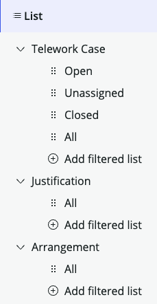
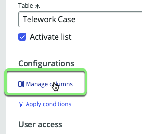
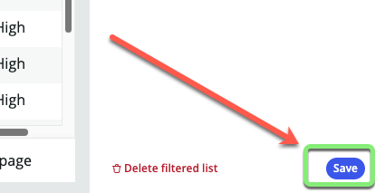

## Overview

A lot has been pre-configured in the Workspace, but Amanda's team still has a few things they would like changed before going live with it. 

## Instructions

### You should be on the **Home** section of the Workspace builder. 

1. Hover over and click on the word **List** on the left sidebar. 

### The Workspace Builder did a great job of laying out the List menu for the Telework Case workspace. 

### Review the columns for Telework Cases to see if they are in a good order for fulfillers to get work done. 

3. In the 'Telework Case' List Category, click the word 'Open'. 

### Amanda's team would like the columns in the 'Open' list to be arranged differently than what the system built below. 

4. Click 'Manage columns' on the right sidebar. 

5. Search for `number` and click on 'Number' in the search results.

6. Click the chevron pointing right to move 'Number' to the 'Selected columns' list. 

7. Click the handle icon next to 'Number' in the 'Selected columns' list and drag it to the top of the list. 

8. Remove the rows:
   * Arrangement
   * Justification
   * Days per week
   

9. Make the necessary changes so the 'Selected columns' look like this and click Apply.
    * Number
    * Short Description
    * Opened by
    * State
    * Priority
    * Assigned to
    

10. Click Save in the bottom right corner. 

## Exercise Recap

In this exercise, you learned how to configure the lists available in a configurable workspace. 