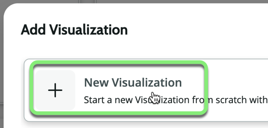
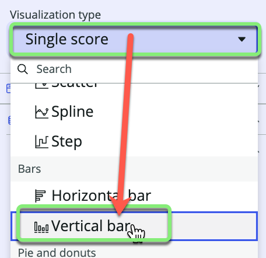
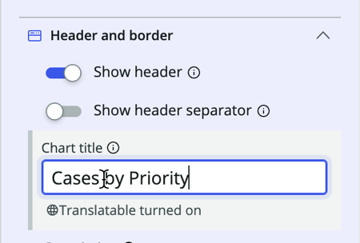
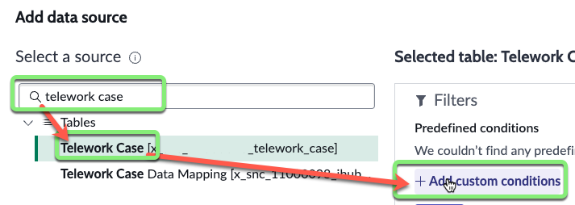
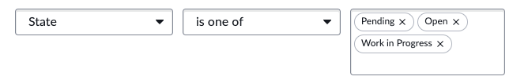

## Overview

Amanda and her team would like to be able to quickly visualize cases by priority.

In this exercise, you will open the Workspace Experience and configure the main dashboard to help them do this.

## Instructions

1.  Click the **Preview** button in the upper right to open the workspace in a new browser tab. 

2. Go into Edit Mode by clicking the **Edit** button 

### Add a new Data Visualization of a Vertical Bar chart showing Telework Cases by Priority.

3. 
   1. Click the **My Work** data visualization.
   2. Click the black plus icon at the top center of the **My Work** data visualization.
   
   3. Click **Data Visualization**.
   
   4. Click **New Visualization**.
   
   5. Click the bottom-right corner of the new **Visualization** and drag it across the page. 
   

4. **Configure the Visualization type.**
   1. Click the **Visualization type** dropdown.
   2. Scroll down and click on **Vertical bar**.
   

5. **Set the Chart title.** 
   1. Click on **Header and border** to expand that section. 
   2. Type `Cases by Priority` in the **Chart Title** field.
   

6. **Add a data source.**
   1. In the **Data** >> **Data sources** section, click + Add data source.
   
   2. Type **Telework Case** in the "Select a source" field. 
   3. Click **Telework Case** in the search results.
   4. Click **+ Add custom conditions**.
   

   ### Amanda's team wants to see only the non-closed cases.
   5. Set **State is one of Pending, Open, Work in Progress**. 
   
   6. Click Add this source in the bottom right.
   

9. **Set the data visualization grouping.**
    1. In the **Data** >> **Group by** section, 
    
    2. Click the pencil icon next to **Active**.
    3. Set **Priority** for the Group by.
    4. Click **Apply**.
    
    ### RESULT
    

10. **Save the changes to the dashboard.**
    * On the top right, click Exit Editing Mode.
    
    * Click Save.
    

### Your workspace should look like the image below. 

## Exercise Recap

In this exercise, we learned how to create a custom workspace and used the the Workspace Builder to display key performance indicators and organize information in ways that benefit our users.

For more information see [Product Documentation: Dashboards in configurable workspaces](https://docs.servicenow.com/csh?topicname=analytics-center-dashboards.html&version=latest)