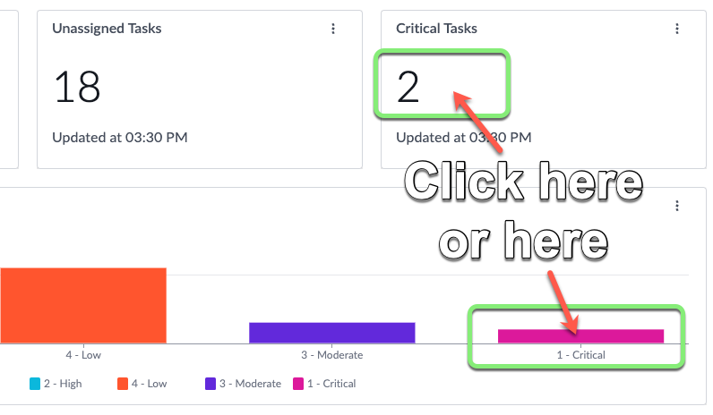
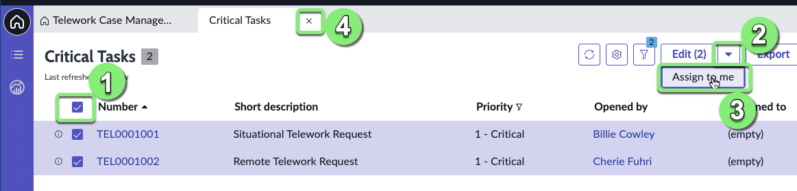
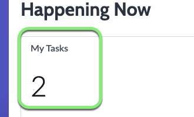
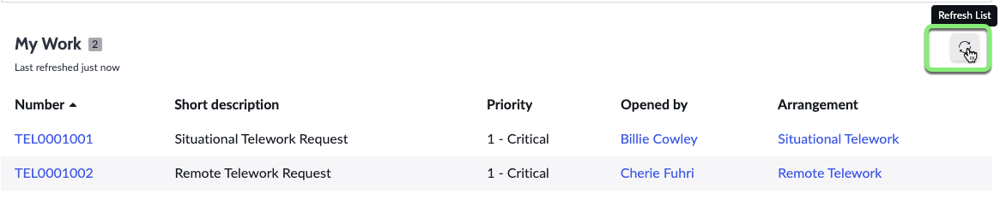
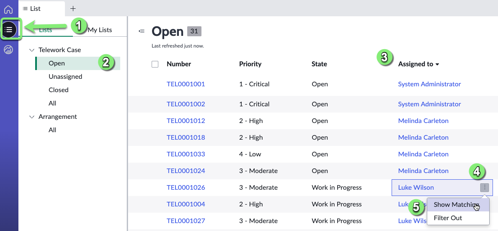
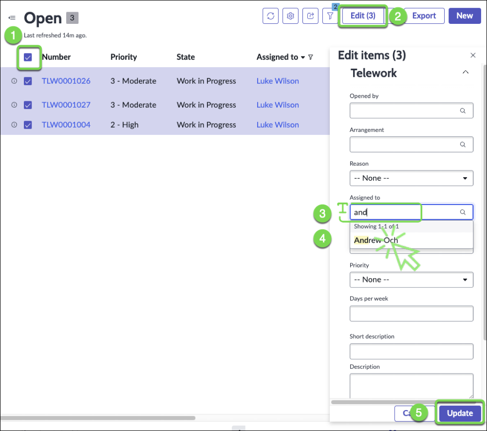
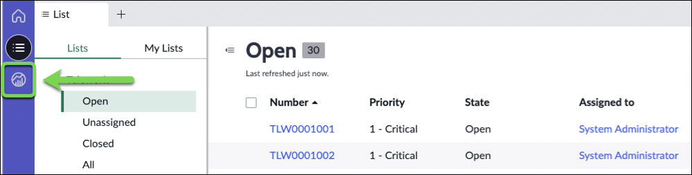
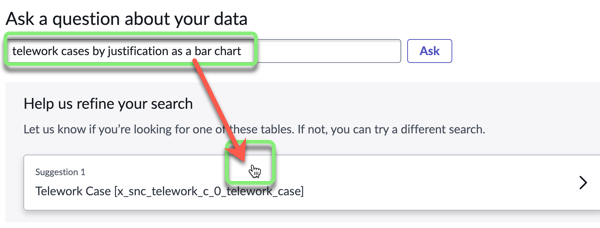
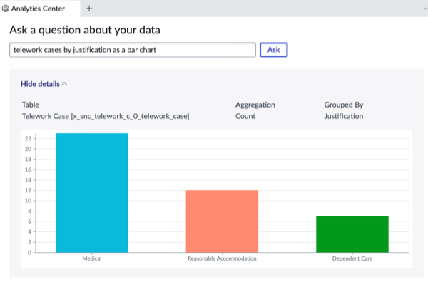

## Overview

In this exercise, you will learn some navigation skills to get around the Workspace. 

There are some Critical Tasks that need to be assigned.

Amanda also wants to explore how to bulk re-assign tasks. 

## Instructions

1. Click on the **Critical Tasks** score or the '1 - Critical' bar chart.

:::note
You can click either data visualization as they are both pointing to the same data: two Telework cases with a state of "1 - Critical" priority. 
:::

2. ### Assign the Critical Tasks to yourself.
   1. Select all rows. 
   2. Click the drop-down arrow next to **Edit**.
   3. Select **Assign to me**.
   4. Close the tab.
   

### The **My Tasks** Data Visualization should now be a 2. 

3. In the **My Work** list, click on the Refresh icon to refresh the list.

## Bulk Assignment

Now let's see how to handle an emergency ⚠️.

Our team member _Luke Wilson_ is out sick today. 

We need to reassign his work to another case worker. (_It is hard to do when the work is managed via emails and spreadsheets!_)

5. Let's find all the open cases assigned to Luke Wilson

    1. Click the List icon.
    2. Click on **Open** in the Telework Case section.
    3. Sort cases by **Assigned to** by clicking on the header.
    4. Click the button next to "Luke Wilson".
    5. click "Show Matching".
    

6. Let's assign Luke's cases to Andrew Och

    1. Select all rows
    2. Click **Edit** 
    3. type **and**
    4. Select "Andrew Och"
    5. Click Update.
    
    
    You should see this message:
    

## Finding Answers with the Analytics Center

7. Now let's check the Analytics Center to quickly find the data we need.

8. Click the Analytics Center button.

9. Let's ask some question about our data.
   1. Type the following query: 

   * `telework cases by justification as bar chart`

   2.  Click Ask.
   3. Click **Telework Case**.
   
   4.  And here is the answer:
   

:::info
As you type in a query, Analytics Q&A suggests recent searches, indicators, tables, and columns that match what you have typed so far. Only the tables and columns to which you have access are shown.
:::

## Exercise Recap

In this exercise, we learned how to use the out-of-the-box capabilities to manage work and quickly find answers to questions about our data.