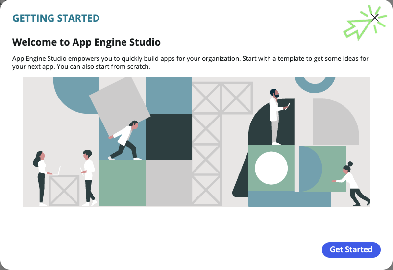

## Purpose

In this exercise, we will learn how to create the core data elements of our application.

## Getting started

1. If the  **Getting Started** dialog opens, close it by clicking the Get Started button.

2. This reveals the homepage of App Engine Studio. From this page:
    - You can create new applications or extend previously developed applications.
    - There are a variety of templates provided out of the box that contain examples of configurations that address common business challenges.
    - Feel free to return here later to review some of the capabilities enabled with these templates.
