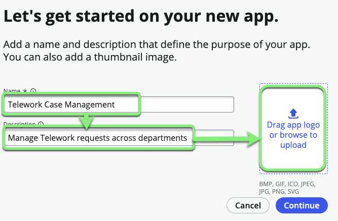
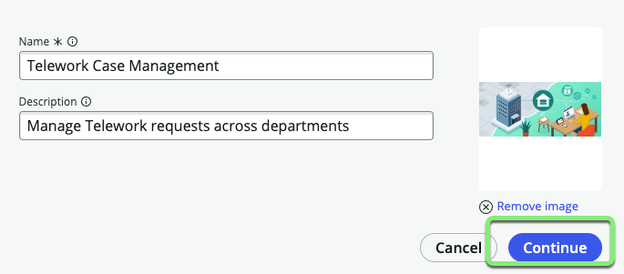
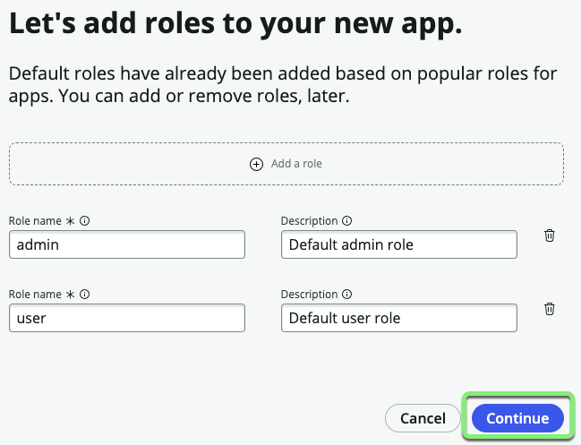

## Overview

In this exercise, we will create our first scoped application called "Telework Case Management". 

A scoped application (or "app" for short), is a container for all of the assets that make up our application with security features wrapped around it. 

## Instructions

1. Click on the Create App button.

2. Complete the form, then click **Drag app logo or browse to upload**
    1. Name: `Telework Case Management`

    2. Description: `Manage Telework requests across departments`

    

    3. Browse to and select the  **telework_App_Logo.png** file you downloaded.

3. Click Continue.

    

4. In the __Let's add roles__ screen, click Continue.

    

5. Click Go to app dashboard.

    

## Exercise recap

As simple as they may have seemed, you have now created a ServiceNow application. 

In the following exercises, we will add data, experiences, logic, and security. 
