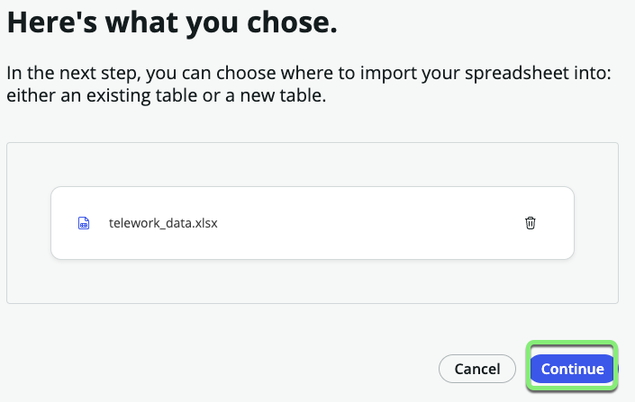
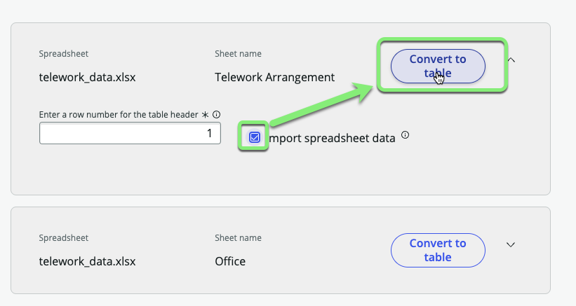
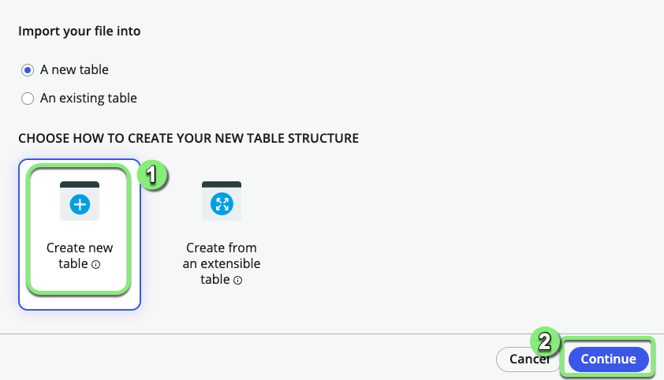
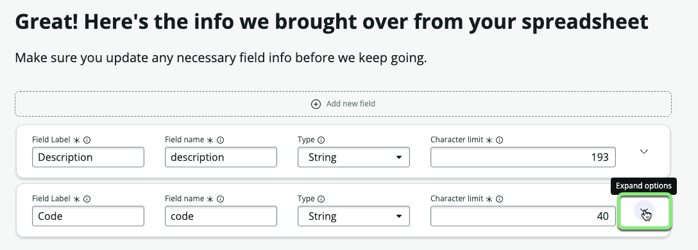
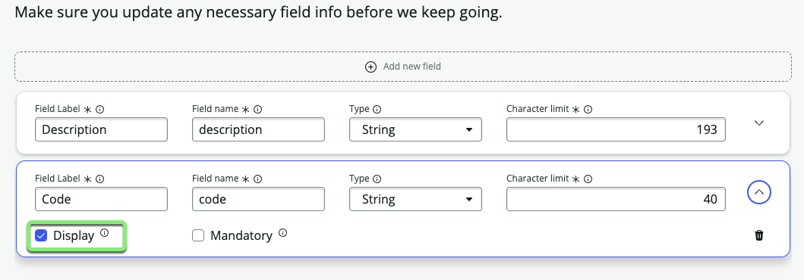
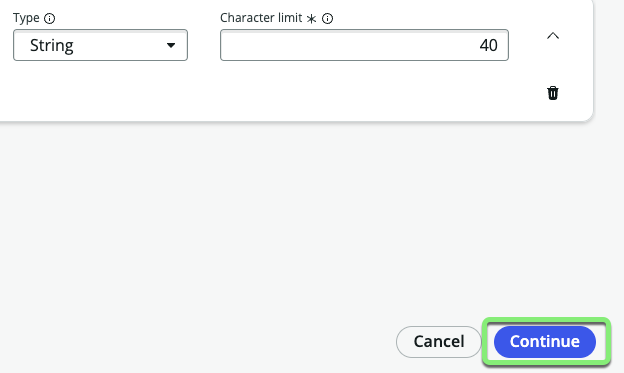
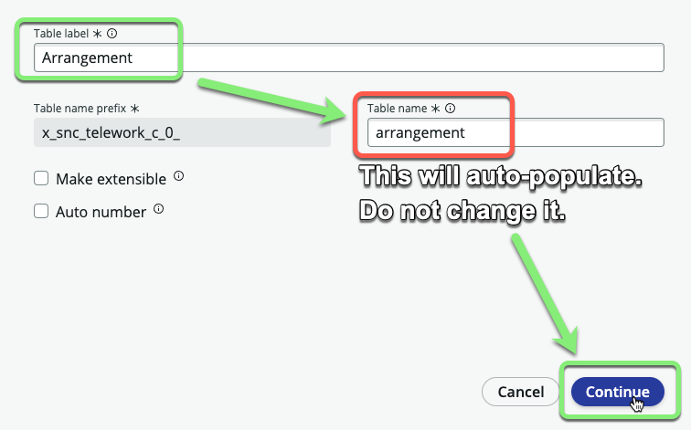
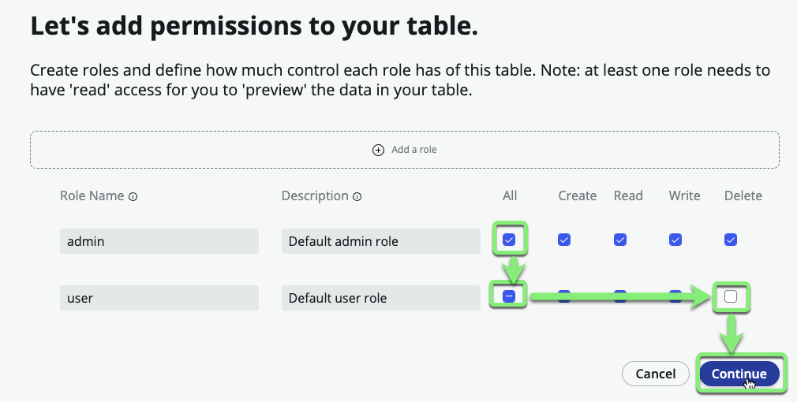
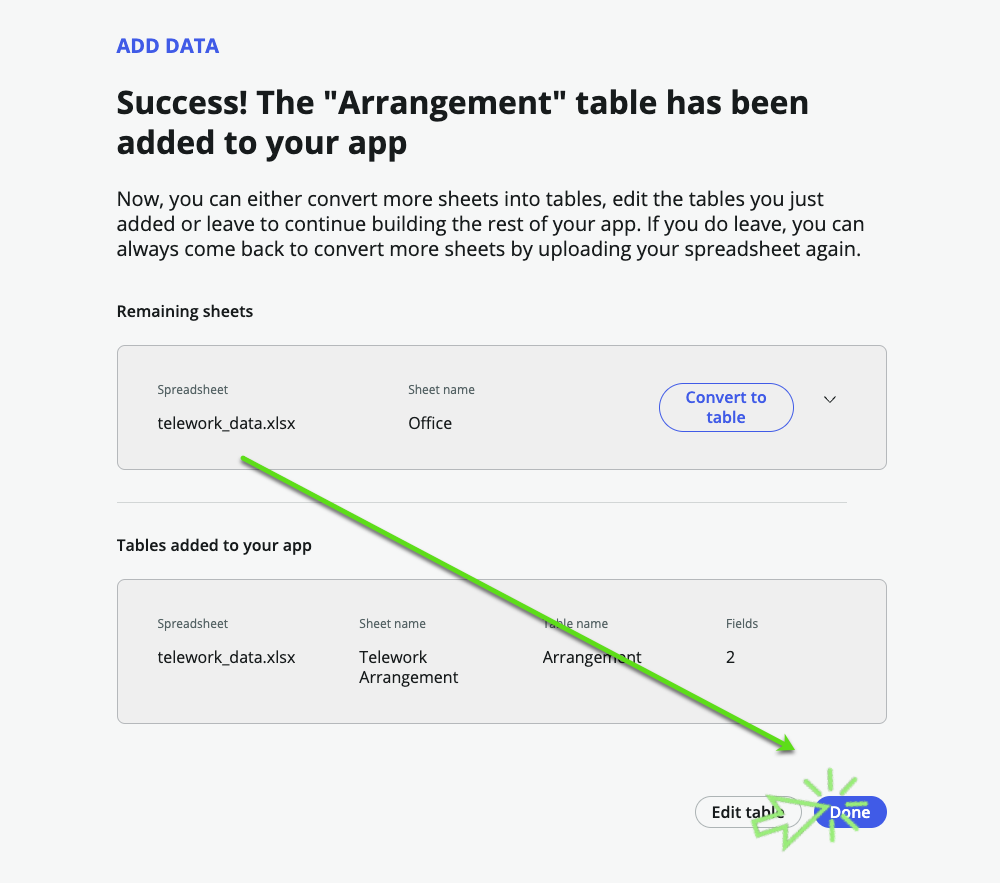
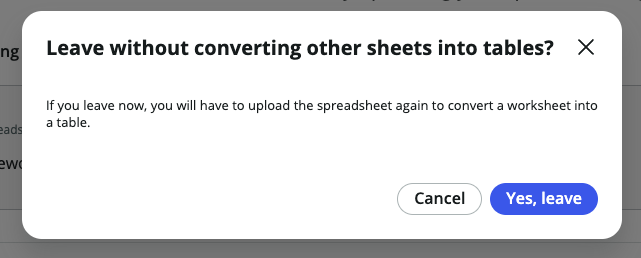

## Overview

In this exercise, we will import a sheet from the spreadsheet "telework_data.xlsx" directly into a new table. 

Later, we will leverage this new table to provide choices to users to choose Telework Arrangement reasons from. 

## Instructions

1. Next to **Data**, click +Add.

    

2. 
   1. Click **Import a spreadsheet**.
   2. Click Continue.

    

3. 
   1. Drag and drop the file <strong>telework_data.xlsx</strong>.
   2. Click Continue.

    

    :::info
    _If you are having trouble dragging onto the page, just click the page and manually select the file._
    :::

    

### The spreadsheet has multiple sheets. **We only need the first one** "Telework Arrangement".

4. 
   1. Check ☑ <strong>Import spreadsheet data</strong> where the sheet name is **Telework Arrangement**.
   2. Click on <strong>Convert to table</strong>.

    

5. Import your file into **A new table**.  
   1. Select <strong>Create new table</strong>.
   2. Click Continue.

    

6. 
   1. Click Expand options (⌄) in the **Code** row to see advanced configuration options.

   

   2. Check the <strong>Display</strong> checkbox under **Code**.

   

   3. Click Continue.

   

:::info
* The **Display** field is the one that appears if you reference this record from another table. A table can only have a single field marked as the **Display** field. 

* For example, in a drop-down or reference we want it to display the code "Remote Telework" and not the full Description.

* _Fields are also known as table columns._
:::

8. **Set the table name.**
   1. **Table label:** `Arrangement` 

   _(HINT:(Hit <kbd>⇥ Tab</kbd>) The table name will auto populate.)_

   2. Click Continue.

    

9. **Add permissions to your table.**
   1. For the <strong>admin</strong> role, check <strong>All</strong>.
   2. For the <strong>user</strong> role, check <strong>All</strong> and then uncheck <strong>Delete</strong>.
   3. Click Continue.

    

10. A loading screen will appear while the table is being created. When it completes, click Done.

    

    We haven't converted all the sheets in the spreadsheets, so we'll see this message pop up.

    Click Yes, leave.

    

:::info
This is intentional to show you that you do not have to import all of the sheets in a workbook. 
:::

12. Click Yes, leave.

## Exercise Recap

Congratulations, you've built your first table in your application, "Arrangement". 

It contains a list of various Telework Arrangements that can be used later for users to choose from. 

Since it is a stand alone table, it will be easy to add and remove entries to the table in Production so that we can easily update the choices for users to pick from.