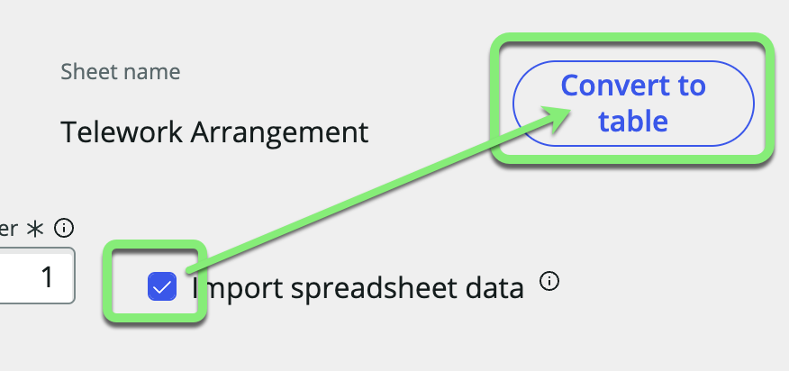

## Overview

In this exercise, we will import a sheet from the spreadsheet "telework_data.xlsx" directly into a new table. 

Later, we will leverage this new table to provide choices to users to choose Telework Arrangement reasons from. 

## Instructions

1. Next to **Data**, click +Add.

    

2. **How do you want to add data to your app?**   
   1. Click **Import a spreadsheet**.
   2. Click Continue.
   

3. **Choose a spreadsheet to import from.**  
   If you have trouble dragging the file onto the page in this step, just click 'browse to upload a spreadsheet' and manually select the file.
   1. Drag and drop the file <strong>telework_data.xlsx</strong> onto the box.
   2. Click Continue.
   

4. **Looks like your spreadsheet has multiple worksheets.**
   1. Check ☑ <strong>Import spreadsheet data</strong> where the sheet name is **Telework Arrangement**.
   2. Click on <strong>Convert to table</strong>.
   

5. **Import your file into: A new table.**  
   1. Select <strong>Create new table</strong>.
   2. Click Continue.
   

6. **Great! Here's the info we brought over from your spreadsheet**
   1. Click Expand options (⌄) in the **Code** row to see advanced configuration options.
   
   2. Check the <strong>Display</strong> checkbox under **Code**.
   
   3. Click Continue.

:::info
* The **Display** field is the one that appears if you reference this record from another table. A table can only have a single field marked as the **Display** field. 

* For example, if you reference this table in a drop-down you want it to display the Code and not the Description.

* _Fields are also known as table columns._
:::

8. **Now, let's get more info about your new table.**
   1. **Table label:** `Arrangement`  
   _**HINT:** Press the `tab` key on your keyboard to make the 'Table name' field auto populate._
   2. Click Continue.
   

9. **Let's add permissions to your table.**
   1. For the <strong>admin</strong> role, check <strong>All</strong>.
   2. For the <strong>user</strong> role, check <strong>All</strong> then uncheck <strong>Delete</strong>.
   3. Click Continue.
   

10. **Success! The "Arrangement" table has been added to your app.**
    1. Click Done.  
    We haven't converted all the sheets in the spreadsheets, so you will see this message pop up.
    
    2. Click Yes, leave.

:::info
We are skipping the other sheet intentionally to show you that you do not have to import all of the sheets in a workbook. 
:::

## Exercise Recap

Congratulations, you've built your first table in your application, "Arrangement". 

It contains a list of various Telework Arrangements that can be used later for users to choose from. 

Since it is a stand alone table, it will be easy to add and remove entries to the table in Production so that we can easily update the choices for users to pick from.