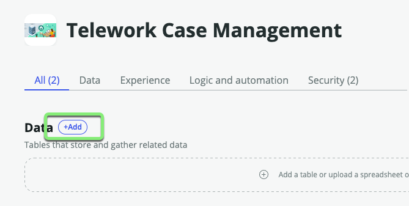
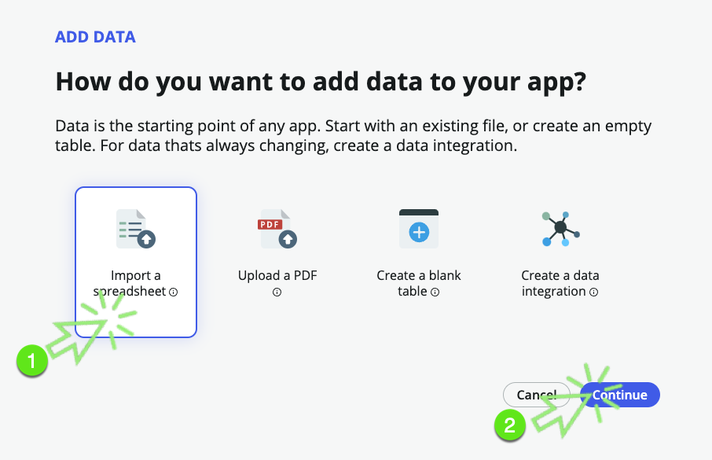

## Overview

In this exercise, we will import data from the "telework_data.xlsx" spreadsheet directly into a new table. This table, called "Telework Arrangement," will serve as a foundation for offering choices to users in the future.

## Instructions

1. **Adding Data**:
   - Next to **Data**, click +Add.
   

2. **How to Add Data**:
   - Select "Import a spreadsheet" and click Continue.
   

3. **Choose a Spreadsheet**:
   - Drag and drop the file **telework_arrangement_choices.xlsx** onto the box or click "browse to upload a spreadsheet" if needed.
   - Click Continue.
   

4. **Table Destination**:
   - Choose "Create new table" and click Continue.
   

5. **Set the Display field for the table.**
   - Click on "Expand options (⌄)" in the **Code** row to access advanced configuration options.
   
   - Check the **Display** checkbox under **Code** and click Continue.
   

:::info
* The **Display** field is the one that appears when referencing this record from another table. Each table can have only one field marked as the **Display** field.
* For example, if you reference this table in a dropdown, it will display the Code and not the Description.
* Fields are also known as table columns.
:::

7. **Table Label**:
   - Set the "Table label" to `Arrangement`.
   - Press the `tab` key on your keyboard to auto-populate the "Table name" field.
   - Click Continue.
   

8. **Set the Table Permissions.**
   - Define permissions for the roles:
     - For the **admin** role, check "All."
     - For the **user** role, check "All" and uncheck "Delete."
   - Click Continue.
   

9. **Your table is ready.**
    - Click Done.
    

## Exercise Recap

Well done! You've created your first table in your application, "Arrangement." This table contains a list of various Telework Arrangements, which users can choose from in the future.

Since it's a standalone table, you can easily add or remove entries in production, making updates to user choices a breeze.