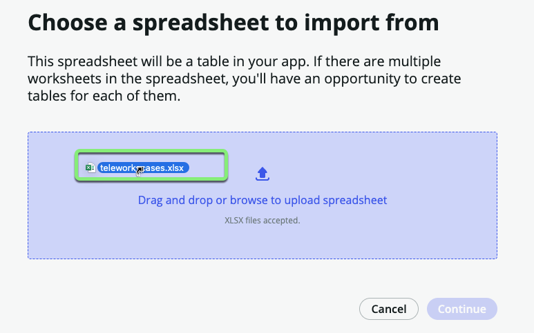
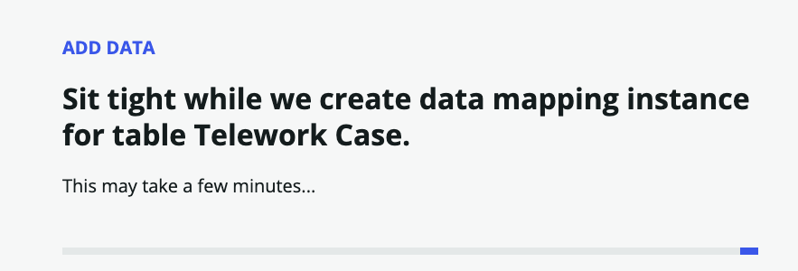
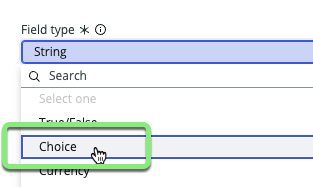
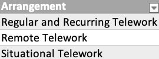
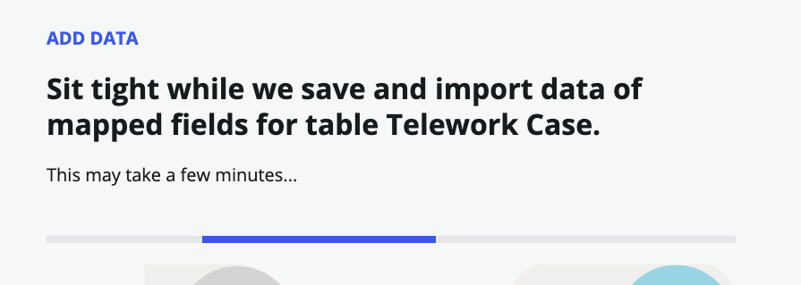
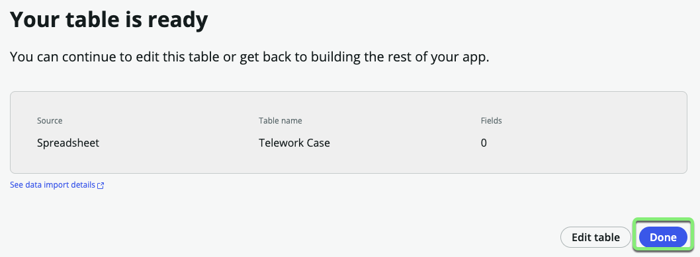

## Overview

ServiceNow has many re-usabled data models to help accelerate our development. One of the most frequently used is the "Task" table. 

It has many different fields on it for tracking request and ticket type work.  The "Task" table is the basis for many other ServiceNow applications such as ITSM, HR, CSM, and more. 

In this exercise, we will import a sheet the spreadsheet "telework_cases.xlsx" directly into a new Task-extended table. This means our new table will inherit all of the fields from the Task table so that we can use them in our new table. 

Later, we will use this new table to keep track of Telework Case Requests. 

## Instructions

1. Next to **Data**, click +Add.

2. **How do you want to add data to your app?**
   1. Select <b>Import a spreadsheet</b>. 
   2. Click Continue.
   
   3. Drag and drop the file <strong>telework_cases.xlsx</strong>.

   _If you have trouble dragging onto the page in this step, just click the page and manually select the file._
   

   2. Check **Import spreadsheet data**.

   3. Click Continue.

    

 **Here's what you chose.**

7. Select **Create from an extensible table**, then click Continue.

8. **Set the table name.**
   1. Type `Task` into the box.
   2. Click on the **Task** table.
   
   3. Click Continue.

9. **Define the properties of your new table.**
   1.  Table label: `Telework Case`
   2.  Table name: _This will auto-populate_
   3.  Auto number: _Checked_
   4. Click Continue.
   

10. **Add permissions to your table.**
    1.  For the <strong>admin</strong> role, check <strong>All</strong>.
    2.  For the <strong>user</strong> role, check <strong>All</strong> and then uncheck <strong>Delete</strong>.
    3.  Click Continue.
    

11. Click Continue.

12.  Click the **Add Fields** link on the right of page. 

13. **Change the Reason field from `String` to `Choice`.**
    1.  Hover over the row and edit the Reason field by clicking on the pencil icon.
    
    2. Click "String" under **Field type**
    
    3. Select **Choice** 
    
    4. Click the Update field button.   
    
    **The choices will be added for you automatically based on what was in the spreadsheet.**
    

14. Days per week is ok as an integer. **Do not do anything to it.**

15. **Change the Arrangment field from `String` to `Reference`.**  

    :::info
    A `Reference` field points to another table. You want the `Arrangement` **field** to point to the the `Arrangement` **table** created earlier. 
    
    This will allow users to select the choices we imported from the `telework_cases.xlsx` spreadsheet. 
    :::

    1. Hover over the row and edit the Arrangement field by clicking on the pencil icon.
    
    2. Click "String" under **Field type**
    
    3. Select "Reference"
    
    4. Type `Arrangement` into the **Reference table** field and click on **Arrangement** in the drop-down. 
    
    5. Click Update field.
    

17. Now that you have configured the new fields click Add fields to add them to our new table. 

18. _**The system does it's best to auto-map fields with similar names, but some are not correct.**_  
    
    Click the 'X' next to the following fields to clear out the following fields.

    
    
    

19. Click Continue.

20. **Your table is ready.**  
    Click Done.
    

## Exercise Recap

In this exercise, you have have imported a spreadsheet into a Data table in your application.

We learned to use the Data Import tool to map the spreadsheet data to new columns in the Telework Case table. 

We were able to complete all these tasks using simple point-and-click administration and without requiring specialized application or database knowledge.

**Next we'll take a look at the list & form views that have been generated for our table and adjust the layouts.**