## Overview

ServiceNow has many re-usable data models to help accelerate development. One of the most frequently used is the "Task" table. 

In this exercise, we will create a "Telework Case Table" by extending the "Task" table. This new table will inherit fields from the "Task" table and be used to track Telework Case Requests.

## Instructions

1. Next to **Data**, click +Add.
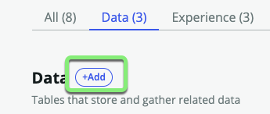

2. **How to Add Data**:
   1. Select <b>Import a spreadsheet</b>.
   2. Click Continue.
   

:::tip
If you have trouble dragging onto the page in the next step, just click the page and manually select the file.
:::

3. **Choose a Spreadsheet to Import**:
   1. Drag and drop the file <strong>telework_cases.xlsx</strong> onto the box.
   2. Check **Import spreadsheet data**.
   3. Click Continue.
   
   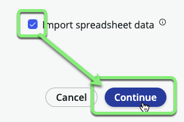

4. **Import into a New Table**:
   1. Select **Create from an extensible table**.
   2. Click Continue.
   

5. **Select the Table**:
   1. Click in the search box.
   2. Click on the **Task** table.
   3. Click Continue.
   

6. **Table Configuration**:
   1. Table label: `Telework Case`
   2. Table name (auto-populated)
   3. Auto number (checked)
   4. Click Continue.
   

7. **Set Permissions**:
   1. For the <strong>admin</strong> role, check <strong>All</strong>.
   2. For the <strong>user</strong> role, check <strong>All</strong> and uncheck <strong>Delete</strong>.
   3. Click Continue.

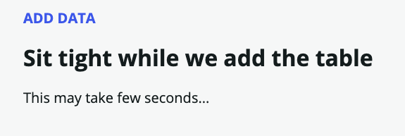

8. **Great! Now your table is ready for data.**
   * Click Continue.

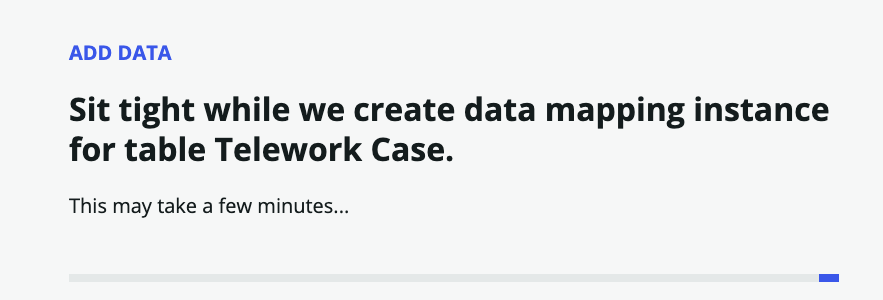

## Now you are ready to map the fields from the spreadsheet to the new table 'Telework Case'. 

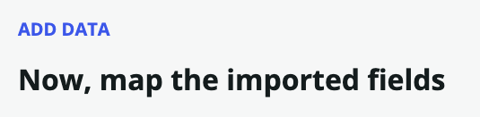

:::info Source: telework_cases.xlsx
* On the left side of the page are the source fields from the spreadsheet.
* The system was able to **Auto map** some of the fields with matching names in the Target table.
* **Auto mapped** fields have a checkmark next to them. 
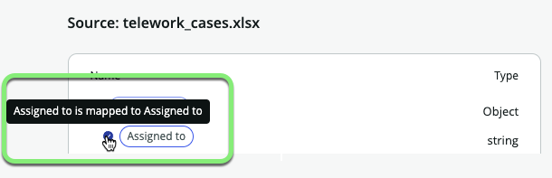
:::

:::info Target: Telework Case
* On the right side of the page are the target fields in the **Telework Case** table.
* When the system was able to **Auto map** a field, it added a Data pill from the Source table. 

:::

:::caution
* On the left side of the screen, you can see that some of the spreadsheet columns do not exist in the target table.
* You will create these new fields in the next few steps. 

:::

9. **Add the the missing fields.**
   * Click the **Add Fields** link on the right.
   
   You will be given the option to '_Add fields from your import to the target table_'.
   

Days per week is ok as an integer. **Do not do anything to it.**

10. **Modify Field Type**: Change 'Justification' from from `String` to `Choice`.
    1. Hover over the row and edit the field **Justification** by clicking on the pencil icon.
    
    2. Click "String" under **Field type** and change it to **Choice**.
    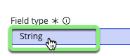
    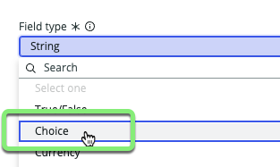
    4. Click Update field

    :::note
    The choices will be added automatically imported from the spreadsheet.
    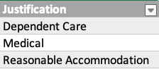
    
Image of spreadsheet choices

    :::

11. **Modify Field Type**: Change Arrangement from `String` to `Reference`.
    1. Hover over the row and edit the field **Arrangement** by clicking on the pencil icon.
    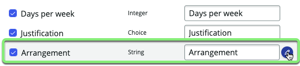
    2. Click "String" under **Field type** and change it to **Reference**.
    
    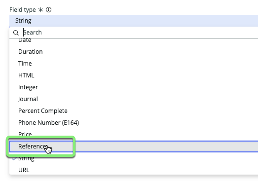
    4. Type `Arrangement` into the **Reference table** field and click on **Arrangement** in the drop-down. 
    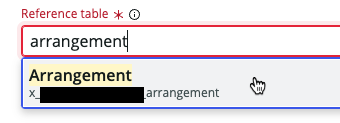
    5. Click Update field.

    :::note
    * A `Reference` field points to another table. You want the `Arrangement` **field** to point to the the `Arrangement` **table** created earlier. 
    * This will allow users to select the choices imported from the `telework_arrangement_choices.xlsx` spreadsheet. 
    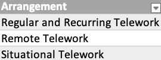
    
Image of spreadsheet choices

    :::

12. **Finish adding new fields.**
    * Click Add fields to add the new fields to the Target table. 
    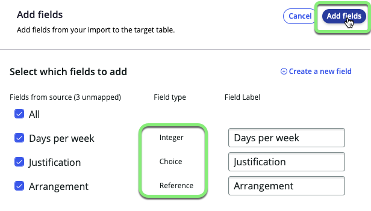

Each field on the left side of the page should now have a checkmark beside of it like below. If not, please review previous steps or ask an instructor for assistance. 

13. **Finalize**:
    * Click Continue in the bottom right. 

14. **Table Ready**:
    * Click Done.
    

## Exercise Recap

In this exercise, you have created a "Telework Case Table" by extending the "Task" table. This table inherits fields from the "Task" table and will be used to track Telework Case Requests. You've successfully completed these tasks using simple point-and-click administration, without requiring specialized application or database knowledge.

**Next, we'll explore list and form views and adjust the layouts.**