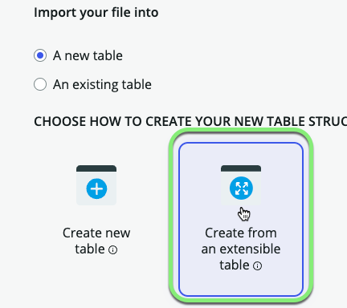

## Overview

ServiceNow has many re-usable data models to help accelerate development. One of the most frequently used is the "Task" table. 

In this exercise, we will create a "Telework Case Table" by extending the "Task" table. This new table will inherit fields from the "Task" table and be used to track Telework Case Requests.

## Instructions

1. Next to **Data**, click +Add.

2. **How to Add Data**:
   1. Select <b>Import a spreadsheet</b>.
   2. Click Continue.
   

:::tip
If you have trouble dragging onto the page in the next step, just click the page and manually select the file.
:::

3. **Choose a Spreadsheet to Import**:
   1. Drag and drop the file <strong>telework_cases.xlsx</strong> onto the box.
   2. Check **Import spreadsheet data**.
   3. Click Continue.
   
   

4. **Import into a New Table**:
   1. Select **Create from an extensible table**.
   2. Click Continue.
   

5. **Select the Table**:
   1. Click in the search box.
   2. Click on the **Task** table.
   3. Click Continue.
   

6. **Table Configuration**:
   1. Table label: `Telework Case`
   2. Table name (auto-populated)
   3. Auto number (checked)
   4. Click Continue.
   

7. **Set Permissions**:
   1. For the <strong>admin</strong> role, check <strong>All</strong>.
   2. For the <strong>user</strong> role, check <strong>All</strong> and uncheck <strong>Delete</strong>.
   3. Click Continue.

8. **Great! Now your table is ready for data.**
   * Click Continue.

9. **Field Mapping**:
   * Click the **Add Fields** link on the right.
   

10. **Modify Field Type**: Change the Reason field from `String` to `Choice`.
    1. Hover over the row and edit the Reason field by clicking on the pencil icon.
    
    2. Click "String" under **Field type**.
    
    3. Select **Choice**.
    
    4. Click Update field
    * (Choices will be added automatically from the spreadsheet.)
    

11. Days per week is ok as an integer. **Do not do anything to it.**

12. **Modify Field Type**: Change the Arrangement field from `String` to `Reference`.
    1. Hover over the row and edit the Arrangement field by clicking on the pencil icon.
    
    2. Click "String" under **Field type**
    
    3. Select "Reference"
    
    4. Type `Arrangement` into the **Reference table** field and click on **Arrangement** in the drop-down. 
    
    5. Click Update field.
    

:::info
* A `Reference` field points to another table. You want the `Arrangement` **field** to point to the the `Arrangement` **table** created earlier. 
* This will allow users to select the choices imported from the `telework_cases.xlsx` spreadsheet. 

Image of spreadsheet choices

:::

13. **Field Auto-Mapping**:
    * Click Add fields to add fields form the import to the target table.
    

14. _**The system does it's best to auto-map fields with similar names, but some are not correct.**_  
    
    Click the 'X' next to the following data pills to unmap them from target table: 
    * Description
    * Opened (_Be careful to remove 'Opened by' from only the Opened field_)
    * Transfer Reason

    
    
    

15. **Finalize**:
    * Click Continue.
    

16. **Table Ready**:
    Click Done.
    

## Exercise Recap

In this exercise, you have created a "Telework Case Table" by extending the "Task" table. This table inherits fields from the "Task" table and will be used to track Telework Case Requests. You've successfully completed these tasks using simple point-and-click administration, without requiring specialized application or database knowledge.

**Next, we'll explore list and form views and adjust the layouts.**