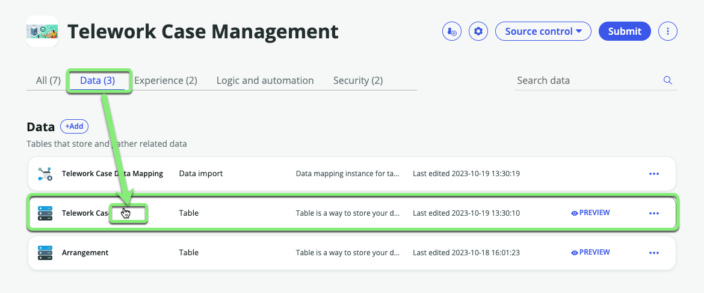
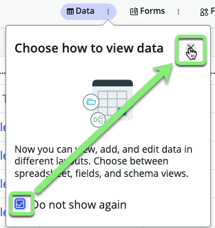
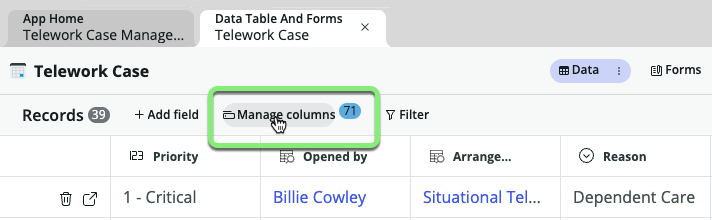
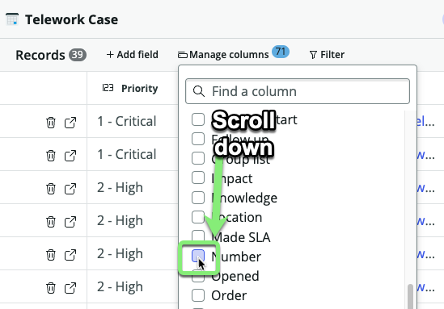
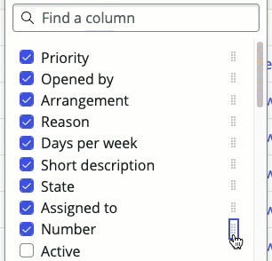
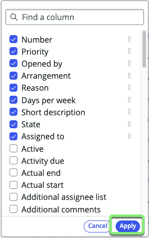
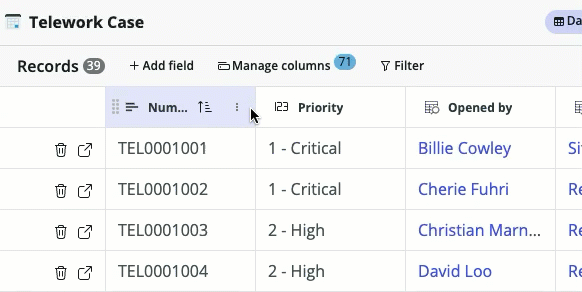
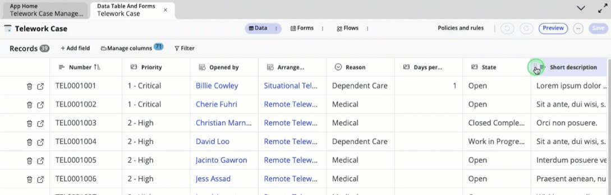
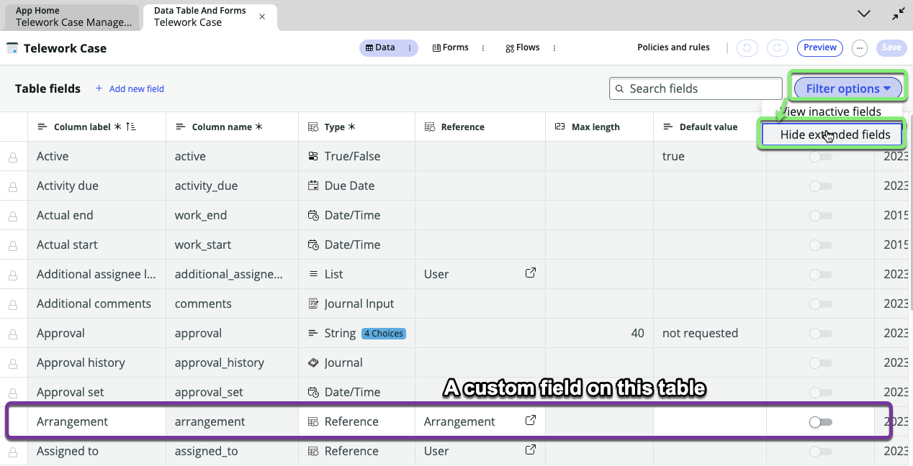

## Overview 

Table Builder is used to design and customize tables, forms, and form elements for users from a single interface without needing to navigate between existing Now Platform tools. 

In this exercise, you will edit the `Telework Case` table using the **Spreadsheet** view in the **Data** tab in **Table Builder**.  

After that, you will switch to the **Fields** view to learn to modify the table properties and structure.

## Instructions

1. Click the **Data** tab, then click the **Telework Case** bar. 

2. **Welcome to Table builder**  
Click 'X' to close the pop-up.

3. Check 'Do not show again' and click the 'x'.

:::note
The default view of Data in Table Builder is the "Spreadsheet" view. 

In "Spreadsheet" view, we can view and edit the data.
:::

4. Rearrange the columns displayed. 
   1. Click **Manage columns**.
   
   2. Scroll down and check the box next to 'Number'.
   
   3. Click the dots next to 'Number', hold, and drag it to the top of the list. 
   
   4. Click Apply
   
   The Number column has been added to our Spreadsheet view of the Data.  

:::info
Resize any of the columns in this view like this:

You can also drag-and-drop to rearrange the columns like this:

:::

5. **Go to the 'Fields' view of Table Builder.** 
   1. Click the three dots next to **Data** and select 'Fields'.
   

6. **Hide the `Task` table rows and only view the custom table rows you created earlier.**  
_The dark gray rows are fields that exist on the `Task` table that we are inheriting in our table `Telework Case` table._ 
   1. Click **Filter options**. 
   2. Click 'Hide extended fields'.
    
Now you can easily see only the custom Fields related to the `Telework Case` table.  

## Exercise Recap

In this exercise, you explored how to use **Table Builder** to view data in **Spreadsheet view** and also how to configure your Fields in the **Fields view**.

The next exercise will involve using the **Form** feature to view the form used to display individual records (or rows) of data in the table.

For more info: [ServiceNow Product Documentation: Table Builder](https://docs.servicenow.com/csh?topicname=tb-landing-page.html&version=latest)