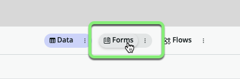
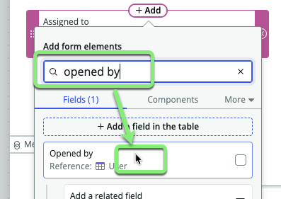
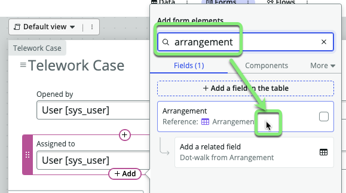

## Overview

On the **Forms** tab in Table Builder, you can visually create, configure, and customize the different form views for your users using the form editor. The views that you define contain the elements that appear when a user opens that form or list.

A form view defines the elements that appear to a user when the user opens a form or list. Each form has a default view, but you may want to create several different form views for different groups of users.

When you created your new table `Telework Case` as an extension of `Task`, it inherited the default form view from `Task`.

In this exercise, you will create a new default form unique to the `Telwork Case` table.

## Instructions

1. Click the **Forms** pill in the middle of the page. 

This is the default form view inherited from the `Task` table. 

It needs to be customized for the `Telework Case` table. 

2. Remove the following fields from the form by clicking the X next to the field.
    - Number
    - Configuration Item
    - Active
    - Parent
    
    When you are done, the top part of the form should look like this:
    

3. **The fulfiller users of the Telework Case Management application want to see who opened the case on the form.**
   1. Hover your cursor above the field 'Assigned to' until the "+Add" button appears and click the button. 
     
   2. Type `opened by` in the search box and click on 'Opened by'.
   
   **Result:** The **Opened by** field has been added to the form.
   

4. **They also want to see who opened the case on the form.**  
Add the field **Arrangement** below **Assigned to**.
   1. Hover your cursor below the field 'Assigned to' until the "+Add" button appears and click the button. 
   
   2. Type `arrangement` in the search box and click on 'Arrangement'.
   
   **Result:** The **Arrangement** field has been added to the form.
   

5. **And they want to see how many 'Days per week' are being requested.**  
   1. Hover your cursor below the field 'Priority' until the "+Add" button appears and click the button.
   
   2. Type `days per week` in the search box and click on 'Days per week'.
   
   **Result:** The **Days per week** field has been added to the form.
   

6. **One final field, they want to see the 'Reason' for the request.**  
   1. Hover your cursor below the field 'Arrangement' until the "+Add" button appears and click the button.
   
   2. Type `reason` in the search box and click on 'Reason'.
   
   **Result:** The **Reason** field has been added to the form.
   

The fulfillers of the Telework Cases have also requested a way to see the history of what fields change on the record. For this, ServiceNow provides a feature called an **Activity formatter**.

7. Click 'More' in the **Add form elements** pane. 

10. ① Click <b>More</b>  
    ② Click <b>Formatters</b>

    

1.  Drag the "**Activities (filtered)**" field onto the form below the Short description field.

12. Your form should look like something this (doesn't have to have exact same layout):

13. On the top right, Click on the Save button

6.  Configure the related list by doing:
    1. Right-click on header.
    2. Select **Configure**.
    3. Then select **Related Lists**.
    

9. In the new form:
    1. Select the item **Task → Parent**.
    2. Click on the button to move the item to the selected list.
    3. Click on the Save button.
    

### Now a new tab at the bottom of the form will show records that have relationships to the current record.

10. Go back to the list view by clicking on the back button at the top.

11. We can even start creating new records/cases. Click **New** in the top right.

### But wait, the form doesn't have the fields we want. Let's fix that.

13. Close the Preview tab by **clicking** the **X**.

**Exercise Recap**

In this exercise, we learned how to modify the list and form views for our Telework Case table.

We also saw some useful things you can do from the list view to generate quick reports.

We were able to complete all these tasks using simple point-and-click administration and without requiring specialized application or database knowledge.

## Part 2 - Configure Telework Case Form

## Part 3 - Preview the Arrangement form

1. Go back to the App Home

2. Click on the **Arrangement** table in the Data section.

3. Click the **Forms** pill in the top middle of the page. 

:::info
Here you can edit the Arrangement form as needed.  No changes are needed at this time.
:::

4. Click the AES tab for the **Arrangement** table.

**Exercise Recap**

In this exercise, we learned how to modify the list and form views for our Telework Case table.

We also saw some useful things you can do from the list view to generate quick reports.

We were able to complete all these tasks using simple point-and-click administration and without requiring specialized application or database knowledge.

* **Policies and rules** 
Policies and rules define how information appears to users based on role and entries, as well as who can access tables and forms built in Table Builder.

* **Flows** 
You can use the Flow Designer functionality that is integrated within Table Builder to manage your table's record-based flows. You can manage these flows by using the Flows tab.

