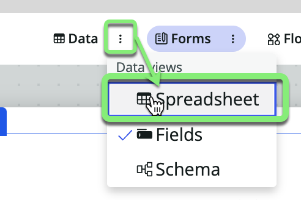
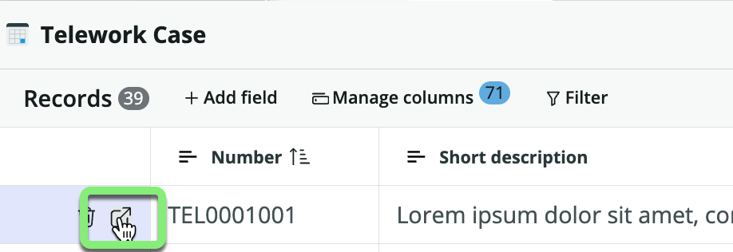

## Overview

On the **Forms** tab in Table Builder, you can visually create, configure, and customize the different form views for your users using the form editor. The views that you define contain the elements that appear when a user opens that form or list.

A form view defines the elements that appear to a user when the user opens a form or list. Each form has a default view, but you may want to create several different form views for different groups of users.

When you created your new table `Telework Case` as an extension of `Task`, it inherited the default form view from `Task`.

In this exercise, you will create a new default form unique to the `Telework Case` table.

## Instructions

1. Click the **Forms** pill in the middle of the page. 

This is the default form view inherited from the `Task` table. 

It needs to be customized for the `Telework Case` table. 

2. Remove the following fields from the form by clicking the X next to the field.
    - Number
    - Configuration Item
    - Active
    - Parent
    - Description
    
    When you are done, the top part of the form should look like this:
    

3. **The fulfiller users of the Telework Case Management application want to see who opened the case on the form.**
   1. Hover your cursor above the field 'Assigned to' until the "+Add" button appears and click the button. 
     
   2. Type `opened by` in the search box and click on 'Opened by'.
   
   **Result:** The **Opened by** field has been added to the form.
   

4. **They also want to see who opened the case on the form.**  
Add the field **Arrangement** below **Assigned to**.
   1. Hover your cursor below the field 'Assigned to' until the "+Add" button appears and click the button. 
   
   2. Type `arrangement` in the search box and click on 'Arrangement'.
   
   **Result:** The **Arrangement** field has been added to the form.
   

5. **And they want to see how many 'Days per week' are being requested.**  
   1. Hover your cursor below the field 'Priority' until the "+Add" button appears and click the button.
   
   2. Type `days per week` in the search box and click on 'Days per week'.
   
   **Result:** The **Days per week** field has been added to the form.
   

6. **They also want to see the 'Reason' for the request.**  
   1. Hover your cursor below the field 'Arrangement' until the "+Add" button appears and click the button.
   
   2. Type `reason` in the search box and click on 'Reason'.
   
   **Result:** The **Reason** field has been added to the form.
   

7. Add the "Additonal Comments" field to the form below 'Short descrition'.

7. **The fulfillers of the Telework Management app have also requested a way to see the history of when fields change on the record. For this, ServiceNow provides a feature called an _Activity formatter_.**
   1. Click 'More' in the **Add form elements** pane. 
   
   2. Click 'Formatters'
   

8.  Drag the "**Activities (filtered)**" box onto the form below the **Work notes** field.

9. On the top right, click Save.

The form should now look like this.

10. **Add a related list that shows Tasks that are children of the "Telework Case" record being viewed on the form.**
    1. Click the three dots next to **Default view**.
    2. Click "Configure related list (UI16 and earlier)".
   
    3. Scroll down the left side.
    4. Click on 'Task -> Parent'.
    5. Click the '>' button.
    
    6. Click Save.
    
    7. Close the **Related Lists** tab.
    

11. **Switch back to the 'Data -> Spreadsheet' view.**
    1.  Click the three dots next to the **Data** pill.
    2.  Click **Spreadsheet**.
   

12. Click the escape-hatch icon next to a record to open it. 

13. Look at form to see changes and related list. 

14. Close record.

15. Close the *Telework Case" tab.

**Exercise Recap**

In this exercise, we learned how to modify the list and form views for our Telework Case table.

Later in the lab you will see a tab at the bottom of records that shows child records. 

