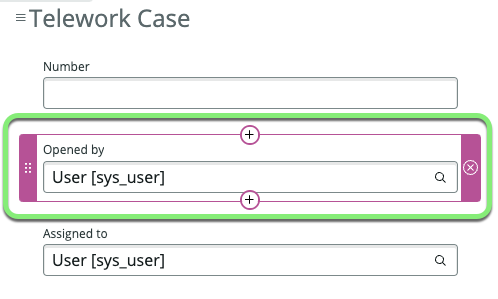
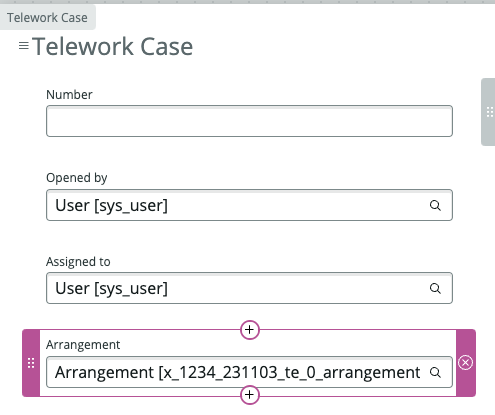

## Overview

The **Forms** tab in Table Builder is your canvas for visually creating, configuring, and customizing form views for your **fulfiller** users without the need to navigate between different tools. 

In this exercise, we will focus on creating a new default form unique to the `Telework Case` table.

This form view is the 'back-end' view that will be visible in the Platform to the **fulfillers** working on the Telework Cases. 

The **fulfiller** have asked that the following fields be added to the form:
* Opened by
* Arrangement
* Days per week
* Justification

## Instructions

1. Click the **Forms** button in the center of the page.
   
   This is the default form view inherited from the `Task` table, which we'll customize for the `Telework Case` table.
   

2. **Add the 'Opened by' field to the form.**
   1. Hover your cursor above the field 'Assigned to' until the "+Add" button appears and click the button. 
   
   2. Type `opened by` in the search box and click on 'Opened by'.
   
   **Result:** The **Opened by** field has been added to the form.
   

One field added. Three to go...
* ~~Opened by~~
* Arrangement
* Days per week
* Justification

3. **Add the 'Arrangement' field to the form.**
   1. Hover your cursor below the field 'Assigned to' until the "+Add" button appears and click the button. 
   
   2. Type `arrangement` in the search box and click on 'Arrangement'.
   
   **Result:** The **Arrangement** field has been added to the form.
   

Two fields added. Two to go...
* ~~Opened by~~
* ~~Arrangement~~
* Days per week
* Justification

4. **Add the 'Days per week' field to the form.**
   1. Hover your cursor below the field 'State' until the "+Add" button appears and click the button.
   2. Type `days per week` in the search box.
   3. Click on 'Days per week'.
   
   **Result:** The **Days per week** field has been added to the form.
   

Three fields added. One to go...
* ~~Opened by~~
* ~~Arrangement~~
* ~~Days per week~~
* Justification

5. **Add the 'Justification' field to the form.**
   1. Hover your cursor below the field 'Arrangement' until the "+Add" button appears and click the button.
   2. Type `justification` in the search box.
   3. Click on 'Justification'.
   
   **Result:** The **Justification** field has been added to the form.
   

All four fields have been added to the form. The **fulfiller users** should be happy with the new form. 
* ~~Opened by~~
* ~~Arrangement~~
* ~~Days per week~~
* ~~Justification~~

6. **Save your work.**
    * Click Save in the top right. 

7. **Switch back to the 'Data -> Spreadsheet' view.**
    1.  Click the three dots next to the **Data** pill.
    2.  Click **Spreadsheet**.
   

8. Click the escape-hatch icon next to a record to open it. 

9. **Confirm the new form matches the requirements from the fulfiller users.**
   * Check out the new form for the `Telework Case` table.
   * It now should have the four fields requested by our **fulfiller** users on the form. 
      * Opened by
      * Arrangement
      * Days per week
      * Justification
   

   _If you don't see the fields on the form, please review the previous steps or ask your instructor for assistance._

10. Close the Record tab.
   

11. Close the **Data Table and Forms** tab.
   

12. You should now be on the **App Home** page. 
   

## Exercise Recap

In this exercise, we learned how to modify the form view for our Telework Case table.
